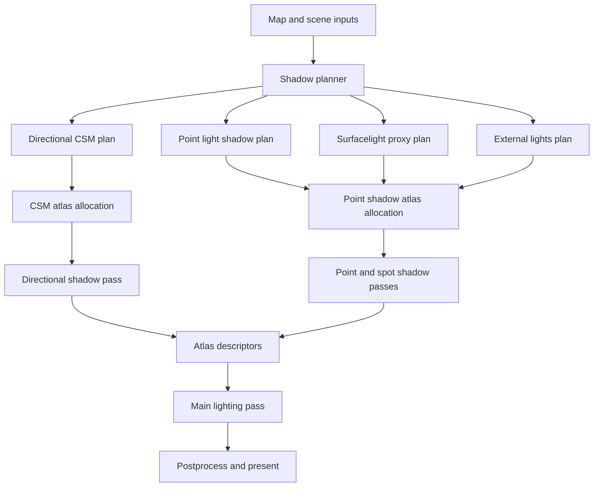
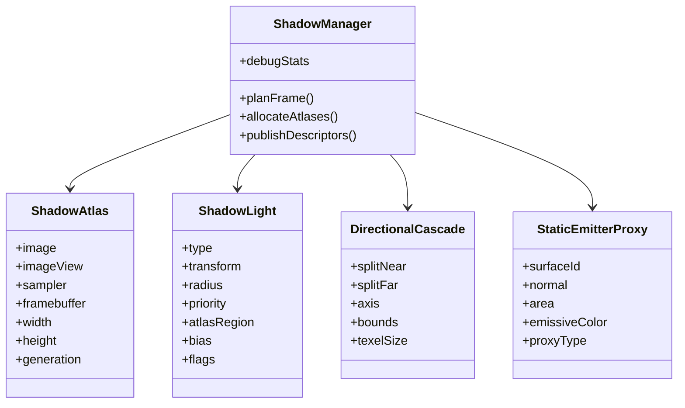

# Vulkan Shadowmapping Subsystem for FnQL

## Executive summary

FnQL already contains a substantial Vulkan shadowing foundation. The repository exposes a dedicated dynamic-light shadow atlas path, a separate cascaded shadow map path for sky suns, dedicated Vulkan shadow images/descriptors/framebuffers for both, CSM-specific shaders/uniforms, and runtime controls for dynamic-light shadow resolution, filter mode, bias, and light budgets. In other words, this is not a greenfield renderer problem; it is a partially implemented shadow framework that should be consolidated into one coherent subsystem rather than replaced wholesale. citeturn29view0turn35view4turn45view0turn46view0turn43view0

The current effects shadow path works because weapon flashes, explosions, and projectile lights already flow through the existing dynamic-light system as ordinary point lights, are prioritized for shadowing by a receiver- and brightness-aware heuristic, and are packed into a cubemap-face atlas limited by `r_dlightShadowMaxLights`. That design is a good fit for short-lived, local, point-like emitters. It is already wired in docs and code, and it explains why effects shadows are the least risky part of the system. citeturn31view0turn41view0turn35view4

The sky shadow path is present but appears fragile in two places. First, CSM planning depends on global sun state in `tr.sunParmsValid`, `tr.sunDirection`, `tr.sunColor`, and `tr.sunIntensity`, while the shader parser stores sun data per sky shader; the visible code strongly suggests a propagation step must exist elsewhere, and if that handoff is absent or late, CSM will silently skip with `c_csmSkippedNoSun`. Second, the parsed sun vector appears to represent the sky/sun direction, while the shadow camera usually needs the *incoming light direction*, which is the negated vector; using the wrong sign would place cascades on the wrong side of the scene or make them appear unstable or absent. The first point is a high-confidence integration risk from the existing data flow; the second is a medium-confidence but very plausible directional bug. citeturn60view0turn56view3turn39view0turn59view2

For an elegant long-term subsystem, FnQL should converge on a three-part shadow architecture: a **point-light cubemap atlas** for transient gameplay effects and custom static/dynamic point lights; a **directional CSM atlas** for sky suns; and a **static emissive-light proxy system** for surfacelights, derived from Q3 shader directives plus baked lightmap evidence. The dynamic and directional pieces match the repository’s current direction; surfacelights require new data extraction and prioritization, not just new Vulkan plumbing. citeturn35view4turn39view0turn59view0turn59view2turn58view2

My recommended implementation order is: stabilize skies first, formalize the unified shadow manager second, add an external static lights file third, and only then add surfacelight proxies. That ordering delivers visible wins quickly, reuses the working point-light path, and delays the hardest content-side problem until the renderer-side abstractions are settled. citeturn35view4turn39view0turn41view0

## Implementation progress

- [x] Stabilized sky sun handoff with explicit `worldSun_t` state, active sky shader promotion, and incoming-light direction for CSM planning.
- [x] Added unified shadow manager summary/debug counters for CSM and point-light shadow planning.
- [x] Added hot-reloadable external point lights through `maps/<mapname>.lights.json`, with renderer-only cvars, budgets, PVS filtering, and point-shadow planner integration.
- [x] Added surfacelight proxy extraction from `q3map_surfaceLight` shader metadata for world faces, grids, and triangle surfaces.
- [x] Added surfacelight proxy color fallback from explicit shader color, lightmap averages, area-weighted vertex colors, and default shader color.
- [x] Added view/PVS/hemisphere/projected-view weighting so renderer-owned static and surfacelight proxy lights do not flood the shadow budget.
- [x] Added precomputed world leaf cluster/area metadata for static sidecar lights and surfacelight proxies, with bounded PVS sample fallback for large lights.
- [x] Added sidecar `spot` parsing and unshadowed directional/linear preview promotion, with true spot shadows still reserved for the spotlight atlas path.
- [x] Added `q3map_lightImage` surfacelight color derivation using alpha-weighted image averages.
- [x] Classified surfacelight proxies as point-capable or spot-pending; planar spot proxies now use linear preview lights and defer shadowing until the spotlight atlas exists.
- [x] Added bounded `q3map_lightSubdivide` emitter subdivision so oversized surfacelight surfaces produce multiple ranked proxy lights without exceeding the proxy cap.
- [x] Started shadow manager ownership by retaining point-light shadow candidate and chosen atlas records in `shadowManager_t` while preserving current `dlight_t` compatibility fields.
- [x] Moved point-light shadow selection and atlas tile assignment onto manager-owned records before syncing the existing `dlight_t` backend fields.
- [x] Moved point-light shadow atlas layout ownership into `shadowManager_t`, including atlas fit, tile geometry, and fill calculations.
- [x] Published per-view shadow manager schedules through draw commands and made backend point/CSM shadow gates consult the scheduled manager state.
- [x] Routed point-light shadow atlas rendering and cache slot identity through manager-owned point plan records, with the existing `dlight_t` fields kept as fallback mirrors.
- [x] Routed point-light shadow sampling metadata through manager-owned point plan records for Vulkan and OpenGL light passes.
- [x] Added manager-owned point/CSM atlas publication state so backend render/cache paths publish sampleable atlas generations before receiver and light-pass sampling.
- [x] Added the disabled-by-default spotlight atlas planning foundation with cvars, 2D tile layout fitting, manager state, and debug reporting for future sidecar/surfacelight spot shadows.
- [x] Added manager-owned spotlight candidate and plan records with priority selection and 2D tile assignment for static sidecar spots and surfacelight spot proxies, while keeping backend scheduling passive.
- [x] Added passive Vulkan/OpenGL spotlight atlas resource scaffolding with sampled depth atlas allocation, framebuffer/render-pass accessors, generation counters, and manager debug publication hooks.
- [x] Added scheduled Vulkan/OpenGL spotlight atlas producer passes that render planned spot tiles as depth-only cone views and publish the atlas generation without receiver sampling yet.
- [x] Connected spotlight preview lights to their manager spot plans with source identity and staged Vulkan/OpenGL spot atlas binding, without enabling receiver sampling yet.
- [x] Added Vulkan spotlight receiver sampling for planned linear spot lights, including 2D atlas projection, PCF taps, depth biasing, and regenerated embedded SPIR-V.
- [x] Added OpenGL GLX spotlight receiver sampling for planned linear spot lights using the staged 2D atlas binding, while leaving the legacy ARB assembly fallback unsampled.
- [x] Added GLX spotlight source-contract coverage so the spot atlas shader mode, raw light-vector projection, C-side mode upload, and texture binding stay in sync.
- [x] Added circular cone gating to Vulkan and GLX spotlight receivers so atlas sampling rejects square-frustum corners outside each planned spot cone.
- [x] Honored per-light spotlight resolution requests by assigning each planned spot an effective tile size inside the stable atlas grid and reporting fill from actual planned tile area.
- [x] Added surfacelight spotlight per-emitter LOD so weak, edge-of-view, or small proxy emitters request lower-resolution tiles while high-importance large emitters can request promoted tiles within the atlas cap.
- [x] Added static map light sidecar source-contract coverage for malformed roots, forward-compatible key skipping, unsupported/invalid/overflow counters, parser defaults, and parse-failed reset behavior.
- [x] Added CSM cache telemetry/source-contract coverage for hit, miss, and uncacheable paths, cascade signature inputs, deformed-surface invalidation, cache publication, and receiver publication gates.
- [x] Added CSM atlas profiling counters/debug output, plus a GLX GPU timing pass for CSM atlas rendering.
- [x] Added CSM cascade stability coverage with atlas-facing texel snapping,
  expanded light-depth bounds, and two-texel cascade cull padding so static
  world casters stay covered without quantizing light-depth projection.
- [x] Matched Vulkan CSM caster and receiver traversal to GLx by walking sorted
  draw surfaces per cascade and changing entity state inline, removing
  per-entity rescans from the sky-sun shadow path.
- [x] Moved point, spot, and CSM atlas publication metadata into manager-owned publication records, with backend producer/cache paths publishing through manager helpers and planned sampling reading the records before fallback backend checks.
- [x] Added a manager-owned ordered shadow pass schedule and changed the Vulkan/OpenGL backends to iterate it for pre-main atlas producer passes while routing CSM receiver dispatch through the same scheduled pass executor.
- [x] Reduced `dlight_t` point-shadow atlas assignment fields to compatibility fallback use by keeping selected point-light atlas allocation only in manager-owned point plans.
- [x] Added GLx/Vulkan runtime sweep and dlight-shadow release-gate smoke coverage for manager schedule publication, point atlas readiness, and per-category manager log evidence.
- [x] Promote `shadowManager_t` from a summary/debug container into the owner of shadow candidates, atlas allocation, descriptor publication, and render scheduling.
- [x] Added manager debug/source-contract coverage for static sidecar and surfacelight spot source breakdowns, proving sidecar `spot` lights promote to preview lights and manager-owned atlas candidates with cone and resolution inputs.
- [x] Added surfacelight spot-plan telemetry for candidate/plan counts, requested and effective tile ranges, cone ranges, atlas allocation, and weak/off-view/budget/malformed rejection counters.
- [x] Tuned large planar surfacelight spot proxies with projected footprint telemetry, bounded caster radius, and per-proxy cone angles so broad emitters use representative spot-shadow volumes.
- [x] Added surfacelight spot runtime LOD smoke summaries to GLX/Vulkan sweeps, including low/nominal/promoted tile coverage, requested/effective tile caps, and bounded atlas fill checks.
- [x] Added GLX/Vulkan surfacelight spot runtime scenes that enable surfacelight proxies plus the 2D spot atlas and require large-planar surfacelight manager/LOD evidence.
- [x] Added dlight-shadow release-gate checks for surfacelight spot atlas publication, non-empty surfacelight spot source counts, parsed spot telemetry, LOD smoke, and large-planar category coverage.
- [x] Added GLX/Vulkan CSM runtime smoke parsing and release-gate checks for sky-sun scene coverage, manager CSM atlas/receiver scheduling, atlas publication, cascade/atlas dimensions, generation, and cache telemetry.
- [x] Documented the surfacelight validation artifact contract for runtime manifest fields, representative scenes, debug cvars, manual large-planar review notes, and release-gate category expectations.
- [x] Added surfacelight validation documentation contract coverage and recorded the focused docs/release-gate evidence commands.
- [x] Added deterministic GLX/Vulkan `csm-shimmer-path` runtime camera probes
  with `setviewpos` micro-movements, per-step screenshots, light-depth center
  telemetry, and `csmStability` summaries for cache/generation churn.
- [x] Added GLX/Vulkan CSM shimmer screenshot diff smoke, comparing path nudge/micro-yaw captures against the baseline step with bounded RMS and changed-pixel thresholds in runtime manifests.
- [x] Added GLX/Vulkan `combined-shadow-atlas` runtime smoke on `q3dm6`, staging a static sidecar spot light and requiring one frame to publish point, spot, CSM atlas, and CSM receiver schedule evidence.
- [x] Added GLX/Vulkan CSM fallback smoke scenes for forced no-world, no-sky-sun, atlas-unavailable, and zero-cascade cases, with `csmFallbacks` summaries requiring zero CSM receiver/atlas publication.
- [x] Add the dedicated 2D spotlight atlas path for planar surfacelight and sidecar spot shadows.
- [x] Add true atlas-backed sidecar spot shadows, per-light resolution, cone-angle sampling, and spotlight atlas integration.
- [x] Finish atlas-backed surfacelight projection validation for large planar emitters, including emitter footprint tuning, caster coverage, and runtime LOD smoke coverage.
- [x] Add CSM runtime shimmer validation and runtime smoke coverage for sidecar and shadow atlas behavior.

## Shadow manager implementation checklist

- [x] Add `shadowManager_t` as the per-view debug and summary container for shadow planning.
- [x] Store point-light candidates and selected point-light atlas plans in `shadowManager_t`.
- [x] Move point-light atlas fit, tile assignment, and fill accounting into manager-owned point plans.
- [x] Route backend point-light atlas rendering and cache slot identity through manager point plans.
- [x] Route point-light sampling metadata through manager point plans for OpenGL/GLX and Vulkan.
- [x] Publish point and CSM atlas readiness/generation state through the manager before sampling.
- [x] Store spotlight candidates and selected 2D spot atlas plans in `shadowManager_t`.
- [x] Route spot atlas producer passes and receiver sampling through manager spot plans.
- [x] Copy the planned manager state into draw-surface commands for backend use.
- [x] Add a manager-owned pass schedule mask and backend schedule helpers for point, spot, CSM atlas, and CSM receiver passes.
- [x] Move CSM cascade plan ownership from `tr.csm`/draw commands into `shadowManager_t` while retaining compatibility mirrors.
- [x] Move atlas resource/descriptor publication metadata into manager-owned publication records rather than backend-global readiness checks.
- [x] Convert backend shadow pass ordering from hard-coded calls to iterating the manager-owned pass schedule.
- [x] Reduce `dlight_t` point-shadow mirror fields to compatibility fallback only, with manager plans as the canonical source.
- [x] Add runtime smoke coverage for manager schedule publication, atlas readiness, and fallback behavior.

## Remaining implementation checkpoint breakdown

### Atlas-backed surfacelight projection validation

- [x] Add focused source-contract coverage for large planar surfacelight proxy geometry: stable emitter origin/normal selection, bounded `q3map_lightSubdivide` fan-out, projected footprint sizing, and sky/invalid-surface rejection.
- [x] Add surfacelight spot-plan telemetry that exposes per-source spot candidates/plans, requested/effective tile sizes, cone angles, atlas allocation, and rejection counters for weak, off-view, over-budget, and malformed emitters.
- [x] Tune large planar emitter footprint and caster coverage heuristics so broad emissive surfaces cast from a representative cone without pulling unrelated geometry or flooding the spot atlas.
- [x] Add runtime LOD smoke coverage for surfacelight spot tiles, proving low/nominal/promoted tile requests stay within atlas caps and produce bounded fill percentages.
- [x] Add GLx and Vulkan runtime sweep scenes that enable `r_surfaceLightProxies`, `r_surfaceLightProxyShadows`, and `r_spotShadows`, then require surfacelight spot manager evidence plus screenshots for large planar emitters.
- [x] Add release-gate evidence checks for surfacelight spot atlas readiness/publication, non-empty surfacelight spot source counts, and per-category runtime coverage.
- [x] Document the expected surfacelight validation artifacts: runtime manifest fields, representative maps/scenes, debug cvars, and manual visual review notes for large planar emitters.

### CSM runtime shimmer and combined atlas smoke

- [x] Add deterministic CSM runtime camera paths with tiny
  view-origin/view-axis deltas to measure cascade signature stability,
  light-depth center coordinates, cache hits/misses, and atlas generation
  churn.
- [x] Add GLx and Vulkan runtime sweep parsing for CSM-specific manager evidence: scheduled CSM atlas/receiver passes, atlas publication generation, cascade count, atlas dimensions, and cache telemetry.
- [x] Add screenshot/diff smoke coverage for CSM shimmer, comparing repeated captures from small camera movements against bounded visual-diff thresholds.
- [x] Add combined sidecar/shadow-atlas smoke scenes that enable CSM, point shadows, sidecar spot shadows, and surfacelight spot proxies in one frame, then require the manager schedule to publish all active atlas types safely.
- [x] Add fallback smoke coverage for no-sun, no-world, atlas-unavailable, and zero-cascade cases so CSM receiver sampling stays disabled when the manager has no valid publication.
- [x] Add release-gate checks for CSM shimmer stability and combined-atlas runtime evidence, including clear failure messages for missing CSM logs, unstable cascade signatures, or unpublished atlases.
- [x] Update maintainer docs with the CSM/sidecar smoke workflow, required cvars, expected runtime logs, and the maps/scenes used for validation.

## Repository findings and current behavior

FnQL’s Vulkan backend already defines distinct render-pass roles for the main pass, screen map, post-bloom, dynamic-light shadows, and CSM shadows; it also exposes Vulkan-side hooks such as `vk_begin_dlight_shadow_render_pass`, `vk_end_dlight_shadow_render_pass`, `vk_begin_csm_shadow_render_pass`, `vk_end_csm_shadow_render_pass`, and descriptor accessors for the CSM atlas. The Vulkan instance state stores separate shadow images, image views, descriptors, framebuffer handles, atlas dimensions, and generation counters for both dynamic-light and CSM shadows. That is the right primitive set for a modern subsystem and means the missing work is mostly policy, correctness, and content integration. citeturn43view0turn45view0turn46view0

The runtime-facing controls also confirm the intended direction. FnQL documents dynamic-light shadow planning, atlas rendering, bias, filtered sampling, maximum shadow-casting light count, and directional CSM support on both GLx and Vulkan. These effects are explicitly documented as visual-only renderer features that do not alter demos, protocol behavior, or game logic, which is important for Quake III compatibility. citeturn35view4

On the gameplay-effects side, `RE_AddDynamicLightToScene` and `RE_AddLinearLightToScene` already allocate `dlight_t` records and initialize per-light shadow state such as `shadowPlanned`, `shadowIndex`, `shadowAtlasBaseFace`, `shadowAtlasFaceSize`, atlas tile coordinates, receiver count, and shadow priority. The planner later rejects linear lights, rejects lights with no lit surfaces, rejects invalid projections, counts receivers, computes a priority proportional to brightness, radius, and nearby receiver count, and then picks the top lights under the shadow budget. That is a sensible shadow budget policy for weapon flashes, explosions, and projectile glows. citeturn31view0turn41view0

The dynamic-light atlas packing logic is also already coherent. Requested face size is clamped to `64..1024`, rounded down to a power of two, then reduced until `maxLights * 6` cubemap faces fit within `glConfig.maxTextureSize`. Chosen lights then receive six contiguous atlas tiles, with atlas fill tracked for debugging. That is a pragmatic packing strategy for transient point-light cubemaps in an idTech3 renderer. citeturn41view0

The sky path is more subtle. The shader parser recognizes `q3map_sun`, `q3map_sunExt`, and `q3map_sunExt2`, parses color, intensity, yaw, and elevation, normalizes/stores the sun color, computes a directional vector from the angular parameters, and writes the result into the shader state when the shader is marked as a sky. Separately, CSM planning clears the CSM plan, requires `r_csmShadows`, requires a world model, requires valid global sun parameters plus positive sun intensity, computes split distances, lays out the CSM atlas, and configures cascade/filter/bias values. That means the parser and planner exist, but the visible evidence does not prove the per-sky-shader sun data is being promoted into the global `tr.sun*` state at the right time for the active world sky. citeturn56view0turn56view3turn60view0turn39view0

The strongest concrete diagnosis for the “implemented but broken” sky case is therefore this: **the code path from parsed sky shader sun directives to global active-scene CSM state is likely incomplete, late, or map-order dependent**, causing silent skips in `R_PlanCascadedShadows`. A second likely issue is **direction sign**: Q3Map2’s sun angles describe the sun’s position/direction in the sky, but the light camera for shadow rendering generally needs the opposite vector, i.e. the direction light travels *from* the sun *toward* the scene. If CSM uses the sky vector un-negated, cascades can be built behind the scene. These two bugs are the first ones I would fix before changing any CSM math. citeturn59view2turn56view3turn39view0

## Target Vulkan architecture

The clean architecture for FnQL is a **unified shadow manager** that owns planning, atlas allocation, render-pass scheduling, descriptor publishing, and per-light metadata for all shadow-capable lights. It should have three backends: point/cubemap shadows, directional cascades, and static emissive proxy shadows. The existing repository structure already points this way: a single `vkUniform_t` carries CSM data, the Vulkan backend exposes both shadow atlases, and the renderer already runs a planning step before queuing draw commands. citeturn43view0turn45view0turn46view0turn39view0turn41view0

The shadow manager should divide responsibility like this:



A single planner phase is important because the renderer already uses explicit Vulkan render passes and explicit image transitions. Vulkan’s synchronization guidance for “first draw writes depth, second draw samples depth” maps directly to shadow rendering: the shadow pass writes a depth attachment, then the main scene samples it, which requires a depth-attachment-write to fragment-shader-read barrier and a layout change from attachment-optimal to read-only-optimal when the passes are separate. citeturn58view0turn45view0

FnQL should keep **PCF with hardware comparison samplers** as the default shadow filter. Vulkan GLSL shadow samplers are specifically defined to perform depth comparison lookups on depth textures, and percentage-closer filtering remains the most practical anti-aliasing technique for classic rasterized shadow maps. The repository already defaults dynamic-light shadows to Poisson PCF and CSM planning to a PCF-like filter mode, so the design direction is consistent with both the implementation and the literature. citeturn59view3turn35view0turn39view0turn58view3

VSM and ESM should remain optional experiments, not the default. For Quake III content, sharp silhouettes, alpha-tested grates, and tight geometry make PCF more robust and easier to debug. VSM/ESM are attractive for softer filtering and mip-based blur, but they add moment/leak tuning, larger bandwidth, and more material-side complexity than FnQL currently needs. That is a design recommendation rather than a repository fact.

The shadow images themselves should be created with both `VK_IMAGE_USAGE_DEPTH_STENCIL_ATTACHMENT_BIT` and `VK_IMAGE_USAGE_SAMPLED_BIT`, because they must be rendered as depth attachments and later sampled in the main shading pass. Transient attachments are worth using only for attachments that are never sampled later; sampled shadow atlases should **not** be treated as transient, but temporary per-pass depth resolves or scratch attachments still can be. Vulkan explicitly allows transient attachment usage for lazily allocated memory when appropriate. citeturn58view4turn58view0



## Light-type analysis and design

### Effects lights

**Current status.** Effects lights already work because FnQL’s gameplay-side lights are emitted as dynamic point lights through `RE_AddDynamicLightToScene`, which initializes shadow fields, while the planner later keeps only short-listed, non-linear, visible, receiver-bearing lights and assigns them cubemap-face atlas regions. The docs expose the relevant controls: `r_dlightShadows`, `r_dlightShadowFilter`, `r_dlightShadowResolution`, `r_dlightShadowMaxLights`, and bias controls. citeturn31view0turn41view0turn35view0

**Why it works.** Weapon firing, explosions, and most projectile glows are local, short-lived, approximately omnidirectional emitters. A point-light cubemap is the correct projection, and an atlas is preferable to per-light images because the effect count is bursty and usually small. FnQL’s priority model already favors bright, nearby, receiver-rich lights, which is exactly what gameplay effects are. citeturn41view0

**Recommended data structures.** Keep `dlight_t` as the public gameplay light record, but add an internal `shadowLight_t` cache for renderer-owned fields:

```c
typedef enum {
    SHADOW_LIGHT_POINT,
    SHADOW_LIGHT_SPOT,
    SHADOW_LIGHT_DIRECTIONAL
} shadowLightType_t;

typedef struct {
    shadowLightType_t type;
    int sourceIndex;          // dlight / map light / surfacelight proxy index
    uint32_t atlasIndex;
    uint16_t atlasX[6], atlasY[6];
    uint16_t faceSize;
    float receiverBias;
    float casterDepthBias;
    float casterSlopeBias;
    float casterNormalBias;
    float priority;
    uint16_t visibleCasterCount;
    uint16_t visibleReceiverCount;
    qboolean dirty;
} shadowLight_t;
```

**Recommended Vulkan resources.** Keep one sampled depth atlas for point-light faces with one framebuffer/render pass pair, one comparison sampler, and one descriptor set bound in the main pass. Retain explicit shadow begin/end hooks, since the current backend already exposes them. citeturn45view0turn46view0

**Projection, filtering, and bias.** Use cubemap-style six-face projection. Keep the current default at 256–512 per face for routine gameplay, with 1024 only for screenshots/debug. Use four-tap Poisson PCF by default; expose 2x2 PCF and hard shadows as the low and ultra-low modes, matching the existing cvars. Preserve the existing split of receiver bias and caster depth/slope/normal bias, because that maps well onto classic shadow acne vs peter-panning tuning. citeturn35view0turn58view3turn59view3

**GPU culling and LOD.** The current CPU planner is already acceptable for effects lights because counts are small. The next step is not GPU-driven draw-indirect first; it is richer culling. Add screen-solid-angle tests, cluster/leaf visibility reuse, and per-face caster bounds rejection. Use a two-tier LOD: 512 faces for the top one or two lights near the view, 256 for the rest, and optionally 128 for off-center effects. This is a recommended extension of the existing priority planner. citeturn41view0

### Skies

**Current status.** FnQL parses `q3map_sun`, `q3map_sunExt`, and `q3map_sunExt2` in shader scripts, stores sun color/direction/intensity for sky shaders, and plans directional cascades when `r_csmShadows` is enabled and valid sun parameters are present. It computes cascade splits using a lambda blend between linear and logarithmic distances, exactly in line with PSSM/CSM practice. citeturn56view0turn56view3turn39view0turn58view2

**Most likely bugs.**  
The first likely bug is **missing active-sky promotion**: parsed sun data is attached to shader state, but the planner reads global `tr.sun*` fields. If the active world sky shader never copies its values into the global scene state before `R_PlanCascadedShadows`, the system will skip with “no sun.” That is a high-confidence diagnosis from the visible parser/planner split. citeturn60view0turn39view0

The second likely bug is **sign convention**: `ParseSkySunParms` computes a vector toward the sun from yaw/elevation, while the shadow camera usually needs the direction light travels into the world. If the CSM camera axis uses the un-negated vector, the cascade origin and orthographic bounds can land on the wrong side of the scene. Q3Map2’s sun directive describes a directional light source, and the engine should treat that as incoming light for shadow rendering. citeturn56view3turn59view2

**Proposed fixes.**  
At BSP/world load or active-sky selection time, resolve exactly one authoritative `worldSun_t`:

```c
typedef struct {
    qboolean valid;
    vec3_t color;
    vec3_t directionToSun;    // parsed from q3map_sun
    vec3_t lightDir;          // = -directionToSun
    float intensity;
    qhandle_t skyShader;
} worldSun_t;
```

Then, in the scene setup phase, assign:

```c
tr.sunParmsValid = worldSun.valid;
VectorCopy(worldSun.lightDir, tr.sunDirection);
VectorCopy(worldSun.color, tr.sunColor);
tr.sunIntensity = worldSun.intensity;
```

Also log the chosen sky shader and resolved vector under `r_csmShadowDebug 1`. That removes ambiguity and makes the handoff testable.

**Projection and filtering.** Keep a 4-cascade atlas as the default. The current code already defaults to 1024 resolution and lambda 0.65, which are sensible starting values; a 2x2 atlas at 1024 per cascade is 2048×2048 total and is a good “shipping” default. PSSM/CSM exists precisely because single directional shadow maps alias badly over large outdoor scenes, which is exactly the Quake liveable-world case. citeturn39view0turn58view2

**Bias policy.** Keep the current three-way caster bias plus receiver bias. For CSM specifically, add slope-aware clamp scaling by cascade texel size, so the effective receiver bias is proportional to world-space texel footprint instead of being a flat world-unit value. This is the cleanest way to reduce near-cascade acne without visibly floating far cascades.

**Optimization policy.** Use cache invalidation conservatively. The docs describe a simple CSM cache, so formalize it: re-render only when camera rotation/translation crosses a texel-snap threshold, when the active sky/sun changes, or when any dynamic caster marked “sun-shadow-dirty” crosses cascade bounds. Snap the atlas-facing light-space axes to texels, but leave light depth continuous and expand it for world-caster coverage; quantizing depth can create visible remapping even when the atlas footprint itself is stable. citeturn35view2turn39view0

### Surfacelights

**Current status.** There is no evidence in the renderer-facing configuration or visible runtime code that FnQL currently turns `q3map_surfaceLight` emitters into runtime shadow-casting lights. Q3Map2 documents `q3map_surfaceLight` and explains that sky shaders historically used `q3map_surfaceLight` and `q3map_lightSubdivide`, with `q3map_skylight` as the preferred faster replacement for sky fill. That means surfacelight semantics exist in content, but not yet as a runtime shadow source in FnQL. citeturn35view4turn59view0turn59view2

**Design goal.** Do not try to make every emissive surface a shadowed light. In Quake III maps that would overrun budgets immediately. Instead, build **static emissive proxy lights** from shader directives plus lightmaps, and only allow a small importance-ranked subset to cast shadows in the active view.

**Required data path.** Extend shader parsing to retain the following compile-time directives in runtime shader state for world materials:

```c
typedef struct {
    qboolean hasSurfaceLight;
    float surfaceLight;
    float lightSubdivide;
    image_t *lightImage;
    qboolean isSky;
} shaderLightMeta_t;
```

At BSP load, build a `staticEmitterProxy_t` array for world faces and patches whose shader metadata marks them emissive. Derive proxy color from either `q3map_lightImage` or average lightmap luminance/chroma on the surface; derive radius from surface area and `surfaceLight`; derive orientation from the surface plane. Q3Map2’s documentation explicitly ties sky fill and surface emission to `q3map_surfaceLight`, `q3map_lightSubdivide`, `q3map_skylight`, and `q3map_sun`, and it warns that skies often need fill as well as directional sun. citeturn59view0turn59view2

**Projection strategy.** Use **spot shadow maps**, not point cubemaps, for most surfacelights. Most Quake III emissive surfaces are effectively hemi-emitters from a plane or patch, so a spotlight or a small set of spotlights aligned to the surface normal is a much better cost/quality trade than six cubemap faces. Only promote to point-light shadowing when the emitter is small and visually omnidirectional, such as flames or glowing globes.

**Atlas strategy.** Maintain a second **2D spotlight atlas** separate from the point-light cubemap atlas. That keeps sampling simple and avoids wasting six faces on planar emitters. A spotlight atlas also lets you use layered or tightly packed rectangular tiles for a larger number of low-cost static emitters.

**Filtering and resolution.** Default to 256² per spotlight tile for emissive proxies, 512² for hero surfaces near the camera, and unshadow the rest. Use 2x2 PCF as the baseline and optionally promote only the top few to Poisson PCF. Static emissive lights often benefit more from budget spread than from heavy filtering.

**Selection policy.** Rank surfacelight proxies using emitted intensity × projected screen area × nearby receiver density × camera proximity. Then enforce three buckets each frame:  
unshadowed emissive lighting for all proxies,  
shadowed proxies for the top N visible emitters,  
and zero-cost baked-only fallback for the rest.  
This preserves the “modern but still Quake III” feel without drowning the GPU in static-light shadow work.

### Custom point lights from an external lights file

**Current status.** There is no visible repository support for a custom runtime map lights file, so this is a clean extension point. FnQL already has the right renderer primitives for point-light shadowing, so the missing work is data ingestion and scene integration. citeturn31view0turn41view0turn45view0turn46view0

**File format.** Prefer a human-editable sidecar file named after the BSP, for example `maps/q3dm7.lights.json`. JSON is heavier than a custom parser, but this feature benefits from readability and tool interoperability. A minimal schema should support these fields:

```json
{
  "version": 1,
  "lights": [
    {
      "name": "rocket_spawn_fill",
      "type": "point",
      "origin": [128, -64, 96],
      "color": [1.0, 0.82, 0.65],
      "intensity": 220,
      "radius": 256,
      "castsShadows": true,
      "resolution": 256,
      "priority": 1.0,
      "style": 0
    }
  ]
}
```

**Runtime structures.**

```c
typedef struct {
    char name[64];
    shadowLightType_t type;
    vec3_t origin;
    vec3_t direction;
    vec3_t color;
    float intensity;
    float radius;
    float innerAngle;
    float outerAngle;
    uint16_t resolution;
    uint8_t style;
    uint8_t flags;  // shadowed, static, scripted, editor-only
    float designerPriority;
} mapLightDef_t;
```

Build a spatial index at map load—cluster lists or a simple BVH over static lights. Then, each frame, promote only nearby visible lights into `shadowLight_t` instances. The point-light shadow path can then reuse the existing atlas planner and sampling code.

**Projection and atlas policy.** Use the current cubemap atlas path for point lights and the new spotlight atlas path for any file-defined `spot` type. Default shadowed point-light resolutions should be 256 or 512; reserve 1024 only for explicitly tagged hero lights. Use designer priority as a multiplier on the existing runtime priority heuristic rather than as an override.

**Editor/runtime controls.** Add `r_staticLights 1`, `r_staticLightShadows 1`, `r_staticLightShadowMaxLights`, `r_staticLightReload`, and `r_staticLightDebug`. The hot-reload command is especially important for a sidecar workflow.

## Integration into the existing renderer

The current Vulkan renderer already has the beginnings of the required frame graph. `vk.h` exposes shadow atlas begin/end functions, CSM descriptors, two command-buffer contexts, and compact descriptor-set conventions. The subsystem should keep this explicit style rather than trying to retrofit a large abstraction layer. citeturn43view0turn45view0turn46view0

The command-buffer flow should be:


That barrier placement follows the Vulkan synchronization guidance for depth-attachment writes followed by fragment-shader sampling from the same image in a later pass. If FnQL ever collapses parts of the graph into a single render pass with input attachments, Vulkan also supports automatic layout transitions there, but the current codebase is visibly organized around separate render-pass entry points, so explicit barriers remain the cleaner near-term fit. citeturn58view0turn45view0

Descriptor layout should be expanded deliberately, not casually. Today the Vulkan backend uses a compact descriptor convention with uniform/storage/sampler bindings and a `vk_material_t` wrapper. For the shadow subsystem, I recommend this split:

| Set | Purpose | Notes |
|---|---|---|
| frame | per-frame UBO + visible-light SSBO | new set; keeps shadow matrices and visible light lists out of material churn |
| material | existing sampled textures and fog/depth-fade bindings | preserve current material path as much as possible citeturn43view0 |
| shadows | point cubemap atlas, spotlight atlas, CSM atlas, samplers | one stable set per frame |
| debug | optional debug overlays and counters | keep off in shipping builds |

Shader-side integration should preserve the existing `vkUniform_t` approach for CSM while moving scalable light lists to SSBOs. The current uniform already has CSM model rows, light-space axes, inverse extents, split/atlas data, shadow color, and view data, which is enough for one directional light path. Point and spot lights should use one SSBO for per-light metadata plus one atlas descriptor set, rather than trying to continue scaling via ad hoc uniforms. citeturn43view0

For Vulkan resource lifetimes, sampled shadow atlases should be persistent images recreated only when resolution, cascade count, light budget, or format changes. Temporary scratch attachments used only within one pass may use transient attachment usage if the platform supports lazily allocated memory, but sampled shadow maps should be normal device-local images because they survive past the producing pass. Vulkan’s resource-creation rules make that split explicit. citeturn58view4

## Option tables and migration plan

The choice that matters most for FnQL is not “which fashionable shadow technique exists,” but “which technique matches each light class.” The tables below are the decisions I would ship.

### Recommended shadow formats and projections

| Light class | Projection | Default format | Default resolution | Atlas strategy | Recommended filter | Notes |
|---|---|---:|---:|---|---|---|
| Weapon / explosion / projectile point lights | cubemap 6-face | D16 for low/medium, D32 for high | 256 face, 512 hero | shared cubemap-face atlas | Poisson PCF | Matches current FnQL dynamic-light design and docs. citeturn35view0turn41view0 |
| Sky sun | directional CSM | D32 preferred, D16 acceptable on lower tiers | 4 × 1024 default | 2×2 cascade atlas | PCF | CSM is the right large-scene solution; current code already plans cascades this way. citeturn39view0turn58view2 |
| Surfacelight proxies | spotlight | D16 | 256 default | separate 2D spotlight atlas | 2x2 PCF | Better cost/quality trade than point cubemaps for planar emitters. |
| External custom lights | point or spot | D16 / D32 by quality tier | 256–512 | reuse point and spot atlases | PCF | Reuse existing point path for `type=point`. |

### Memory cost versus quality

| Configuration | Approx texels | D16 cost | D32 cost | Use case |
|---|---:|---:|---:|---|
| One point light at 256 face | 6 × 256² | 0.75 MiB | 1.50 MiB | routine effects |
| One point light at 512 face | 6 × 512² | 3.00 MiB | 6.00 MiB | hero point lights |
| One point light at 1024 face | 6 × 1024² | 12.00 MiB | 24.00 MiB | screenshots / debugging |
| Four-cascade CSM at 1024 | 2048² atlas | 8.00 MiB | 16.00 MiB | recommended default |
| Four-cascade CSM at 2048 | 4096² atlas | 32.00 MiB | 64.00 MiB | high-end only |

The repository already constrains point-light face size by atlas fit under `maxTextureSize`; keeping these costs explicit will help tune `r_dlightShadowMaxLights` and future static-light budgets. citeturn41view0turn39view0

### Filtering trade-offs

| Filter | Strengths | Weaknesses | Recommended use |
|---|---|---|---|
| Hard compare | cheapest, easiest debug | severe aliasing | debug / very low-end |
| 2x2 PCF | cheap, stable | still sharp | default for spot/surfacelight proxies |
| Poisson PCF | better edge quality | more samples / more shimmering if poorly dithered | default for point-light shadows and CSM |
| VSM / ESM | softer filtering and blurring options | leakage/tuning complexity | future experiment only |

PCF remains the most practical real-time default for raster shadow maps, and shadow samplers are the natural Vulkan/GLSL fit for it. citeturn58view3turn59view3

### Migration plan

**Milestone one — stabilize skies.**  
Add explicit world-sun resolution, copy the active sky shader’s sun parameters into `tr.sun*` at world setup, negate to obtain incoming-light direction, and add debug prints for chosen sky shader, sun vector, split distances, and atlas dimensions. Success criteria: `r_csmShadows 1` produces visible sun shadows on maps with `q3map_sun*`, and `c_csmSkippedNoSun` stops firing on valid sky maps. citeturn39view0turn56view0turn60view0

**Milestone two — unify shadow planning.**  
Introduce `shadowManager_t`, centralize planning for dynamic lights and CSM, and publish shadow descriptors from one place. Success criteria: shadow atlas generation counters, planned-light counts, and CSM counts are visible from one debug entry point, and render-pass ordering is fixed under a single command-buffer schedule. citeturn41view0turn45view0turn46view0

**Milestone three — add external lights file support.**  
Load static map lights, build a spatial index, and reuse the existing point-light planner for `point` definitions. Success criteria: hot-reloadable sidecar lights with debug overlays and no gameplay regression.

**Milestone four — add surfacelight proxies.**  
Persist `q3map_surfaceLight` metadata at shader load, build static emissive proxy lights from BSP surfaces plus lightmaps, and feed them into a spotlight atlas budget. Success criteria: emissive geometry can cast optional runtime shadows without exploding shadow-pass cost.

**Milestone five — optimization and polish.**  
Add cascade caching thresholds, spotlight atlas LOD, view-cluster culling, and optional multiview exploration for cubemap rendering. Keep per-light multiview as an optimization path, not a first implementation target.

### Tests and profiling metrics

A rigorous test matrix should track correctness and cost together:

| Category | Metric | Target |
|---|---|---|
| correctness | no-shadow maps still render identically | exact or near-exact parity |
| correctness | sky-sun maps produce stable directional shadows | no `NoSun` skip on valid skies |
| correctness | effects shadows appear for rockets, plasma, rail impacts, BFG cases | visually present and stable |
| correctness | custom file lights hot-reload without restart | yes |
| performance | shadow pass GPU time | separate timers for point, spot, CSM |
| performance | atlas occupancy | point/spot/CSM fill percentage |
| performance | shadowed-light count | planned vs skipped by reason |
| stability | shadow shimmer | reduced after texel snapping and cache thresholds |
| quality | acne / peter-panning incidence | minimal at defaults |

FnQL already exposes useful debug counters for dynamic-light and CSM planning, including atlas size/fill and skipped-reason counters. Keep those, expand them, and treat them as first-class profiling outputs. citeturn35view0turn39view0turn41view0

## Open questions and limitations

The repository evidence strongly supports the current dynamic-light design and the existence of a CSM path, but one critical sky detail remains inferential rather than directly confirmed from the visible code: the exact site where parsed sky-shader sun parameters are copied into the global `tr.sun*` state. The recommendation above assumes that handoff is currently missing, late, or incorrect because the planner demonstrably depends on global sun state while the parser demonstrably stores per-shader sky sun data. citeturn60view0turn39view0

I also did not verify the exact Vulkan depth format chosen at shadow-image creation sites inside `vk.c`, so the format recommendations above are prescriptive rather than a claim about the current implementation. The architecture already has separate shadow images and render passes; the remaining work is to make the format/quality tiers explicit and consistent. citeturn46view0turn45view0

The final architectural recommendation is therefore:

**Keep the current point-light cubemap atlas for effects, fix the sky-to-CSM data flow immediately, introduce a separate spotlight atlas for static emissive proxies, and add external map lights as reusable point/spot inputs.** That path is the most elegant, the least disruptive to FnQL’s current renderer, and the best fit for Vulkan’s explicit image/render-pass model and Quake III’s content structure. citeturn41view0turn39view0turn45view0turn46view0turn58view0turn59view2
