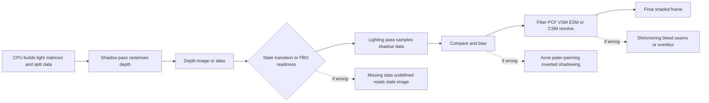
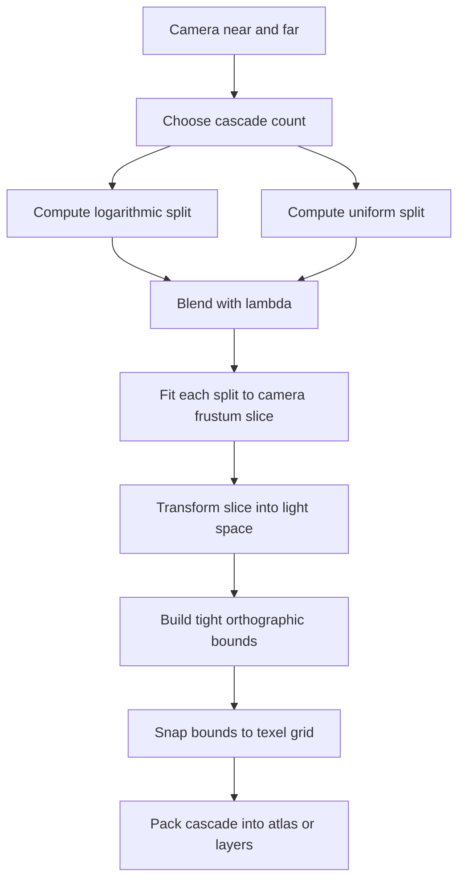
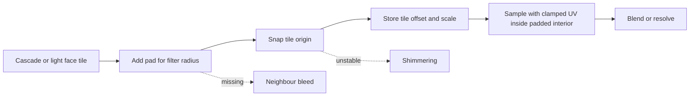

# Checklist-Driven Remediation Plan for OpenGL and Vulkan Shadow Mapping

## Executive summary

This report is a renderer-engineering playbook for diagnosing and fixing shadow mapping defects across OpenGL and Vulkan, with an explicit emphasis on cross-API invariants, state correctness, precision management, and repeatable debugging. The core conclusion is simple: most “mysterious” shadow failures are not caused by filtering or resolution first; they are caused by one of five earlier faults in the chain: wrong light-space transform, wrong depth convention, wrong compare path, wrong render target state, or wrong synchronisation or resource binding. Those must be eliminated before tuning bias, kernel size, or cascade strategy. Khronos’ OpenGL and Vulkan specifications reinforce that the compare path, depth formats, clip-space conventions, and attachment validity are all explicit state, not implementation folklore. citeturn20view0turn20view1turn20view2turn9search3turn23search0

A useful practical anchor comes from the selected GitHub repository, **themuffinator/FnQL**, which exposes the exact sort of dual-backend problem space this report targets. FnQL ships legacy OpenGL, a canonical OpenGL-lineage **GLx** renderer, and a Vulkan backend; it documents dynamic-light shadow maps for GLx/OpenGL-lineage and Vulkan, supports hard shadows, 2×2 PCF, Poisson PCF, and directional cascaded shadow maps, and provides explicit diagnostics such as `glxinfo`, `glxpostprocess`, `glxstaticworld 8`, `r_speeds 7`, and proof scripts for parity and regression sweeps. Its Vulkan backend includes a dedicated `tr_shadows.c` and `csm_shadow.vert` / `csm_shadow.frag`, and the fragment shader explicitly handles both forward and reversed depth conventions when sampling the cascade atlas. That combination makes the repository an excellent model for a disciplined, cross-API shadow debugging workflow. citeturn38view1turn37view0turn38view0turn39view0turn42view0turn43view0turn48view0turn48view1

The highest-confidence remediation sequence is therefore:

1. **Freeze conventions**: define one canonical world→light transform contract, one depth direction, one NDC convention per backend, and one face-culling policy.
2. **Validate render target correctness**: depth format, attachment completeness, viewport, scissor, clear value, compare mode, border clamp, and shadow image sampling capability.
3. **Visualise raw shadow data** before filtering: render the shadow map to screen, inspect light frusta, inspect cascade coverage, and prove that the stored depth is correct.
4. **Fix compare semantics and bias** next: wrong compare op or wrong reversed-Z handling will masquerade as acne, peter-panning, or “inverted shadows”.
5. **Only then tune filtering and partitioning**: PCF/Poisson kernels, VSM/ESM parameters, cascade splits, stabilisation, and atlas packing. citeturn20view0turn20view1turn10search0turn11search1turn11search6turn17search6turn13search16turn23search0

Assumptions for this report: no hard target-hardware constraint, no fixed shadow-map resolution, no fixed scene complexity, and no restriction to forward or deferred rendering. Recommendations therefore bias toward robust desktop-class OpenGL and Vulkan implementations that must survive migration, multiple GPU vendors, and mixed-quality content. citeturn9search3turn24search3turn7search1turn12search11

## Scope, assumptions, and evidence base

The enabled connector set for this task is **GitHub only**. Per your instruction, GitHub-backed findings here are limited to **themuffinator/FnQL**. External corroboration then comes from Khronos OpenGL and Vulkan specifications and reference pages, Vulkan Guide material, original or near-primary shadowing papers and NVIDIA/Intel/AMD vendor material, plus official tool documentation where available. citeturn38view1turn37view0turn20view0turn20view1turn20view2turn9search3turn24search3turn7search1turn12search2turn12search9

Within FnQL, the repository structure is already diagnostic: `code/rendererglx`, `code/renderervk`, and `code/renderercommon` are split out, while the Vulkan backend includes a `shaders` directory and a dedicated `tr_shadows.c`; the OpenGL-lineage path is explicitly positioned as the canonical migration target for the OpenGL family, while Vulkan remains a first-class alternative. That separation strongly suggests that any shadow regression investigation should treat “shared scene logic” and “backend-specific raster/attachment/sampler state” as separate failure domains rather than debugging them together. citeturn39view0turn42view0turn42view1turn42view2

FnQL’s display documentation is especially useful because it encodes the user-facing knobs that typically expose engineering faults. It states that dynamic-light shadow maps are available on GLx/OpenGL-lineage and Vulkan; filtering choices include hard shadows, 2×2 PCF, and four-tap Poisson PCF; resolution is requested per face and then rounded or reduced to fit an atlas; max shadow-casting lights trades crispness for coverage; and multiple bias controls are separated into receiver bias, constant caster depth bias, slope-scaled caster bias, and caster normal bias. That breakdown mirrors the engineering best practice of separating *receiver-side compare problems* from *caster-side rasterisation problems* instead of collapsing everything into one “shadow bias” slider. citeturn35view0turn37view0

FnQL also documents directional **CSM** on GLx and Vulkan, and its Vulkan `csm_shadow.frag` shows manual four-tap depth sampling, explicit atlas UV computation, per-cascade split gating, a reversible forward/reversed compare path, and a receiver-depth reparameterisation that depends on a mode flag. That is a concrete reminder that in real engines the most fragile parts of CSM are usually not the matrix multiplies themselves, but: split ownership, atlas addressing, depth convention, and the exact compare logic selected for the stored depth representation. citeturn35view0turn45view0turn48view0turn48view1

## What FnQL already tells you

The repository’s public documentation and shader inventory support four concrete engineering inferences.

| FnQL observation | Evidence | Why it matters for remediation |
|---|---|---|
| The engine carries **three distinct renderer paths**: legacy OpenGL, canonical GLx, and Vulkan. | README and GLx guide list `opengl`, `glx`, and `vulkan`; source tree separates `rendererglx`, `renderervk`, and `renderercommon`. citeturn38view1turn38view0turn39view0 | Shadow bugs should be bisected into shared scene logic vs backend-specific state. |
| Shadow features are intentionally **backend-parity tested**. | GLx guide provides `glx_runtime_sweep.py --gate rc-parity/rc-proof` and runtime diagnostics. citeturn38view0 | Treat image parity and GPU timing parity as first-class tests, not ad hoc screenshots. |
| Shadow tuning is already decomposed into **filtering, resolution, atlas pressure, and multiple bias classes**. | Display guide enumerates `r_dlightShadowFilter`, `r_dlightShadowResolution`, `r_dlightShadowMaxLights`, receiver bias, constant depth bias, slope bias, and normal bias. citeturn35view0turn37view0 | Your debugging checklist should mirror this decomposition; otherwise one mis-tuned knob hides another fault. |
| Vulkan CSM code explicitly supports **forward and reversed depth** and samples an **atlas** manually. | `csm_shadow.frag` mixes forward and reversed comparisons and derives atlas UVs and receiver depth explicitly. citeturn45view0turn48view1 | Any migration checklist must test compare-op direction, clear value, depth range, and atlas bleed separately. |

FnQL’s GLx guide is also worth emulating as a debugging standard. Its first recommended renderer-bug artefacts are `glxinfo`, `glxmaterial`, `glxpostprocess`, `glxstaticworld 8`, `r_speeds 7`, plus a matching legacy OpenGL screenshot when comparing against GLx. Translating that idea to generic shadow debugging gives a robust minimum artefact set: a capture of the shadow pass, a capture of the lit pass, the light frustum visualisation, the raw shadow map, the depth compare state dump, and a counter summary. citeturn38view0

A further useful implication is architectural. FnQL’s Vulkan backend uses a dedicated `shaders` folder containing `csm_shadow.vert` and `csm_shadow.frag`, while the main backend source includes `tr_shadows.c`. That separation is the right design target for any renderer that wants reproducible shadow debugging: shadow rasterisation, shadow sampling, and backend state setup should each have their own debug toggles and test harnesses. If they are tangled into one “lighting” path, regressions become much harder to isolate. citeturn42view0turn43view0



## Technique taxonomy and selection guidance

The major shadow-map families differ less by “visual quality” in the abstract than by where they spend error budget: raster precision, sample count, prefilterability, temporal stability, or geometry correctness. Williams’ original shadow mapping gives the baseline image-space visibility formulation; PCF converts depth comparisons into a filtered fraction; PSSM/CSM redistribute resolution over view depth; VSM and ESM trade exactness for prefilterability; PCSS or CHS chase contact hardening; and ray-traced or hybrid methods restore geometric correctness where raster maps break down, especially for thin occluders and close-contact detail. citeturn4search11turn13search7turn13search10turn13search5turn13search0turn12search9turn31search8

| Technique | Use it when | Main strength | Main failure mode | Recommendation |
|---|---|---|---|---|
| **Basic shadow map** | You need the simplest hard-shadow baseline or a debug oracle. | Minimal complexity; easiest to validate. | Stair-step aliasing, acne, peter-panning. | Always implement first as the ground-truth debug mode. citeturn4search11turn13search16 |
| **PCF** | You need stable, cheap softening for one or a few lights. | Simple and robust; works with hardware compare samplers. | Expensive for large kernels; still resolution-limited. | Default production path for many real-time lights. Prefer rotated Poisson or separable approximations after correctness is proven. citeturn20view0turn13search7turn35view0 |
| **VSM** | You want prefilterable soft shadows, mip chains, or separable blurs. | Cheap large-radius filtering. | Light leaking; moment instability; precision sensitivity. | Good for broad, soft penumbrae and atlas-friendly filtering if bleed is acceptable or mitigated. citeturn13search5 |
| **ESM** | You want prefilterability with fewer VSM-style leaks in some scenes. | Efficient blur-friendly approximation. | Exponent tuning, overflow or underflow sensitivity, edge energy loss. | Viable when you can afford per-light tuning and exposure-like exponent management. citeturn13search11 |
| **CSM / PSSM** | Directional sun shadows over large scenes or long view distances. | Reallocates texel density to the visible frustum. | Cascade seams, shimmering, unstable splits, atlas bleed. | Baseline for outdoor directional shadows; stabilise cascades before increasing resolution. citeturn13search10turn12search6turn35view0 |
| **Contact-hardening via PCSS / CHS** | You need penumbrae that widen with blocker distance for hero lights. | Better perceptual cues and contact hardening. | Blocker-search cost, temporal instability, noise. | Use sparingly for key lights or on top of filtered maps; do not use as the first shadow path you debug. citeturn13search0turn12search5 |
| **Ray-traced shadows** | You need correctness for thin geometry, foliage, or close contacts and your target tier supports RT. | Best geometric correctness and penumbra modelling. | Cost, denoising complexity, platform variance. | Best for high-end tiers or for hybrid near-field shadows. citeturn12search9turn31search8 |
| **Hybrid raster + ray** | You need scalable wide-area shadows *and* accurate local contacts. | Good cost/quality trade. | Integration complexity and denoiser interaction. | Recommended high-end strategy: raster for distance, RT for near contacts or hero lights. citeturn12search9turn12search13 |

For most engines with no special constraint, the pragmatic stack is:

- **Point and spot lights**: basic map → PCF → optional PCSS for hero lights.
- **Directional light**: CSM/PSSM first, optionally SDSM-style split refinement later.
- **Very soft broad shadows**: VSM or ESM if you need large prefilterable kernels.
- **Close-contact hero quality**: hybrid ray-traced shadows layered over raster shadows. citeturn12search2turn12search6turn13search10turn12search9



## Artifact taxonomy, root causes, and prioritised fixes

The classic shadow-map pathology list is well established: perspective aliasing and projective aliasing arise because image-space sampling density is mismatched to screen-space need; self-shadowing and acne arise from depth quantisation, rasterisation rules, and compare bias; peter-panning is the overcorrection of the same problem; shimmering reflects unstable projections or resampling; light leakage is endemic to moment-based approximations and also to border or atlas bleed; and seams often come from cascades, atlases, or mismatched conventions rather than from the filter itself. citeturn13search16turn13search10turn13search5turn17search6

A practical priority order for fixing these is:

**conventions → target correctness → content correctness → compare correctness → bias → filtering → partitioning → performance tuning**. If you reverse that order, you will almost always waste time. Khronos state rules and FnQL’s split controls both point in that direction. citeturn20view0turn20view1turn20view2turn35view0turn38view0

| Artifact | Dominant root cause | First fix | Second fix | Notes |
|---|---|---|---|---|
| **Shadow acne / self-shadowing** | Rasterised depth equals or slightly exceeds receiver depth due to quantisation and slope. | Verify compare direction and clear value. | Add slope-scaled bias and, if needed, small normal offset. | Do not start by inflating constant bias. citeturn20view1turn14search0turn35view0 |
| **Peter-panning** | Bias too large on caster or receiver. | Reduce constant bias. | Prefer slope-aware and normal-aware bias over brute-force offset. | Usually the “fix” for acne overshot. citeturn20view1turn35view0 |
| **Light leak in VSM/ESM** | Prefiltered approximation loosens occlusion bounds; blur crosses discontinuities. | Reduce kernel radius or exponent. | Add clamp, warp tuning, EVSM-style extensions, or switch back to PCF for critical lights. | A technique trade-off, not just a bug. citeturn13search5turn13search11 |
| **Shimmering / crawling** | Unstable light frusta, unsnapped cascades, moving atlas allocations, changing receiver kernels. | Stabilise cascade bounds to texel grid. | Fix atlas allocation determinism and keep split policy stable under camera motion. | Often more visible than raw aliasing. citeturn13search10turn12search6 |
| **Jagged / pixelated edges** | Insufficient texel density or no filtering. | Prove basic map is correct, then enable PCF. | Increase resolution only after fixing projection fit. | Resolution is rarely the first real fix. citeturn4search11turn13search7turn13search16 |
| **Perspective aliasing** | Near-camera receivers under-sampled by light projection. | Use CSM/PSSM or improved fit. | Consider SDSM-like dynamic partitioning. | Outdoor directional shadows almost always need this. citeturn13search10turn12search2turn12search6 |
| **Projection / projective aliasing** | Receiver plane orientation magnifies texels badly. | Improve light frustum fit. | Use better filtering or alternative projection strategies. | Distinct from perspective aliasing. citeturn13search16 |
| **Cascade seams** | Split mismatch, blend mismatch, different bias or filter per cascade, atlas bleed. | Visualise split indices and blend bands. | Pad atlas tiles, clamp UVs, equalise bias rules, add cross-fade. | Frequently mistaken for “precision” issues. citeturn13search10turn35view0turn45view0 |
| **Atlas bleed** | Sampling outside tile due to filter radius or missing border policy. | Pad each tile by kernel radius. | Clamp UVs and use border colour deliberately. | Especially common with Poisson PCF and CSM atlases. citeturn30search0turn45view0 |
| **Inverted or missing shadows** | Wrong compare op, wrong reversed-Z policy, wrong depth range, wrong clip transform. | Validate NDC convention and compare direction first. | Then validate projection matrix and sampler compare mode. | This must be ruled out before any bias work. citeturn20view0turn10search0turn11search1turn11search6turn45view0 |
| **Whole-pass black or empty map** | Render target incomplete, wrong layout, wrong viewport, wrong descriptor or stale image. | Inspect the raw shadow map. | Validate FBO completeness in GL or barriers/layout/descriptor bindings in VK. | Usually a pass-setup bug, not a shader bug. citeturn20view2turn23search0turn24search1 |



## Ordered debugging checklist

The following lists are reference diagnostics for future shadow regressions,
not open implementation tasks for this completed remediation plan.

### Cross-API invariant checklist

- **Freeze the depth convention per backend**.  
  OpenGL defaults to NDC depth in **[-1, 1]**, while Vulkan defaults to **[0, 1]**. OpenGL can switch to zero-to-one with `glClipControl(..., GL_ZERO_TO_ONE)`, and Vulkan can optionally emulate OpenGL-style negative-one-to-one through `VK_EXT_depth_clip_control`. Do not mix projection matrices and compare logic across those conventions. citeturn10search0turn27search0turn11search1turn11search6

- **Decide whether you use forward depth or reversed-Z**, and apply it everywhere.  
  Reversed-Z materially improves floating-point depth precision, but only if the projection, clear value, depth test, and shadow compare semantics all agree. FnQL’s Vulkan CSM shader explicitly carries both forward and reversed compare paths, which is the right pattern when the engine supports either mode. citeturn17search6turn10search0turn45view0turn48view1

- **Visualise the light frustum or cascade boxes in world space**.  
  Before inspecting filters, prove that the light volume really encloses the intended casters and receivers. CSM/PSSM quality is dominated by frustum fit and stabilisation, not by kernel size alone. citeturn13search10turn12search6

- **Render the raw shadow map to the screen** with false-colour depth if necessary.  
  If the map itself is empty, aliased in the wrong region, or clipped, do not touch sampling code yet. FnQL’s GLx bug-report guidance effectively encourages this kind of pass-by-pass evidence gathering. citeturn38view0

- **Test with one light, one shadow type, one filter, one clear case**.  
  Disable atlases, disable cascades, disable PCF, disable alpha-tested casters, and use a unit debug scene first. Only reintroduce complexity once the baseline is correct. This is the only reliable way to isolate root cause. citeturn24search8turn38view0

### OpenGL checklist

- **Check FBO completeness** for the depth-only shadow target.  
  The attachment must be depth-renderable, dimensions must be valid, and the framebuffer must be complete before rendering. citeturn20view2

- **Use a shadow-appropriate depth format**.  
  `DEPTH_COMPONENT16`, `DEPTH_COMPONENT24`, `DEPTH_COMPONENT32F`, and `DEPTH24_STENCIL8` are standard sized formats; prefer `DEPTH_COMPONENT24` for a conservative baseline and `DEPTH_COMPONENT32F` if you are deliberately using reversed-Z or need extra numeric headroom. citeturn20view3

- **Set compare state deliberately**.  
  If the texture’s base internal format is depth and `TEXTURE_COMPARE_MODE` is `COMPARE_REF_TO_TEXTURE`, the sampler returns compare results rather than raw depth; if compare mode is `NONE`, it returns raw depth. Filtering on shadow samplers may compare multiple depth values and return a value proportional to compare passes or failures. citeturn20view0turn14search1turn14search7

- **Verify viewport and scissor** exactly match the shadow map region.  
  A stale window-sized viewport on a small FBO is still one of the easiest ways to create apparently “random” shadows. citeturn27search6

- **Use `glPolygonOffset` knowingly, not superstitiously**.  
  The effective offset depends on slope (`factor`) and a depth-resolution term (`units`), and OpenGL defines the offset as `m * factor + r * units` with optional clamp behaviour. Small, positive, slope-aware offsets are usually better than large constants. citeturn20view1turn14search0

- **If you port from Vulkan or D3D, validate `glClipControl` up front**.  
  `GL_ZERO_TO_ONE` changes the clip-volume and window-depth transform, and `GL_UPPER_LEFT` affects the effective Y convention and face-culling sense. If you switch clip control without updating matrices or culling assumptions, shadows often fail in ways that look like depth bugs. citeturn10search0turn29search5

- **Border/clamp policy must match your atlas or projection policy**.  
  If you sample outside a tile or projection footprint and intend “fully lit”, clamp-to-border with a lit border colour can be correct; if you intend “stay in tile”, clamp-to-edge and explicit UV clamping are safer. Choose one policy consciously. citeturn30search0

### Vulkan checklist

- **Choose the depth format by querying support, not by hope**.  
  Vulkan requires format support to be queried per implementation with `vkGetPhysicalDeviceFormatProperties`. The guide explicitly notes that only `VK_FORMAT_D16_UNORM` and `VK_FORMAT_D32_SFLOAT` are required to support readback via sampling or blit; `D24` variants are not equally guaranteed across devices. citeturn22search1turn26search5turn25search2

- **Validate the sampler compare path**.  
  In Vulkan, depth compare is a sampler feature, not just a shader convention. Ensure `VkSamplerCreateInfo.compareEnable` and `compareOp` match the stored depth convention; if you are doing manual PCF, use a regular sampled image and compare in shader instead. citeturn2search4turn11search6

- **Prove image layout and synchronisation correctness**.  
  If the first draw writes the depth attachment and a later pass samples it for shadows, you need the correct execution and memory dependency, plus the correct layout transition from attachment-optimal to read-only. Khronos’ synchronisation examples provide the exact pattern for the shadow-map case. citeturn23search0

- **Validate descriptor contents, not just descriptor allocation**.  
  The combined image sampler must point to the correct image view, with the correct depth aspect, expected layout, and expected compare state. Validation layers help here, but only if enabled early. citeturn24search1turn24search4turn24search9

- **Handle viewport and origin conventions explicitly**.  
  `VkViewport.height` may be negative to flip Y, but you must also adjust the viewport origin accordingly. If you do not, or if you forget to check `frontFace` after changing your winding convention, cascades and culling can appear broken. citeturn11search10turn29search1turn29search19

- **Be explicit about OpenGL-style depth emulation** only when needed.  
  Vulkan defaults to [0,1]; `VK_EXT_depth_clip_control` exists for efficient OpenGL layering and allows negative-one-to-one depth clipping when enabled. Use it only if your migration plan truly needs it. citeturn11search1turn11search3

- **Turn on validation, synchronisation validation, and debug utils from day one**.  
  The Vulkan Guide is unequivocal that validation layers should be enabled during development; `VK_EXT_debug_utils` should be used for object naming and messages; and best-practices validation is separately available. citeturn24search1turn24search4turn24search12turn24search22

### Cross-API migration pitfalls checklist

| Pitfall | OpenGL side | Vulkan side | Fix |
|---|---|---|---|
| NDC depth mismatch | Default **[-1,1]** | Default **[0,1]** | Standardise matrices or use `glClipControl` / `VK_EXT_depth_clip_control` deliberately. citeturn10search0turn11search1 |
| Y origin mismatch | Lower-left by default | Usually solved with negative viewport height or matrix/shader flip | Pick one policy for all shadow and main passes. citeturn29search1turn10search0 |
| Culling after origin flip | `GL_UPPER_LEFT` affects winding sense | Negative viewport height affects clip-to-framebuffer mapping; `frontFace` still matters | Re-validate front-face and cull mode after any origin change. citeturn29search5turn29search19 |
| Hidden vs explicit synchronisation | Driver-managed | Application-managed | In Vulkan, always prove the attachment→sample transition with explicit barriers or subpass dependencies. citeturn23search0turn24search16 |
| Shadow compare semantics | `TEXTURE_COMPARE_MODE` on texture or sampler | `compareEnable`/`compareOp` in sampler | Log and dump compare state per shadow pass. citeturn20view0turn2search4 |
| Atlas sampling outside tile | Border/clamp bugs easy to hide | Layout and descriptor bugs can resemble bleed | Pad tiles, clamp UVs, and test single-light no-atlas mode first. citeturn30search0turn45view0 |

## Reference implementation patterns and minimal repros

The patterns below are intentionally small and conservative. They are not “engine architecture” code; they are correctness anchors.

### OpenGL depth rendering and compare-sampler setup

The core OpenGL rules are: use a depth-renderable format; make the FBO complete; if the texture compare mode is off you will read raw depth, while if it is on you will read compare results; and polygon offset is the standard slope-aware caster bias tool. citeturn20view2turn20view3turn20view0turn20view1

```cpp
// OpenGL shadow map setup
GLuint shadowFbo = 0, shadowTex = 0;
glCreateFramebuffers(1, &shadowFbo);
glCreateTextures(GL_TEXTURE_2D, 1, &shadowTex);

glTextureStorage2D(shadowTex, 1, GL_DEPTH_COMPONENT24, shadowW, shadowH);
glTextureParameteri(shadowTex, GL_TEXTURE_MIN_FILTER, GL_LINEAR);
glTextureParameteri(shadowTex, GL_TEXTURE_MAG_FILTER, GL_LINEAR);
glTextureParameteri(shadowTex, GL_TEXTURE_WRAP_S, GL_CLAMP_TO_BORDER);
glTextureParameteri(shadowTex, GL_TEXTURE_WRAP_T, GL_CLAMP_TO_BORDER);

const float litBorder[4] = {1.f, 1.f, 1.f, 1.f};
glTextureParameterfv(shadowTex, GL_TEXTURE_BORDER_COLOR, litBorder);

// Compare sampler path for hardware PCF-style sampling
glTextureParameteri(shadowTex, GL_TEXTURE_COMPARE_MODE, GL_COMPARE_REF_TO_TEXTURE);
glTextureParameteri(shadowTex, GL_TEXTURE_COMPARE_FUNC, GL_LEQUAL);

glNamedFramebufferTexture(shadowFbo, GL_DEPTH_ATTACHMENT, shadowTex, 0);
glNamedFramebufferDrawBuffer(shadowFbo, GL_NONE);
glNamedFramebufferReadBuffer(shadowFbo, GL_NONE);

if (glCheckNamedFramebufferStatus(shadowFbo, GL_FRAMEBUFFER) != GL_FRAMEBUFFER_COMPLETE) {
    // fail hard
}
```

```glsl
// OpenGL GLSL hard shadow / hardware-compare sampler
layout(binding = 4) uniform sampler2DShadow uShadow;

float hardShadow(vec4 lightClip)
{
    vec3 ndc = lightClip.xyz / lightClip.w;          // [-1,1] if using default GL clip depth
    vec3 uvz = ndc * 0.5 + 0.5;                      // -> [0,1]
    return texture(uShadow, uvz);                    // returns visibility
}
```

```glsl
// OpenGL GLSL manual PCF
layout(binding = 4) uniform sampler2D uShadowRaw;

float pcfShadow(vec4 lightClip, vec2 shadowSize, float bias)
{
    vec3 ndc = lightClip.xyz / lightClip.w;
    vec3 uvz = ndc * 0.5 + 0.5;

    if (any(lessThan(uvz.xy, vec2(0.0))) || any(greaterThan(uvz.xy, vec2(1.0))))
        return 1.0;

    vec2 texel = 1.0 / shadowSize;
    float vis = 0.0;
    for (int y = -1; y <= 1; ++y)
    for (int x = -1; x <= 1; ++x) {
        float z = texture(uShadowRaw, uvz.xy + vec2(x, y) * texel).r;
        vis += (uvz.z - bias <= z) ? 1.0 : 0.0;
    }
    return vis / 9.0;
}
```

### OpenGL VSM and ESM patterns

These techniques are only worth using after the basic path is correct; otherwise they hide the real bug behind a “soft” failure. VSM is prefilterable but prone to leak; ESM is also blur-friendly but sensitive to exponent choice. citeturn13search5turn13search11

```glsl
// VSM shadow-map encode pass
layout(location = 0) out vec2 outMoments;

void main()
{
    float d = gl_FragCoord.z;
    float dx = dFdx(d);
    float dy = dFdy(d);
    outMoments = vec2(d, d * d + 0.25 * (dx * dx + dy * dy));
}
```

```glsl
// VSM sample
float chebyshevUpperBound(vec2 moments, float t)
{
    if (t <= moments.x) return 1.0;
    float variance = max(moments.y - moments.x * moments.x, 1e-6);
    float d = t - moments.x;
    return variance / (variance + d * d);
}
```

```glsl
// ESM encode/sample sketch
float esmEncode(float depth, float k) { return exp(k * depth); }
float esmShadow(float receiverDepth, float avgExpDepth, float k)
{
    return clamp(exp(-k * receiverDepth) * avgExpDepth, 0.0, 1.0);
}
```

### Vulkan depth image, sampler, and barrier pattern

The Vulkan side must prove three things separately: the chosen depth format is query-supported; the image transitions from attachment use to shader-read use correctly; and the sampler compare path matches the stored depth convention. Khronos provides explicit examples for the depth-attachment-to-fragment-sampler dependency. citeturn22search1turn25search2turn26search5turn23search0

```cpp
// Vulkan: choose a sampleable depth format conservatively
VkFormat shadowFormat = VK_FORMAT_D32_SFLOAT; // or VK_FORMAT_D16_UNORM if appropriate

// Sampler for compare-sampler PCF path
VkSamplerCreateInfo sci{VK_STRUCTURE_TYPE_SAMPLER_CREATE_INFO};
sci.minFilter = VK_FILTER_LINEAR;
sci.magFilter = VK_FILTER_LINEAR;
sci.mipmapMode = VK_SAMPLER_MIPMAP_MODE_NEAREST;
sci.addressModeU = VK_SAMPLER_ADDRESS_MODE_CLAMP_TO_BORDER;
sci.addressModeV = VK_SAMPLER_ADDRESS_MODE_CLAMP_TO_BORDER;
sci.addressModeW = VK_SAMPLER_ADDRESS_MODE_CLAMP_TO_BORDER;
sci.borderColor  = VK_BORDER_COLOR_FLOAT_OPAQUE_WHITE;
sci.compareEnable = VK_TRUE;
sci.compareOp     = VK_COMPARE_OP_LESS_OR_EQUAL; // reverse if using reversed-Z
```

```cpp
// Vulkan: after shadow pass, before lighting pass samples the map
VkImageMemoryBarrier2 barrier{VK_STRUCTURE_TYPE_IMAGE_MEMORY_BARRIER_2};
barrier.srcStageMask  = VK_PIPELINE_STAGE_2_EARLY_FRAGMENT_TESTS_BIT |
                        VK_PIPELINE_STAGE_2_LATE_FRAGMENT_TESTS_BIT;
barrier.srcAccessMask = VK_ACCESS_2_DEPTH_STENCIL_ATTACHMENT_WRITE_BIT;
barrier.dstStageMask  = VK_PIPELINE_STAGE_2_FRAGMENT_SHADER_BIT;
barrier.dstAccessMask = VK_ACCESS_2_SHADER_READ_BIT;
barrier.oldLayout     = VK_IMAGE_LAYOUT_ATTACHMENT_OPTIMAL;
barrier.newLayout     = VK_IMAGE_LAYOUT_READ_ONLY_OPTIMAL;
barrier.image         = shadowImage;
barrier.subresourceRange.aspectMask = VK_IMAGE_ASPECT_DEPTH_BIT;
barrier.subresourceRange.levelCount = 1;
barrier.subresourceRange.layerCount = 1;

VkDependencyInfo dep{VK_STRUCTURE_TYPE_DEPENDENCY_INFO};
dep.imageMemoryBarrierCount = 1;
dep.pImageMemoryBarriers = &barrier;
vkCmdPipelineBarrier2(cmd, &dep);
```

```glsl
// Vulkan GLSL compare-sampler path
layout(set = 2, binding = 0) uniform sampler2DShadow uShadow;

float hardShadowVk(vec4 lightClipZeroToOne)
{
    vec3 uvz = lightClipZeroToOne.xyz / lightClipZeroToOne.w; // already 0..1 convention
    return texture(uShadow, uvz);
}
```

```glsl
// Vulkan GLSL manual PCF path
layout(set = 2, binding = 0) uniform sampler2D uShadowRaw;

float pcfShadowVk(vec3 uvz, vec2 texel, float bias)
{
    float vis = 0.0;
    for (int y = -1; y <= 1; ++y)
    for (int x = -1; x <= 1; ++x) {
        float z = texture(uShadowRaw, uvz.xy + vec2(x, y) * texel).r;
        vis += (uvz.z - bias <= z) ? 1.0 : 0.0;
    }
    return vis / 9.0;
}
```

```hlsl
// HLSL pattern commonly cross-compiled to SPIR-V for Vulkan
Texture2D<float> ShadowTex    : register(t0);
SamplerComparisonState ShadowSamp : register(s0);

float HardShadow(float3 uvz)
{
    return ShadowTex.SampleCmpLevelZero(ShadowSamp, uvz.xy, uvz.z);
}
```

A representative **real-engine Vulkan CSM pattern** already exists in FnQL: the vertex shader pushes `mvp`, reconstructs world position and view distance, and the fragment shader computes local light coordinates, rejects out-of-range fragments, derives atlas UVs, gathers four depth samples, and mixes forward or reversed compare logic depending on a mode flag. That is a sound architecture when you want exact control over atlas packing and reversed-Z semantics rather than relying on opaque compare-sampler behaviour. citeturn48view0turn48view1turn45view0

### Minimal repro scenes and verification sequence

Use these five scenes in this order.

| Scene | Purpose | Pass criteria |
|---|---|---|
| **Single cube over plane** | Baseline correctness for one shadow-casting directional or spot light. | Hard shadow silhouette matches geometry exactly before filtering. |
| **Thin wall and receiver behind it** | Light leak and peter-panning test. | No visible detached shadow; VSM/ESM leak measured against hard-shadow baseline. |
| **Grazing-angle tilted quad** | Slope-bias stress test. | Acne disappears with minimal slope bias and no obvious hover gap. |
| **Camera dolly across cascade boundaries** | CSM seam and shimmer test. | Stable shadow edges with no popping or discontinuous penumbra width. |
| **Atlas stress with multiple lights** | Tile bleed and allocation determinism test. | No neighbour bleed at tile edges; lights keep deterministic allocation under camera motion. |

Manual capture verification for future visual QA should proceed as follows:

- Run **hard-shadow baseline**.
- Capture the **raw depth map**.
- Capture the **lit pass without PCF**.
- Enable **PCF only**.
- Add **atlasing** or **cascades**.
- Add **reversed-Z** if used.
- Add **soft-shadow approximations** only after all above are stable. citeturn13search16turn13search10turn23search0turn38view0

## Performance, validation, and concise remediation plan

Shadow-map cost is usually dominated by one of three things: extra raster work in the shadow pass, bandwidth and cache pressure during filtered lookup, or pass orchestration overhead such as barriers, layout transitions, and redundant state changes. AMD notes that terrain shadow rendering often becomes front-end or triangle-throughput limited; Intel’s GPA material emphasises sampler and shader bottleneck analysis; and NVIDIA Nsight Graphics provides event inspection, shader profiling, and GPU performance-marker analysis for OpenGL and Vulkan. citeturn12search1turn12search7turn12search11turn7search1turn7search7

A robust tool stack is therefore:

| Tool | Best use | Key validation target |
|---|---|---|
| **Khronos validation layers** | Vulkan correctness during development | Descriptors, layouts, synchronisation, usage errors. citeturn24search1turn24search9turn24search16 |
| **`VK_EXT_debug_utils`** | Naming resources and collecting messages | Make shadow images, views, framebuffers, and pipelines readable in captures. citeturn24search4turn9search1 |
| **Nsight Graphics** | Event inspection, GPU Trace, shader profiling | Shadow-pass cost, shader stalls, bad overdraw, pass scheduling. citeturn7search1turn7search7 |
| **Intel GPA** | Cross-vendor frame capture and sampler or shader diagnosis | Sampler pressure, texture access, platform-specific bottlenecks. citeturn12search3turn12search11 |
| **RenderDoc** | General frame capture and pass-by-pass inspection | Raw shadow map, viewport, depth attachment content, descriptor sanity. |
| **FnQL parity scripts and diagnostics** | Engine-specific proof workflow | Backend parity, FBO/post-process state, GPU frame time. citeturn38view0 |

Recommended future automated tests for a renderer codebase:

- **Golden-image tests** for the five minimal repro scenes, with hard-shadow and filtered-shadow baselines.
- **Matrix-contract unit tests** for world→light, frustum slice extraction, cascade snapping, and atlas UV reconstruction.
- **Depth-direction tests** that assert correct clear values, compare ops, and reversed-Z toggles in both APIs.
- **State-dump smoke tests** that fail CI if shadow compare mode, border clamp, viewport, or depth formats differ from the approved configuration.
- **Capture-on-failure workflow** for one canonical scene, storing a GPU frame capture and shadow debug overlay on regression.

### Final concise actionable remediation plan

1. **Create one “shadow correctness” mode** in both APIs: single light, hard shadow, no atlas, no cascade, no reversed-Z, no alpha-tested casters.
2. **Prove raw depth output** and dump light-space matrices and viewports every frame.
3. **Normalise coordinate conventions**: write down the backend contract for NDC depth, Y orientation, face winding, and depth clear and compare values.
4. **Implement explicit bias separation**: receiver bias, slope bias, constant caster bias, optional normal bias. Never ship a single monolithic bias.
5. **Reintroduce filtering**: hardware compare PCF first if available; manual PCF next only if you need custom kernels or atlas control.
6. **Reintroduce cascades**: start with stable texel-snapped CSM, then refine split placement; only move to SDSM-style dynamic partitioning if needed.
7. **Reintroduce atlasing**: add tile padding equal to the maximum filter radius, clamp UVs inside tile interiors, and verify deterministic allocations.
8. **Only after correctness is stable, profile**: use Nsight, Intel GPA, validation, and frame captures to reduce raster cost, sampler cost, and transition overhead. citeturn13search10turn23search0turn24search3turn7search1turn12search11turn38view0

### Implementation tracking checklist

Status: complete. All actionable remediation rounds below have been implemented
and verified in the local source/runtime checks for this plan.

- [x] Round 1: Add `r_shadowCorrectness` and force the minimal point-light, hard-filtered, no-spot/no-CSM/no-alpha-test path in GLx and Vulkan.
- [x] Round 2: Emit per-frame correctness evidence for point-shadow depth output, including atlas publication, viewport/scissor, cache/render status, and full light-space projection/model matrices.
- [x] Round 3: Normalize and document coordinate conventions for GLx and Vulkan: atlas tile origin, renderer `viewParms_t` origin, API-space viewport origin, sampler Y rules, clip-space Y conversion, depth clear, and compare direction.
- [x] Round 4: Implement explicit bias separation verification and tighten source/runtime tests around receiver bias, constant caster bias, slope bias, and normal bias.
- [x] Round 5: Reintroduce and verify filtering paths after the hard-shadow oracle is stable.
- [x] Round 6: Reintroduce and verify cascades from the documented coordinate contract.
- [x] Round 7: Reintroduce and verify atlas pressure, padding, UV clamping, and deterministic allocation.
- [x] Round 8: Profile and tune only after correctness evidence is stable.

### Open questions and limitations

GitHub-backed investigation was intentionally restricted to **themuffinator/FnQL**. Within that repo, the public documentation, file layout, and the exposed Vulkan CSM shader were sufficient to ground backend-parity and reversed-depth observations, but I did not exhaustively inspect every shadow-related source file in `tr_shadows.c` across all backends. Where this report recommends broader implementation patterns beyond those visible files, it does so by synthesising Khronos specifications, recognised papers, and vendor guidance rather than by claiming exhaustive repository-code coverage. citeturn38view1turn38view0turn42view0turn42view1turn48view0turn48view1
