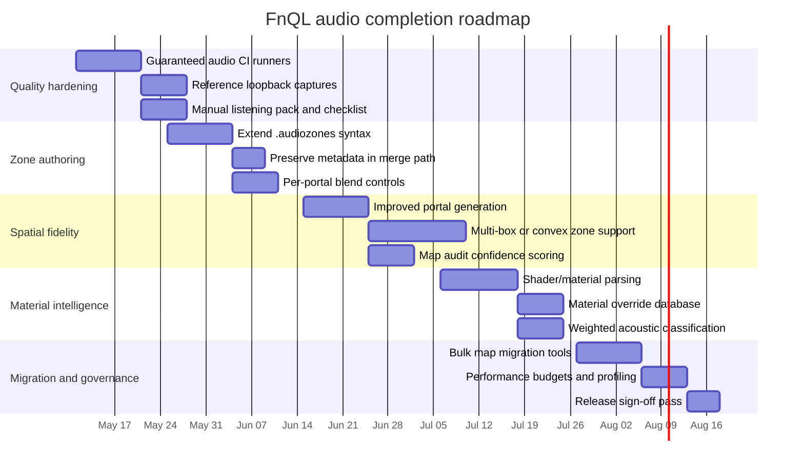

# FnQL Audio Implementation Review

## Executive summary

The new audio system in urlthemuffinator/FnQLhttps://github.com/themuffinator/FnQL is no longer a tentative prototype. On the available evidence, it has moved well beyond the original plan in several important areas: the client now exposes a modern OpenAL-based path alongside the legacy backend, first-class HRTF and output-mode controls, configurable OpenAL distance models, native multi-channel playback paths up to 7.1, UHJ and first-order B-Format acceptance, environment reverb and occlusion, device recovery, deterministic loopback tests, and an audio-zone sidecar compiler/runtime with audit tooling. In short, the repository substantially implements the plan’s core architectural direction and, in several places, exceeds it. fileciteturn18file1 fileciteturn14file2 fileciteturn14file0 fileciteturn14file1 fileciteturn16file0 fileciteturn16file1 fileciteturn16file2 fileciteturn17file0 fileciteturn17file1 fileciteturn17file2 fileciteturn18file0

The strongest conclusion is that the largest remaining deficits are no longer in the headline HRTF/spatial-audio feature set. They are in the “last mile” quality disciplines that determine whether the system becomes the best version of itself: spatial fidelity of the zone compiler, richness of zone authoring metadata, depth of material analysis, explicit compatibility/migration tooling for large map and mod estates, and stronger CI/perceptual validation so that audio quality is protected over time, not just implemented once. fileciteturn18file1 fileciteturn17file0 fileciteturn17file1 fileciteturn18file0

That matters because the plan explicitly aimed for high quality across mixing, spatial audio, surround, backward compatibility, support for older and newer systems, and a “robust and high-quality zone map system” driven by material analysis. The repository is strong on backend capability, device/output coverage, and fallback behaviour; it is only partial on the final zone-authoring and acoustic-classification ambitions implied by that wording. fileciteturn18file1 fileciteturn18file0

From an external architectural standpoint, the choice to stay on urlOpenAL Softturn2search2 remains sound. OpenAL Soft officially supports HRTF, EFX, streaming, loopback, multi-channel formats, B-Format, and UHJ output paths, while the OpenAL 1.1 model provides standard distance attenuation semantics. More ambitious stacks such as urlSteam Audioturn2search3 and urlResonance Audioturn2search1 offer richer simulation models, but they also imply a heavier integration and content/tooling burden than the current project scope appears to want. citeturn2search2turn2search47turn2search3turn2search1

## What the plan required

The plan in urldocs/plans/modern-audio-hrtf-7-5-26.mdhttps://github.com/themuffinator/FnQL/blob/main/docs/plans/modern-audio-hrtf-7-5-26.md set out a clear direction: retain the classic backend contract and fallback behaviour, but modernise the runtime around proper OpenAL-driven positional audio, HRTF, output/device controls, improved distance modelling, better diagnostics, modern streaming, optional map-zone sidecars, and deterministic test coverage. It also framed the zone system as optional for gameplay but valuable for higher-quality environmental transitions on existing maps. fileciteturn18file1

The plan’s intent was not merely “get OpenAL working.” It explicitly aimed to replace pseudo-spatial behaviour with true 3D source rendering where appropriate, preserve direct handling for stereo/UI/music paths, expose cvars for modern OpenAL capabilities, and add automated validation for HRTF state, filter behaviour, distance attenuation, and fallback logic. It also proposed a built-in zone compiler as an in-repo tool rather than an external dependency. fileciteturn18file1

That direction aligns with the external technical landscape. OpenAL Soft’s official feature set covers precisely the capabilities the plan targets: 3D sources, distance attenuation, doppler, EFX, streaming, multi-channel formats, loopback devices, HRTF, UHJ, and B-Format output. The OpenAL spec also gives the project a standard vocabulary for inverse, linear, and exponential distance models rather than bespoke attenuation curves. citeturn2search2turn2search47turn2search0

## Planned versus implemented

The repository now implements most of the planned surface area, and a few important pieces go beyond it.

| Planned item | Current state | Evidence | Assessment |
|---|---|---|---|
| OpenAL default backend with legacy fallback | Implemented | `snd_main.c`, `docs/AUDIO.md` fileciteturn14file2 fileciteturn18file0 | Strong and user-visible |
| User-facing device, HRTF, output-mode, distance-model, source-count and limiter controls | Implemented | `snd_main.c`, `AudioSystemShared.inl`, `docs/AUDIO.md` fileciteturn14file2 fileciteturn14file0 fileciteturn18file0 | Matches the plan |
| True modern spatial pipeline for world audio | Implemented in practice, with diagnostics and tests | `docs/AUDIO.md`, `openal_loopback_tests.cpp` fileciteturn18file0 fileciteturn16file0 | Supported by runtime docs and deterministic tests |
| Reverb, occlusion, tone shaping | Implemented | `AudioSystemShared.inl`, `docs/AUDIO.md`, loopback filter tests fileciteturn14file0 fileciteturn18file0 fileciteturn16file0 | Meets plan, with room to refine tuning |
| Surround and direct-channel handling | Implemented and broader than plan | `AudioSystemShared.inl`, `AudioSystemStreams.inl`, loopback speaker-layout tests fileciteturn14file0 fileciteturn14file1 fileciteturn16file0 | Strongest area; includes quad, 5.1, 6.1, 7.1 |
| UHJ and B-Format paths | Implemented | `AudioSystemShared.inl`, loopback encoded-sound-field tests, docs fileciteturn14file0 fileciteturn16file0 fileciteturn18file0 | Exceeds original minimum scope |
| Device recovery and diagnostics | Implemented | `recovery_policy_tests.cpp`, `docs/AUDIO.md` fileciteturn16file2 fileciteturn18file0 | Beyond the original plan’s baseline |
| Audio-zone sidecar runtime | Implemented | `AudioSystemShared.inl`, `AudioZoneRuntime.h`, `docs/AUDIO.md` fileciteturn14file0 fileciteturn17file1 fileciteturn18file0 | Works and degrades safely |
| Audio-zone compiler and audit tool | Implemented | `audiozonesc.cpp`, tool README, CMake target fileciteturn17file0 fileciteturn15file2 fileciteturn15file1 | Good first-pass tooling |
| Backward compatibility for mods/assets/maps | Mostly implemented | classic sound interface, optional zones, version-1 sidecars accepted, stereo direct path defaults fileciteturn15file0 fileciteturn17file1 fileciteturn18file0 | Good, but not yet fully industrialised |
| Deterministic test coverage | Implemented, but not complete for perceptual QA | CMake, zone/runtime/recovery/loopback tests fileciteturn15file1 fileciteturn16file0 fileciteturn16file1 fileciteturn16file2 | Strong functional base, weaker perceptual guardrails |

The implementation is especially strong in three areas. First, the runtime/control plane is coherent: `snd_main.c` exposes modern cvars and command hooks, and `docs/AUDIO.md` documents them thoroughly, including fallback semantics and debugging workflows. Second, the multi-channel/output path is substantially better than many “modernised old-engine” audio rewrites: the code explicitly recognises mono, stereo, quad, 5.1, 6.1, and 7.1 PCM layouts, and the loopback suite validates speaker ordering, isolation, and buffer acceptance. Third, the project has already done the hard work of making the zone system optional and fail-safe, which is exactly the right compatibility posture for an engine serving existing entity["video_game","Quake III Arena","1999 PC arena shooter"] content and mods. fileciteturn14file0 fileciteturn14file1 fileciteturn14file2 fileciteturn16file0 fileciteturn17file1 fileciteturn18file0

The principal area where the repository does **not** yet fully satisfy the ambition of the plan is the zone/material system. It exists, it works, and it is thoughtfully designed, but it still relies on axis-aligned boxes, heuristic material labelling, and constrained portal generation. That is “good and useful.” It is not yet “as elegant and spatially correct as it can possibly be.” fileciteturn17file0 fileciteturn17file1 fileciteturn17file2

## Gaps, partial features and compatibility risks

The table below focuses on the highest-confidence gaps that remain after comparing the plan to the current implementation.

| Gap | Impact | Root cause and repository references | Suggested fix | Effort | Priority |
|---|---|---|---|---|---|
| Hand-authored zone text cannot express v2 metadata such as material class, flags, or explicit portals | Limits maintainers’ ability to hand-tune acoustics and transitions; overrides can only alter coarse zone parameters | The text parser accepts bounds, preset, gain/filter/transition/priority fields only; the runtime format supports richer metadata, but the text path does not expose it. Overrides merged from BSP are also stripped to unknown material/no portals. fileciteturn17file0 fileciteturn17file2 | Extend `.audiozones` syntax with `material`, `flags`, and `portal {}` blocks; preserve override metadata during `--merge`; add validation rules and docs | M | High |
| Zone geometry is restricted to axis-aligned boxes | Acoustic boundaries will be spatially wrong in diagonals, stairs, irregular atria, curved spaces, and narrow connectors; blend zones can leak into adjacent playable space | The format and runtime store only mins/maxs AABBs, and generation expands/merges leaves into boxes. fileciteturn17file0 fileciteturn17file1 fileciteturn17file2 | Add composite zones or convex/polyhedral zones; if format complexity must stay low, support multi-box zones and brush/leaf references in the compiler | L | High |
| Material analysis is heuristic rather than authoritative | Wrong material classes can lead to weak or misleading reverb/occlusion tuning on custom maps; this falls short of “full use of material analysis” | `AnalyzeLeafAcoustics` relies on contents flags, surface flags, and shader-name token heuristics such as `stone`, `metal`, `grass`, `sky`. It does not parse shader scripts or use explicit acoustic metadata. fileciteturn17file0 | Parse shader scripts where present; support a material-override mapping file; weight votes by visible/shared surface area instead of token hits alone; add confidence reporting to `--audit` | M/L | High |
| Portal generation is conservative and may miss valid transitions | Zone crossfades may be absent or too coarse even where two spaces are obviously connected | Generated portals are built only between adjacent generated zones and are skipped when preset and material both differ; openness is based on simple overlap/face-area heuristics. fileciteturn17file0 | Build portals independently of preset/material equality; optionally use BSP adjacency/visibility instead of box-only heuristics; allow authored portals in text format | M | High |
| Functional tests are strong, but perceptual regression testing is weak | Mechanical correctness may pass while the mix gets worse for players | The repo has runtime, recovery, and loopback tests, but no reference renders, listening-test protocol, or scene-level perceptual baselines. fileciteturn15file1 fileciteturn16file0 fileciteturn16file1 fileciteturn16file2 | Add gold-master loopback captures for representative scenes, scripted listening packs, and an ABX/manual review checklist before release | M | High |
| CI can legally skip advanced audio validation | Audio improvements may merge without actually being exercised on some runners | `fnql_audio_loopback_tests` is configured with a skip return code, which is appropriate for portability but weak as a permanent quality gate. fileciteturn15file1 fileciteturn16file0 | Add at least one guaranteed OpenAL Soft-capable runner on Linux and Windows; publish capability matrices and test logs as CI artefacts | S/M | High |
| Asset metadata for UHJ/B-Format is inferred from filename tags | Fragile naming-based detection can miss valid assets or accidentally classify names with matching substrings | Encoded sound-field formats are inferred from filename tags such as `uhj`, `bformat2d`, `ambisonic`. fileciteturn14file0 fileciteturn18file0 | Add explicit asset metadata support where feasible, or at minimum an asset-lint tool that reports inferred format decisions before shipping | M | Medium |
| Zone blending constants are global and fixed | One portal-blend distance/curve may not fit all maps or movement speeds | Runtime blend distance, minimum blend, and max blend are fixed constants. fileciteturn17file1 | Permit per-zone or per-portal blend distance/curve tuning, with safe defaults and compiler validation | S/M | Medium |
| Compatibility and migration are documented, but not yet industrialised for bulk map estates | Existing mods/maps will mostly work, but maintainers lack a polished migration pipeline for large libraries | The guide explains behaviour and the compiler offers `--from-bsp`, `--merge`, `--audit`, and `--strict`, but there is no built-in bulk sweep/report workflow across map collections. fileciteturn15file2 fileciteturn17file0 fileciteturn18file0 | Add repo scripts to batch-generate `.azb` files, run `--audit --strict`, and emit HTML/CSV reports of warnings, material confidence, overlaps and missing portals | S/M | Medium |
| Platform support posture is pragmatic rather than explicitly versioned | The system appears capable across modern OpenAL-capable machines and legacy fallback, but older-system guarantees are not formalised | The project preserves the legacy path and packages the Windows OpenAL DLL when available, but no explicit support matrix for old OS/hardware classes is documented in the audio implementation itself. fileciteturn15file1 fileciteturn14file2 fileciteturn18file0 | Define supported tiers: “modern OpenAL path”, “legacy fallback path”, and “best effort unsupported”; test both audio backends under low-rate/low-source conditions | M | Medium |

The compatibility risks are manageable rather than alarming. The project’s default posture is conservative: stereo world-sample spatialisation is opt-in, authored stereo/music/raw paths remain direct by default, missing or invalid `.azb` files are ignored safely, and the runtime still accepts legacy sidecars. The biggest risk is therefore not breakage-by-default, but silent quality drift in maps or assets that deserve more explicit metadata and profiling discipline. fileciteturn14file0 fileciteturn14file2 fileciteturn16file1 fileciteturn18file0

## Roadmap to the best possible audio system

The right roadmap is evolutionary, not revolutionary. The current architecture is already aligned with what the underlying APIs are good at. OpenAL Soft officially supports the feature family this repository is now using, while the wider ecosystem shows that deeper simulation stacks are available if the project later decides it wants SOFA-based custom HRTFs, richer propagation, or HOA-style rendering. For now, the best return is to harden the current OpenAL-first path rather than replace it. citeturn2search2turn2search47turn2search3turn2search1

### Milestone roadmap

| Milestone | Scope | Deliverables |
|---|---|---|
| Audio quality hardening | Protect current wins | CI runners that always execute audio tests; reference loopback captures; release checklist for headphones/speakers/surround |
| Zone authoring upgrade | Make the zone system truly production-grade | Extended `.audiozones` syntax for material/flags/portals; merge-preserving metadata; per-portal tuning |
| Spatial fidelity upgrade | Reduce geometric artefacts | Multi-box or convex zone support; improved portal detection; stronger generated-zone confidence metrics |
| Material intelligence upgrade | Make zone generation materially credible on heterogeneous maps | Shader parsing, override maps, weighted material voting, `--audit` confidence and anomaly scoring |
| Compatibility and migration toolkit | Smooth adoption across existing content | Bulk BSP-to-AZB sweep scripts, strict audits, generated reports, conservative fallback presets for legacy mods |
| Profiling and release governance | Keep the system excellent over time | Audio performance budgets, map scene captures, capability logs and dashboarded test artefacts |

Implementation progress as of May 8 2026: the first slice of the **Zone
authoring upgrade** milestone is now implemented. `.audiozones` text can author
v2 material classes, outdoor/underwater flags, and explicit named or indexed
portal blocks; `--merge` preserves that metadata on override zones while
stripping only the internal generated flag; and CTest now compiles and audits a
metadata-rich authoring fixture.

Implementation progress as of May 8 2026: the **per-portal tuning** slice of the
**Zone authoring upgrade** milestone is now implemented. The sidecar format keeps
version 1 and version 2 compatibility while adding version 3 portal blend
distance, minimum threshold, maximum crossfade, and curve metadata. `.audiozones`
portal blocks can author those controls directly, generated portals retain safe
defaults, and runtime/tests now validate tuned portal blends.

Implementation progress as of May 8 2026: the first **Spatial fidelity** and
**Material intelligence** audit slice is now implemented. `fnql-audiozonesc
--audit` computes material, portal, lookup, overlap, and overall confidence plus
an anomaly score and grade. Bulk sweep reports preserve those values in JSON/CSV
so generated-zone confidence and suspect maps can be triaged before listening
passes.

Implementation progress as of May 8 2026: the first generation-side
**Material intelligence** slice is now implemented. BSP generation accepts
`--material-map` shader-pattern overrides, weights material evidence by visible
surface/brush role, carries optional preset and flag overrides into generated
zones, and recomputes dominant material metadata when zones are coarsened.
Synthetic IBSP coverage verifies that custom shader packs can be classified
without changing the map.

Implementation progress as of May 8 2026: the first slice of the
**Compatibility and migration toolkit** milestone is now implemented.
`scripts/audio_zone_sweep.py` can batch-discover BSP maps, preserve
map-relative `.azb` output paths, merge matching `.audiozones` overrides, run
strict audits, and emit JSON/CSV reports for CI artifacts or manual
listening-triage passes. The deterministic planning, parsing, and report-writing
logic is covered by audio sweep tests.

### Suggested timeline

A useful strategic rule for this roadmap is: **freeze the current runtime contract, then improve quality beneath it**. That means preserving cvar names, backend fallback semantics, direct stereo defaults, and the sound interface while incrementally enriching generation, tuning, diagnostics, and validation. This is exactly how you avoid breaking mods/assets while still raising fidelity. fileciteturn14file2 fileciteturn15file0 fileciteturn18file0

## Validation, CI/CD and migration

The repository already has a solid functional-testing spine. `fnql_audio_loopback_tests` checks HRTF status and mode switching, distance attenuation, stereo direct-channel isolation, 5.1 rendering, encoded sound-field buffer acceptance, filter-matrix behaviour, and speaker layout correctness for stereo, quad, 5.1, 6.1 and 7.1. `fnql_audio_zone_tests` covers sidecar compatibility, portal blends, tie-breaking, and invalid sidecar rejection. `fnql_audio_recovery_tests` covers device-polling and recovery policy. That is excellent groundwork and should be kept. fileciteturn15file1 fileciteturn16file0 fileciteturn16file1 fileciteturn16file2

The next step is to add **scene-level** and **perceptual** validation on top of those low-level tests. Low-level loopback tests answer “did the API state behave?”; they do not answer “did the player’s experience get better?” The release process should therefore add a small curated listening suite: one dry arena, one echoic interior, one doorway transition, one underwater scene, one heavy-occlusion corridor, and one authored surround asset test. Each scene should have fixed camera paths, fixed source events, and reference loopback captures so that changes to reverb wetness, filter strength, portal blends, or channel leakage can be detected before release. fileciteturn16file0 fileciteturn18file0

For CI/CD, the minimum acceptable standard is one Linux runner and one Windows runner that are known to have current OpenAL Soft capability for loopback/HRTF-related checks. Keep the portable skip path for arbitrary machines, but do not rely on it as the primary quality gate. CI should archive `s_info`-style capability snapshots, loopback logs, and zone-audit reports from a representative map corpus so that regressions are inspectable after the fact. fileciteturn15file1 fileciteturn16file0 fileciteturn17file0

Profiling should focus on a few high-value counters: active mono 3D voices, active direct-channel voices, occlusion traces per frame, filter state updates per frame, effect-slot transitions, audio-thread wake frequency, and queue depth for stream buffers. The repository already has the diagnostics needed to make this practical; what it lacks is a published budget and a release gate. Add one. For example: no more than a specified percentage CPU overhead versus the current baseline in a scripted 16-player combat scene, no crackle at the default 48 kHz/100 Hz profile, and predictable degradation under low-source-count or legacy-backend fallback scenarios. fileciteturn14file1 fileciteturn18file0

Migration for existing mods, audio assets and maps should be documented as a staged workflow. For mods and assets, preserve the current defaults: leave `s_alSpatializeStereo` off, keep direct stereo/music behaviour, and introduce any encoded-format handling through validation tooling rather than surprise runtime inference. For maps, ship a maintainer-facing batch workflow: generate `.azb` from BSP, merge small hand-authored overrides, run `--audit --strict`, then listen only to maps that produce warnings or low-confidence material classifications. This keeps migration cheap and backwards-safe while still raising quality. fileciteturn14file0 fileciteturn15file2 fileciteturn17file0 fileciteturn18file0

## Open questions and limitations

No explicit target OS-version floor or hardware matrix was provided, so this report treats platform requirements as “no specific constraint.” Practically, that means the best interpretation is: preserve the modern OpenAL path where supported, keep the legacy backend healthy for fallback and older/quirkier systems, and formalise support tiers instead of implying universal perfection on every machine. fileciteturn14file2 fileciteturn18file0

A second limitation is evidential rather than architectural. The connector evidence is strongest on repository files, tests, docs and tool code. Some very large implementation files are easier to confirm through their exposed cvars, helper structures, runtime docs and deterministic tests than through exhaustive line-by-line inspection in a single pass. That does not materially change the high-confidence findings above, but it does mean the report is strongest on implemented capability, test coverage, compatibility posture, and zone/compiler design, and slightly less granular on every internal call chain inside the largest OpenAL implementation files. fileciteturn14file0 fileciteturn18file0

Primary repository references reviewed for this assessment include urlcode/client/snd_main.chttps://github.com/themuffinator/FnQL/blob/main/code/client/snd_main.c, urlcode/client/snd_local.hhttps://github.com/themuffinator/FnQL/blob/main/code/client/snd_local.h, urlcode/audio/AudioSystemShared.inlhttps://github.com/themuffinator/FnQL/blob/main/code/audio/AudioSystemShared.inl, urlcode/audio/AudioSystemStreams.inlhttps://github.com/themuffinator/FnQL/blob/main/code/audio/AudioSystemStreams.inl, urlcode/audio/AudioZoneRuntime.hhttps://github.com/themuffinator/FnQL/blob/main/code/audio/AudioZoneRuntime.h, urlcode/audio/AudioZoneFormat.hhttps://github.com/themuffinator/FnQL/blob/main/code/audio/AudioZoneFormat.h, urlcode/tools/audiozones/audiozonesc.cpphttps://github.com/themuffinator/FnQL/blob/main/code/tools/audiozones/audiozonesc.cpp, urltests/audio/openal_loopback_tests.cpphttps://github.com/themuffinator/FnQL/blob/main/tests/audio/openal_loopback_tests.cpp, urltests/audio/audiozone_runtime_tests.cpphttps://github.com/themuffinator/FnQL/blob/main/tests/audio/audiozone_runtime_tests.cpp, urltests/audio/recovery_policy_tests.cpphttps://github.com/themuffinator/FnQL/blob/main/tests/audio/recovery_policy_tests.cpp, urldocs/AUDIO.mdhttps://github.com/themuffinator/FnQL/blob/main/docs/AUDIO.md, and urlcode/tools/audiozones/README.mdhttps://github.com/themuffinator/FnQL/blob/main/code/tools/audiozones/README.md. Primary external references used for architectural comparison were urlOpenAL Soft official documentation and feature overviewturn2search2, urlOpenAL 1.1 specificationturn2search47, urlSteam Audio HRTF documentationturn2search3, and urlResonance Audio developer overviewturn2search1.
