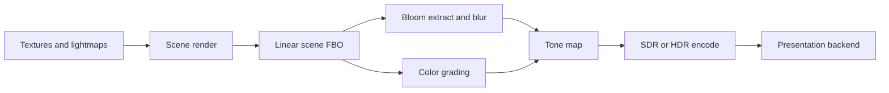
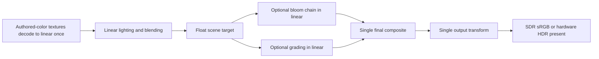

# Scrutinizing the FnQL GLx Renderer Against Its Documented Goals

## Executive summary

The strongest high-confidence finding is that GLx is **documented as the canonical OpenGL-lineage renderer**, but it is **not yet architecturally independent enough to be considered the final renderer in substance**. The repository still keeps `opengl` as the default, blocks promotion pending proof artifacts and zero-legacy-delegation ownership runs, and explicitly requires a rollback package even after promotion. The GLx module also still compiles most of the legacy renderer sources, while the GLx executor mostly validates plans and forwards draw calls rather than fully owning execution. In other words: GLx is currently a **hybrid compatibility-first adapter**, not yet a cleanly separated renderer core. fileciteturn33file0L1-L1 fileciteturn29file0L1-L1 fileciteturn38file0L1-L1 fileciteturn43file0L1-L1

On the color side, the repository’s own documentation describes **two materially different presentation pipelines**. With `r_hdr 0`, the engine stays on a **display-referred SDR compatibility path**. With `r_hdr 1`, it switches to a **scene-linear HDR path** with exposure, bloom thresholding, tone mapping, color grading, and an output transform selected from SDR sRGB, scRGB, HDR10/PQ, macOS EDR, or screenshot output. The same docs also state that the current OpenGL/GLx SDR final shader **already writes SDR sRGB**, and therefore `GL_FRAMEBUFFER_SRGB` stays disabled in that path. That combination is exactly the kind of setup where a linear/sRGB mistake, missing texture decode, double encoding, or mismatched exposure contract produces the user-visible symptom you described: `r_hdr=1` looks flat and low-contrast on an SDR panel, while `r_hdr=0` looks dark and over-contrasted because it is a different, legacy-toned path rather than a true “same image without HDR” path. fileciteturn33file0L1-L1 fileciteturn35file0L1-L1 fileciteturn39file0L1-L1 fileciteturn40file0L1-L1

The technically correct baseline from the graphics stack is clear. sRGB textures should decode to linear before filtering and shading; if an sRGB framebuffer is used as a render target, correct linear blending requires framebuffer sRGB conversion support; Windows HDR composition uses FP16 scRGB with linear gamma and performs OS-level color conversion around that canonical space; entity["software","SDL","Simple DirectMedia Layer"] exposes HDR-enabled state, SDR white level, and HDR headroom as dynamic window properties; and macOS EDR presentation requires explicit EDR-capable layers and linear float-capable formats. The repo’s documented GLx control surface lines up with these platform models, but the current implementation still appears to leave too much of the actual OpenGL execution in legacy code, especially around postprocess/output. citeturn12view0turn13view0turn13view1turn15view0turn15view1turn15view2turn9search0turn9search6turn8search0turn8search5turn8search14

The practical conclusion is straightforward. The next work should **not** be “delete opengl1.” The next work should be to **make GLx own the output contract**: one explicit scene-linear main buffer, one explicit bloom chain, one explicit tone-map/grade stage, one explicit SDR/HDR encode stage, one explicit presentation backend decision, and instrumentation that proves which transfer function and color space are active on every frame. Only after that, plus parity and ownership proofs, should `opengl` become an alias or be de-emphasized. Removing the legacy renderer now would be high risk and would violate the repository’s own promotion contract. fileciteturn39file0L1-L1 fileciteturn40file0L1-L1 fileciteturn43file0L1-L1

## What GLx says it is trying to be

The repository’s display guide describes `cl_renderer glx` as the **canonical OpenGL-lineage renderer module**. It explicitly says GLx “preserves the OpenGL display and bloom surface while adding GLx-owned capability tiers, streaming, static-world, material, postprocess, output, and profiling paths,” and that it is the OpenGL-lineage path intended for promotion once the promotion gate is green. At the same time, the same documentation states that `cl_renderer opengl` remains the current compatibility default. That is the central documented goal tension: **GLx is intended to become the canonical path, but is still operating under compatibility-first constraints.** fileciteturn33file0L1-L1

The code formalizes that goal as a tiered renderer model. `code/rendererglx/glx_render_ir.h` defines five product tiers—GL12, GL2X, GL3X, GL41, GL46—and associates progressively more modern behavior with higher tiers: scene-linear output, modern post chains, timer queries, sync-aware uploads, static and dynamic buffer ownership, persistent uploads, indirect submission, direct state access, and detailed GPU counters. That is a strong design direction: GLx is not meant to be merely “OpenGL with more files,” but a capability-driven renderer architecture that scales from old compatibility contexts to high-end modern OpenGL. fileciteturn40file0L1-L1 citeturn13view2turn13view3

The promotion contract is even stricter. The promotion gate requires the five tiers to remain represented in code and documentation; requires reviewed runtime evidence on Windows and Linux; requires passing RC smoke/parity/proof manifests; and, critically, requires **ownership diagnostics reporting zero legacy delegation** before the `opengl` alias plan is allowed. It also explicitly says the rollback path is not optional. That means the repository’s own rules already answer one of your questions: **opengl1 cannot be removed safely today without violating the documented project contract.** fileciteturn43file0L1-L1

## What the repository actually implements today

The strongest evidence of legacy coupling is the GLx project itself. `code/win32/msvc2017/rendererglx.vcxproj` compiles not only the GLx-specific C++ files, but also a very large set of legacy renderer C files such as `tr_arb.c`, `tr_backend.c`, `tr_bsp.c`, `tr_cmds.c`, `tr_image.c`, `tr_init.c`, `tr_main.c`, `tr_scene.c`, `tr_shade.c`, `tr_shader.c`, `tr_shadows.c`, `tr_surface.c`, `tr_vbo.c`, and `tr_world.c`. That is not a small bridge layer. It is the legacy renderer body being built into the GLx module. fileciteturn29file0L1-L1

The initialization path confirms that coupling. `code/renderer/tr_init.c` registers the FBO/HDR/color/bloom/output cvars, performs OpenGL extension detection for sRGB textures and framebuffer sRGB, initializes ARB programs, and then calls `GLX_CompatOnOpenGLReady(&glConfig, gl_extensions)`. Meanwhile `code/rendererglx/glx_module.cpp` registers GLx-side control surfaces and, on OpenGL readiness, initializes `GLX_PostProcess`, `GLX_Stream`, `GLX_Material`, `GLX_StaticWorld`, and the executor schedule. This is a split-control model: legacy renderer initialization still owns core OpenGL/FBO/HDR setup plumbing, while GLx layers diagnostics, IR, and selected execution helpers on top. fileciteturn35file0L1-L1 fileciteturn26file0L1-L1

The execution path is also not yet “pure GLx.” `code/rendererglx/glx_draw.cpp` is a thin wrapper around `glDrawElements` and `glDrawArrays`. `code/rendererglx/glx_executor.cpp` validates IR products against capability tiers and then forwards dynamic draws straight to those wrappers. That means GLx currently acts more like a **capability-aware scheduling and accounting layer** than a fully independent renderer backend. The executor is useful, but it is not the same thing as ownership of postprocess, output transforms, or the full draw path. fileciteturn37file0L1-L1 fileciteturn38file0L1-L1

The compatibility adapter makes the remaining dependency explicit. `code/renderer/tr_glx_compat.h` describes itself as the “legacy-renderer GLx compatibility adapter,” keeping shared ABI forwarding and non-GLX stubs in `renderercommon/tr_glx_bridge.h` and keeping only “legacy renderer state conversion and fixed-function draw adapters” locally. That file contains entity classification, material-stage translation, and streamed draw helpers that bind buffers, rewrite client array state, and route geometry through compatibility draw functions. This is the exact substrate the promotion contract says must eventually shrink to zero legacy delegation. fileciteturn25file0L1-L1

Even the GLx material compiler still betrays compatibility inheritance. `code/rendererglx/glx_material.cpp` generates GLSL 1.20 programs from translated legacy stage keys and uses compatibility-era attributes like `gl_Color` and `gl_MultiTexCoord`. That is a reasonable transitional choice, but it is not what a fully decoupled renderer would look like. A fully owned GLx path would define stable material inputs, stable frame/object constants, and stable color contracts directly rather than reconstructing them from the fixed-function and ARB-era state model. fileciteturn41file0L1-L1

## HDR pipeline audit

The cvar-level control plane is clear. `tr_init.c` registers `r_fbo`, `r_hdr`, `r_hdrPrecision`, `r_srgbTextures`, `r_framebufferSRGB`, `r_tonemap`, `r_tonemapExposure`, `r_colorGrade`, the lift/gamma/gain and white-point controls, `r_outputBackend`, `r_outputAllowExperimentalLinuxHDR`, the bloom controls, and render-scale controls. It also tracks whether texture sRGB and framebuffer sRGB support are available from the underlying OpenGL implementation. That is the root of the HDR path. fileciteturn35file0L1-L1

The display guide then defines how those controls are supposed to behave. `r_hdr 0` is the display-referred SDR compatibility path. `r_hdr 1` is the scene-linear HDR path with exposure, bloom thresholding, tone mapping, color grading, and output transform. `r_srgbTextures` is meant to use hardware sRGB decode for authored color textures in the scene-linear path, while lightmaps, fog, dynamic-light masks, and data textures remain linear/data textures. The same document says `r_framebufferSRGB` is only to be used when the draw target itself is sRGB-encoded, and it explicitly notes that **the current OpenGL/GLx SDR final shader keeps it disabled because the shader already writes SDR sRGB output**. It also documents final output backend choices: automatic, forced SDR sRGB, Windows scRGB, HDR10/PQ, macOS EDR, and Linux experimental HDR. fileciteturn33file0L1-L1

GLx mirrors that state in `code/rendererglx/glx_postprocess.h`. The `PostProcessState` structure stores the active HDR mode, HDR precision mode, tonemap mode, bloom threshold mode, internal format, texture format, texture type, whether texture-sRGB decode is active, whether framebuffer-sRGB is available/enabled, the selected display output object, the last output transform, the last exposure, paper-white nits, max output nits, lift/gamma/gain values, LUT scale/size, selected backend, native backend, hardware HDR activity, display HDR headroom validity, display SDR white, display max nits, and a detailed set of counters for gamma-direct, gamma-blit, bloom, and postprocess results. This is a strong diagnostic state model, but the key point is that it is a **state mirror**, not proof that GLx owns the actual final-pass implementation. fileciteturn39file0L1-L1

`code/rendererglx/glx_render_ir.h` makes the intended output model explicit. It defines `OutputTransfer::{SdrSrgb, LinearSrgb, ScRgb, Hdr10Pq, MacEdr, ScreenshotSrgb}`, `SceneColorSpace::{DisplayReferredSdr, SceneLinear}`, `ToneMapOperator::{Legacy, Reinhard, Aces}`, `ColorGradeMode::{None, LiftGammaGain, Lut3D, LiftGammaGainLut3D}`, and a rich `OutputTransform` structure carrying exposure, bloom soft knee, paper white, max output nits, per-channel grading controls, white-point adaptation parameters, LUT size/scale, and selected output backend state. Architecturally, that is exactly the right abstraction for a modern postprocess/output stage. fileciteturn40file0L1-L1

The problem is where execution still lives. Because the GLx project still compiles `tr_arb.c`, because `tr_init.c` still owns the major OpenGL/FBO/HDR setup, and because `glx_executor.cpp` primarily validates products and forwards immediate draw calls, the most likely current reality is that **the actual fullscreen FBO/HDR/bloom/final-output shader path is still effectively legacy-shared** even though the GLx-side state model is modernized. That architectural split is the main reason color bugs in this area are hard to reason about and hard to fix cleanly. fileciteturn29file0L1-L1 fileciteturn35file0L1-L1 fileciteturn38file0L1-L1 fileciteturn39file0L1-L1

The external correctness baseline supports that diagnosis. The entity["software","OpenGL","graphics API"] texture-sRGB extension defines sRGB textures as textures whose RGB channels are converted to linear values for shading, while alpha remains linear; the sRGB framebuffer extension says correct linear-to-sRGB encoding and sRGB-destination blending happen only when framebuffer-sRGB update/blending is enabled for an sRGB-capable destination. Meanwhile, urlMicrosofthttps://www.microsoft.com documents Windows Advanced Color HDR composition around FP16 scRGB with BT.709/sRGB primaries and linear gamma, and says 1.0f is interpreted differently on SDR and HDR displays; entity["software","SDL","Simple DirectMedia Layer"] documents runtime properties for “HDR enabled,” SDR white level, and HDR headroom; and urlApplehttps://www.apple.com documents EDR headroom and EDR metadata for linear float-capable presentation surfaces. Those are the contracts GLx needs to satisfy per backend. citeturn12view0turn13view0turn13view1turn15view0turn15view1turn15view2turn9search0turn9search6turn8search0turn8search5turn8search14

## Why SDR looks wrong and how to fix it

The observable behavior—`r_hdr=1` looking flat on an SDR panel, and `r_hdr=0` looking dark and over-contrasted—is best explained as a **cross-over bug between two different output contracts** rather than one single broken setting. The repo itself documents that these two modes are not the same pipeline. The likely failure modes below are ordered by practical likelihood and by how directly they match the repository’s own control flow and the color-management rules above. fileciteturn33file0L1-L1 fileciteturn39file0L1-L1 fileciteturn40file0L1-L1 citeturn12view0turn13view0turn13view1turn15view1turn9search0turn9search6

| Plausible cause | Why it matches the symptom | Concrete code-level fix | Reproduction and verification |
|---|---|---|---|
| Missing or partial sRGB texture decode in the scene-linear path | If authored albedo/UI textures are sampled as linear instead of sRGB-decoded, the scene will shade too dark; exposure compensation then flattens contrast and makes `r_hdr=1` look washed | In `tr_image.c` plus the legacy FBO/HDR setup path, classify textures into **authored-color** vs **linear/data** and force authored-color textures to sRGB decode under `r_hdr=1`; keep lightmaps/fog/dlight/data linear | Render a gray ramp, UI art, and a color checker with `r_srgbTextures 0` and `1`; compare histograms and sampled mid-gray values |
| Ambiguous final SDR encode path | The docs already admit the current shader writes SDR sRGB while framebuffer-sRGB is disabled. If any path writes linear instead, or if another path enables framebuffer-sRGB anyway, the frame will be too dark or too flat | Make one contract official: either **shader writes linear + enable framebuffer-sRGB on sRGB targets**, or **shader writes encoded sRGB + framebuffer-sRGB stays off**. Do not allow both | Add an on-screen debug line showing output transfer, destination encoding, and framebuffer-sRGB state; verify 0–1 gray ramps visually and via captured pixel values |
| `r_hdr=0` is legacy overbright/gamma compatibility rather than a modern SDR reference path | A display-referred compatibility path can easily look more crushed and contrasty than a scene-linear tone-mapped SDR path; the two modes are not parity modes | Treat `r_hdr=0` as a **legacy mode**, not as the baseline reference. Create an explicit “scene-linear SDR” reference mode for parity work, or re-route `r_hdr=0` through the same final SDR encode stage without HDR-only extras | Compare side-by-side captures with bloom off and tonemap fixed; ensure “SDR reference” and “HDR on SDR output” differ only by intended operator choices |
| Wrong backend selection or wrong hardware-HDR inactive behavior | If `auto` chooses a non-SDR transfer while the display path is actually SDR, or if hardware-HDR-active state is stale, the frame may be encoded for the wrong target | In GLx output selection logic, hard-force `SdrSrgb` whenever the platform does not report active HDR/EDR headroom. Log requested backend, selected backend, native backend, and hardware-active flag every frame in debug mode | On SDR Windows, SDR macOS, and SDR Linux, verify forced SDR backend selection even when `r_outputBackend 0` is used |
| Incorrect paper-white / max-luminance handling on SDR | If SDR output still uses HDR-oriented paper-white assumptions, tone mapping may reserve too much headroom and reduce local contrast | On SDR, normalize paper-white to the SDR reference-white contract and bypass HDR-only paper-white/max-output logic unless hardware HDR is active | Check 18% gray, diffuse white, and specular highlight mapping against target luminance ranges; confirm white does not top out too early or too late |
| Non-linear blending in bloom or UI composite | If any bloom/HUD mix happens against sRGB-encoded data without correct linearization, haze and low local contrast are common | Keep intermediate postprocess targets strictly linear, preferably float; apply output transform only once at the end | Use a bright HUD element over dark background and compare halo behavior before/after fix |
| Wrong main scene-buffer precision | If `r_hdr=1` still lands in normalized or otherwise inadequate storage, exposure and bloom math will compress or band badly | For scene-linear rendering, require float main color attachments—preferably `RGBA16F` for the main scene and a smaller float format only for carefully chosen intermediate passes | Use extreme-brightness test scenes and exposure sweeps; inspect banding, clipping, and histogram truncation |
| Double tone mapping or legacy gamma after tone mapping | `glx_postprocess.h` tracks both tonemapped frames and gamma-direct/gamma-blit frames, which suggests the final stack still has multiple mutually interacting presentation concepts | Define the exact order once: **decode → shade linear → bloom/grade → tone map → encode once → present**. Disable legacy overbright/gamma shaping whenever scene-linear mode is active | Add a debug graph of stage order and a frame-dump flag that writes out pre-tone-map, post-tone-map, and final-present images |
| Lack of ICC/display-profile-aware SDR handling on wide-gamut SDR displays | On composited SDR systems, OS color management may hide this; in some fullscreen/legacy paths, color may be treated as plain sRGB with no profile adaptation | Keep windowed compositor-friendly presentation as the default for correctness; if exclusive fullscreen bypasses OS color management, consider optional ICC-aware output conversion | Validate on a wide-gamut SDR monitor with a color checker and ΔE measurements; compare windowed vs exclusive fullscreen |

The most important practical fixes are the first four. They can be implemented without a full renderer rewrite, and they would likely explain most of the “low contrast vs over-contrast” split on typical SDR panels.

The minimum reproducible validation set should be standardized before code changes continue. On an SDR display, run: `cl_renderer glx`, `r_fbo 1`, `r_bloom 0`, `r_hdr 0/1`, `r_tonemap 0/1/2`, `r_tonemapExposure 0.5/1.0/2.0`, `r_srgbTextures 0/1`, `r_framebufferSRGB 0/1`, and force `r_outputBackend 1`. On an HDR-capable display, repeat with `r_outputBackend 0` and `2`, plus OS HDR enabled and disabled. For each run, capture: final frame PNG, pre-encode frame dump, histogram, luminance false-color, 1D gray ramp, RGB primaries, a color checker, and an over-range report for float targets. The acceptance metrics should include percentile luminance, clipping percentage, mid-gray placement, diffuse-white placement, and—if available—color-checker ΔE. Those metrics are directly motivated by the repository’s output model and by the platform/output contracts documented by the graphics stack. fileciteturn33file0L1-L1 fileciteturn39file0L1-L1 fileciteturn40file0L1-L1 citeturn15view1turn15view2turn9search0turn9search6turn10search0turn10search2

## Whether GLx is optimal, where the hotspots are, and what should be refactored

GLx is **not yet optimal** against its own documented goals. Architecturally, it is not optimal because a modern GLx IR and state model sits on top of a still-compiled legacy renderer body. Performance-wise, it is not optimal because the hot path still contains compatibility adapters, buffer-binding preservation, client-state rewrites, and immediate draw forwarding where the design aspires to persistent uploads, ownership, indirect submission, and DSA. Visually, it is not optimal because the renderer still exposes two very different presentation contracts (`r_hdr=0` and `r_hdr=1`) while not yet making the final output stage clearly GLx-owned and auditable. fileciteturn25file0L1-L1 fileciteturn29file0L1-L1 fileciteturn38file0L1-L1 fileciteturn40file0L1-L1

The most obvious CPU hotspot is the compatibility streaming path. `tr_glx_compat.h` uploads client memory into the GLx stream ring, queries and restores old buffer bindings, rewrites vertex and texcoord pointers, and flips client-state masks around every streamed draw. `glx_stream.cpp` then manages ring offsets, fallback strategy selection, optional persistent mapping, and frame fences. This is acceptable as a transitional path, but it is exactly the kind of per-draw CPU overhead that modern tier goals are supposed to eliminate. The stream ring itself is well thought out, but the surrounding compatibility plumbing is still expensive. fileciteturn25file0L1-L1 fileciteturn42file0L1-L1

The most obvious postprocess hotspot is full-screen pass count. The display guide preserves the large OpenGL bloom control surface, including configurable bloom passes, blend base, filter size, and reflection. `glx_postprocess.h` tracks resolve, copy-screen, gamma-direct, gamma-blit, bloom calls, intermediate passes, final passes, and multi-sample/super-sample blits. That strongly suggests the renderer can still incur several full-screen copies and composites per frame, especially when MSAA, SSAA, bloom, screenshots, and output export features are active together. A modern GLx path should aggressively **fuse resolve/composite/encode passes** where possible and narrow the number of intermediate targets. fileciteturn33file0L1-L1 fileciteturn39file0L1-L1

The most obvious “missed opportunity” hotspot is the executor itself. `glx_render_ir.h` promises ownership models up to persistent uploads, indirect submission, DSA, and detailed counters. But `glx_executor.cpp` still forwards dynamic draws directly to immediate draw wrappers. The high-end tier policy is therefore ahead of execution reality. Until GLx executes post nodes, output transforms, and high-end draw plans with genuinely different code paths, the architecture will continue to carry validation overhead without realizing the full performance upside of its IR design. fileciteturn38file0L1-L1 fileciteturn40file0L1-L1 citeturn13view2turn13view3

The refactor priorities are therefore clear. First, move the **final postprocess/output chain** to a GLx-owned implementation on GL3X+ and keep legacy fallback only for lower tiers. Second, remove per-draw state querying/restoration from the streamed-draw hot path by introducing stable VAO/state-cache ownership for GLx-managed dynamic draws. Third, ensure the scene stays linear until the final encode stage and fuse resolve/bloom composite/encode where correctness allows. Fourth, narrow the material interface so that GLx stops being a translator from legacy fixed-function stage keys and becomes the owner of a renderer-internal material contract. Fifth, make the GL46 tier real: persistent mapped upload path, immutable buffers, and indirect/static submission should be genuinely hot-path features, not just policy text. fileciteturn41file0L1-L1 fileciteturn42file0L1-L1 fileciteturn40file0L1-L1

### Legacy reuse and migration away from it

The legacy reuse is extensive enough that it should be treated as a first-class migration program rather than incidental cleanup. The GLx module currently embeds a large legacy file set, keeps a named compatibility adapter, and still reconstructs modernized GLx behavior from translated legacy state. That is appropriate for getting parity, but it is the wrong end-state for a promoted renderer. fileciteturn29file0L1-L1 fileciteturn25file0L1-L1 fileciteturn41file0L1-L1

A sound migration plan is:

- **Fence the ABI first.** Keep only a narrow, typed public surface in `renderercommon`, and forbid new direct calls from rendererglx files back into broad legacy renderer internals.  
- **Extract postprocess/output next.** Move the shared FBO/HDR/bloom/final-present logic out of the legacy `tr_arb.c` ownership model and into a GLx-owned `glx_postprocess` implementation for GL3X+, with legacy fallback only for old tiers.  
- **Extract dynamic draw ownership after that.** Replace compatibility streamed draws with GLx-owned submission state for the categories already tracked by the compatibility layer.  
- **Then extract material ownership.** Continue to support legacy stage semantics through translation, but make the internal shader/material model GLx-native.  
- **Only then shrink project-file legacy inputs.** At that point, the `rendererglx.vcxproj` legacy file list can finally begin to contract in a controlled way. fileciteturn29file0L1-L1 fileciteturn25file0L1-L1 fileciteturn38file0L1-L1

### Whether opengl1 can be removed safely

No—not now. The repository policy already says so, implicitly and explicitly. GLx is not the default yet, promotion is blocked until proof and ownership criteria are met, and rollback packaging remains mandatory even after promotion. The safest current path is **deprecation by alias and packaging**, not deletion. fileciteturn43file0L1-L1

A concise risk matrix looks like this:

| Risk | Current severity | Why |
|---|---|---|
| Visual regressions in SDR/HDR output | Critical | The final output contract is not yet clearly GLx-owned |
| Driver/platform regressions | High | The project still supports five OpenGL product tiers |
| User config/rollback breakage | High | `opengl` remains the default and legacy rollback is explicitly required |
| Performance regressions | Medium to High | Some hot paths still rely on compatibility plumbing and immediate submission |
| Incomplete ownership proof | Critical | Promotion requires zero legacy delegation |
| Packaging/support burden | High | Removing legacy too early eliminates the designed safety valve |

The correct deprecation/removal plan is therefore phased. First, finish GLx ownership of postprocess/output and prove no legacy delegation on required platforms. Second, promote by making `cl_renderer opengl` an alias for GLx in promoted builds while keeping an explicit legacy package or build flag. Third, keep that rollback path for at least a full release cycle with proof artifacts and release notes. Only after sustained stability should source-level removal even be considered—and even then, the repository’s current contract argues for a maintained rollback artifact rather than immediate historical erasure. fileciteturn43file0L1-L1

## GPT-5.5 agent implementation plan

The plan below is designed for task-level execution by GPT-5.5 agents. It is intentionally discrete, testable, and aligned with the repository’s current code boundaries and promotion policy. fileciteturn25file0L1-L1 fileciteturn26file0L1-L1 fileciteturn29file0L1-L1 fileciteturn39file0L1-L1 fileciteturn40file0L1-L1 fileciteturn42file0L1-L1 fileciteturn43file0L1-L1

| Priority | Task | Required inputs | Code changes | Tests | Expected outputs | Effort | CI checks |
|---|---|---|---|---|---|---|---|
| P0 | Baseline color-pipeline instrumentation | Representative demo/map set; SDR display; HDR display if available | Add per-frame debug dump for selected backend, scene color space, transfer, exposure, paper white, max nits, sRGB decode state, framebuffer-sRGB state | SDR and HDR sweeps with `r_hdr`, `r_tonemap`, `r_srgbTextures`, `r_outputBackend` matrix | JSON/CSV logs, frame captures, per-scene histograms | Medium | Artifact upload required; fail if metadata missing |
| P0 | Main scene-buffer format audit | Existing FBO creation code; current `r_hdrPrecision` behavior | Force explicit float main scene attachment for `r_hdr 1`; document and assert exact internal/format/type values | Exposure sweep, highlight clipping, banding ramp | Patch plus format matrix doc | Medium | Fail if `r_hdr 1` scene target is not float |
| P0 | SDR output-contract hardening | Current final-pass shader logic | Pick one SDR encode contract and assert it in code: shader encode or framebuffer-sRGB, never both | Gray-ramp capture, UI overlay blend test, bloom-off capture | Output-contract design note and patch | Medium | Golden-image compare; fail on ramp mismatch |
| P0 | Texture colorspace classification audit | Texture loaders and shader/material paths | Audit authored-color vs linear/data textures; enable decode exactly once in scene-linear mode | Color checker, UI art, diffuse textures, lightmaps | Classification manifest and code patch | High | Fail on missing manifest rows or test deltas |
| P1 | GLx-owned postprocess/output path on GL3X+ | Legacy postprocess path, GLx IR/output model | Implement GLx execution of `PostNode` and `OutputTransform` for GL3X+; keep legacy fallback for older tiers | Parity captures and performance numbers | New GLx postprocess backend and fallback matrix | High | Ownership test must show post/output no longer delegated on GL3X+ |
| P1 | Streamed-draw hot-path optimization | `tr_glx_compat.h`, `glx_stream.cpp`, dynamic draw categories | Remove per-draw `GetIntegerv`/restore pattern where GLx owns submission; introduce stable state cache/VAO-based submission where possible | CPU frametime microbench and scene replay | Reduced CPU overhead and lower draw-call overhead | High | Perf budget threshold on benchmark scenes |
| P1 | Material-path narrowing | `glx_material.cpp`, translated stage keys | Introduce GLx-native frame/object/material parameter blocks and reduce dependence on compatibility-era shader globals | Shader compile-cache stress test and scene parity | Smaller variant surface and clearer shader contracts | High | Fail on shader compile-cache regressions |
| P2 | Legacy coupling reduction | `rendererglx.vcxproj`, bridge headers, executor | Stop compiling legacy files not needed after extraction; shrink compatibility surface incrementally | Ownership proofs and build-matrix checks | Migration map and slimmer GLx module | High | Fail if legacy delegation count is non-zero in promoted tiers |
| P2 | Promotion and rollback packaging | `scripts/glx_promotion.py`, packaging metadata, release docs | Add deprecation/alias behavior only behind green promotion gate; keep rollback package | Proof-manifest validation on Windows/Linux | Promotion-ready package plan | Medium | Promotion job blocked unless proofs and rollback package metadata exist |

### Suggested visual aids to prepare

The work above should produce visual artifacts, not just logs. The most useful ones are:

- a **current pipeline flowchart** and a **target pipeline flowchart**;
- **before/after histograms** for `r_hdr 0` and `r_hdr 1` on SDR;
- a **false-color luminance overlay** for scene-linear, post-tone-map, and final-present frames;
- a **backend/state overlay screenshot** showing transfer, scene color space, selected backend, HDR headroom, and framebuffer-sRGB state;
- a **parity diff sheet** with side-by-side captures: legacy OpenGL, current GLx, patched GLx;
- a **driver-tier matrix** showing which path executed on GL12, GL2X, GL3X, GL41, and GL46.

A useful flowchart template for the agents is:

And a useful target-state flowchart is:

## Open questions and limitations

The connector evidence was strong enough to trace the architecture, the cvar surface, the output abstraction, the promotion contract, and the legacy coupling, but it did **not** expose every exact `tr_arb.c` FBO allocation line and ARB fragment-program instruction at clean line granularity in the final answerable form. So the file paths and function names above are exact patch points from the inspected commit, but the exact OpenGL enums for every scene/bloom/output attachment and every local program parameter index should still be verified in the referenced commit before patches land. fileciteturn29file0L1-L1 fileciteturn39file0L1-L1

No specific HDR panel model, OS compositor mode, or fullscreen/windowed requirement was provided. The validation plan therefore assumes generic SDR panels at SDR reference-white behavior and generic HDR-capable displays using platform-reported headroom/advanced-color state, which is the least misleading assumption given the repo’s backend model. citeturn15view1turn15view2turn9search0turn8search0turn8search14

Finally, I did not inspect fresh local proof manifests. So the recommendation that opengl1 should not be removed is based on the repository’s current documented gate and architecture, not on a newly-run proof corpus. That is still a strong conclusion, because the policy itself currently forbids the premature removal path. fileciteturn43file0L1-L1