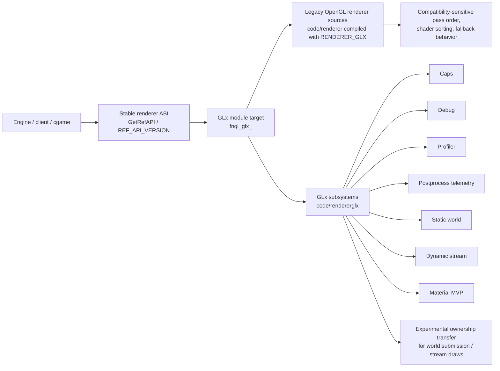
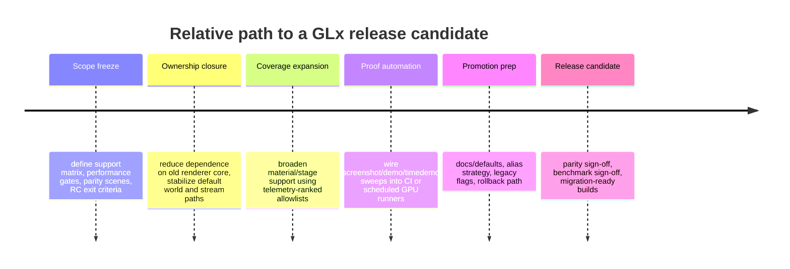

# GLx Implementation Analysis for FnQL

## Executive summary

This report compares the current GLx work in urlthemuffinator/FnQLhttps://github.com/themuffinator/FnQL against `docs/plans/glx-7-5-26.md`, using the repository itself as the primary source of truth. In the checked-in evidence I reviewed, GLx is no longer just a stub: it has real build/runtime integration, a defined capability-tier model, debug-output wiring, GPU timing/profiling hooks, a dynamic stream ring with multiple backends, a substantial static-world packet/arena/MDI experiment surface, a narrow but functional GLSL material MVP, postprocess/bloom parity instrumentation, and a runtime sweep harness. That is meaningful progress. However, it is **not yet at the point where `opengl`/`opengl2` can be retired safely**. The biggest reason is structural: the GLx target is still built from the legacy OpenGL renderer sources **plus** the new `code/rendererglx/` sources, so GLx today is a compatibility-oriented fork/variant of the legacy renderer, not a genuinely independent replacement core. The repo’s own docs still describe GLx as experimental, `USE_GLX` is still opt-in, and the default renderer remains `opengl`. fileciteturn26file0 fileciteturn25file0 fileciteturn32file2 fileciteturn32file0

The plan file’s strategic goals are still sound: keep the renderer ABI stable, preserve compatibility-sensitive pass order and display behavior, modernize implementation incrementally, and consolidate the OpenGL lineage into one maintainable path. The implementation is broadly aligned with that strategy, but several plan items are only partially realized in code or are present only as **gated experimental paths** rather than default-on, release-quality behavior. The most important gaps are: broader material/shader-stage coverage, hard evidence of screenshot/demo parity, automated runtime regression checks in CI, and a deliberate extraction path that lets GLx stop depending on the old `code/renderer` implementation for core behavior. fileciteturn26file0 fileciteturn25file0

My headline recommendation is straightforward: **do not retire `opengl` or `opengl2` yet**. Instead, move in two phases. First, push GLx to a release-candidate state by hardening parity, expanding coverage, automating sweeps, and defining a stable default GLx profile. Second, perform deprecation in this order: put `opengl2` behind a legacy build flag first, make `opengl` a migration alias to GLx only after parity metrics and manual QA pass, and only then remove old renderer code after the shared compatibility baseline has been split cleanly enough that GLx no longer requires the legacy renderer sources as its substrate. fileciteturn26file0 fileciteturn25file0

The plan does **not** specify the production target platform set, performance targets, or calendar release schedule. I have treated those as open questions and kept the roadmap relative rather than date-committed. The repo currently builds GLx in release artifacts across Windows, Linux, and macOS, but that is not the same thing as having a declared GLx support policy or runtime parity guarantee for those platforms. fileciteturn26file0 fileciteturn32file1

## Scope and approach

The precise scope here is: compare the current repository implementation against `docs/plans/glx-7-5-26.md`, identify what is implemented, what is partial, what is still missing, and what must happen before a release candidate and safe retirement of the legacy OpenGL renderers. I interpret the user’s “gl1/gl2” shorthand as the repo’s `opengl` and `opengl2` renderer lineages, because that is how the repo names its modular renderers and build defaults. fileciteturn26file0 fileciteturn32file2

I treated the current checked-in GLx tip as the state reflected by the recent GLx-related commits `35f9c861` (“Add experimental GLx renderer…”), `1f07ce0a` (“Add GLX builds…”), and `3235f610` (“Wire up GLx renderer, debug contexts, and docs”), together with the current GLx architecture note and the plan file itself. Where the plan’s checkboxes say something is done but the repo evidence still shows it as experimental, cvar-gated, or unverified, I marked it **Partial** rather than simply inheriting the plan’s checkbox state. fileciteturn32file2 fileciteturn32file1 fileciteturn32file0 fileciteturn25file0 fileciteturn26file0

Three assumptions remain explicitly unspecified and should stay that way until the project owners decide them: the production target platform matrix for GLx, the performance acceptance thresholds for promotion/default status, and the calendar release target for an RC. I do **not** infer those from CI build coverage or from the existence of optional code paths. fileciteturn26file0

The plan’s tiering is technically defensible. Keeping a shader-based baseline rather than fixed-function fallback fits the repo’s direction, and treating persistent mapping / immutable buffers / advanced batching as optional accelerators is also consistent with the OpenGL feature ladder: uniform buffers are a 3.1-era feature, while immutable `glBufferStorage` is core later and exposed through `ARB_buffer_storage`; Apple’s archived OpenGL guidance also reinforces why a “modern but not 4.5-mandatory” path is sensible on older/macOS-facing OpenGL code. citeturn1view1turn1view2turn1view0

## Current implementation inventory

The current GLx architecture is best understood as a **small C ABI bridge** sitting on top of a compatibility-first OpenGL renderer baseline. The architecture note is explicit that GLx preserves the existing renderer ABI (`GetRefAPI`, `REF_API_VERSION`, `refimport_t` / `refexport_t`) and that the first implementation slice compiles the compatibility-proven OpenGL renderer with `RENDERER_GLX`, while GLx-specific code lives in `code/rendererglx/`. The initial GLx target therefore is not a fresh renderer from scratch; it is an incremental modernization layer attached to the legacy renderer core. fileciteturn25file0 fileciteturn32file2



That structure matters more than any single feature, because it explains both the project’s rapid progress and its main blocker to retirement of the old renderers. The implementation is modular in the *build* sense, but not yet independent in the *ownership* sense. fileciteturn25file0 fileciteturn32file2

### Files, modules, and primary responsibilities

| Area | Primary files/modules | What they currently own |
|---|---|---|
| Build and packaging | `CMakeLists.txt`, `Makefile`, `code/win32/msvc2017/rendererglx.vcxproj`, `.github/workflows/release.yml` | Optional `USE_GLX` build, modular `fnql_glx_*` artifact generation, manual release packaging |
| ABI bridge | `code/rendererglx/glx_module.*` | C ABI bridge, command registration, subsystem bring-up/shutdown, bridge functions used by legacy renderer hooks |
| Capability model | `code/rendererglx/glx_caps.*`, `glx_local.h` | Init-time version/extension detection, tier selection, feature flags |
| Debug plumbing | `code/rendererglx/glx_debug.*` | Debug-output callback setup, labels, debug groups, filtering |
| Telemetry | `code/rendererglx/glx_profiler.*` | Frame counters, timer queries, draw/material/static-world telemetry |
| Dynamic scene streaming | `code/rendererglx/glx_stream.*` | Ring-buffer allocation, persistent/map-range/orphan fallback ladder, shadow tess uploads, streamed draw accounting |
| Material MVP | `code/rendererglx/glx_material.*` | Small GLSL compatibility program cache for a narrow set of stage shapes |
| Postprocess parity | `code/rendererglx/glx_postprocess.*` | FBO and bloom/gamma/render-scale telemetry around the shared OpenGL postprocess path |
| Static world | `code/rendererglx/glx_static_world.*` | Packet manifests, arena uploads, device-run submission, filtered multidraw and indirect submission experiments |
| Legacy renderer integration points | `code/renderer/tr_init.c`, `tr_shade.c`, `tr_vbo.c`, plus related renderer files | Hook points where the legacy renderer calls into GLx for profiling, stream draws, static world dispatch, postprocess telemetry |
| Runtime switch and sweeps | `code/client/cl_main.c`, `scripts/glx_runtime_sweep.py` | In-process renderer switching plus screenshot/timedemo sweep automation |
| User-facing docs | `docs/fnql/GLX_RENDERER.md`, `docs/DISPLAY.md`, `BUILD.md` | Architecture note, experimental status, build usage, display/bloom guidance |

This inventory is consistent across the architecture note, the plan, and the GLx-related commit history. The initial GLx introduction commit created the module and build plumbing; the later commits expanded CI artifacts, debug context handling, and docs. fileciteturn25file0 fileciteturn26file0 fileciteturn32file2 fileciteturn32file1 fileciteturn32file0

### Representative evidence snippets

The most important build fact is that GLx is currently a **hybrid target**:

```cmake
ADD_LIBRARY(${RENDERER_PREFIX}_glx${RENDEXT} SHARED
  ${RENDERER_GL_SRCS} ${RENDERER_GLX_SRCS} ${RENDERER_COMMON_SRCS} ${AUX_SRCS})
TARGET_COMPILE_DEFINITIONS(${RENDERER_PREFIX}_glx${RENDEXT}
  PRIVATE USE_RENDERER_DLOPEN RENDERER_GLX)
```

That is the cleanest single proof that GLx still depends on the old renderer implementation for major behavior. The GLx-specific code is real, but it is linked in alongside the old `code/renderer` sources rather than replacing them. Evidence: `CMakeLists.txt`, introduced in `35f9c861` and refined in later GLx commits. fileciteturn32file2 fileciteturn32file0

The material path is intentionally narrow, not general:

```cpp
enum class MaterialProgramMode {
    SingleTexture,
    MultiModulate,
    MultiAdd,
    MultiReplace,
    MultiDecal,
    Fog
};
```

That narrowness is not accidental; the architecture note states that the first material slice covers single-texture, fixed-function multitexture modulate/add/replace/decal, and fog-only stream passes. That is a valid MVP, but it is still far from “compile id Tech 3 shader stages into a controlled GLSL permutation system.” fileciteturn25file0

The sweep harness already encodes meaningful parity/stress profiles:

```python
"glx-parity": {
    "r_fbo": "1",
    "r_bloom": "2",
    "r_bloom_passes": "2",
    "r_vbo": "1",
    "r_glxWorldRenderer": "1",
    "r_glxStreamDraw": "1",
    "r_glxStreamDrawMultitexture": "1",
    "r_glxStreamDrawFog": "1",
    "r_glxStreamDrawDepthFragment": "1",
    "r_glxMaterialRenderer": "1",
    "r_glxGpuTiming": "1",
}
```

That is good tooling. The problem is not the absence of a harness; it is the lack of checked-in evidence that this harness is run as a hard release gate in CI. fileciteturn26file0

## Plan-to-code comparison

The following status table is intentionally strict. **Done** means the code is present in the repo in a clearly identifiable form. **Partial** means the feature exists only as a guarded experiment, a thin MVP, or without the verification/process needed for release use. **Not started** means I did not find credible implementation evidence in the checked-in sources I reviewed. The comparison is anchored to the plan and to the current GLx architecture note. fileciteturn26file0 fileciteturn25file0

| Plan item | Status | Main code locations / evidence path | Assessment |
|---|---|---|---|
| Create `code/rendererglx/`, wire `USE_GLX`, expose `cl_renderer glx` | Done | `CMakeLists.txt`, `Makefile`, `rendererglx.vcxproj`; commits `35f9c861`, `3235f610` | Landed and build-integrated |
| Preserve `GetRefAPI` / renderer ABI | Done | `GLX_RENDERER.md`, `glx_module.*` | ABI stability is central to the implementation |
| Init / shutdown / `vid_restart` / capability dump commands | Done | `glxinfo`, `glxcaps`, command registration, lifecycle callbacks | Present in current architecture note |
| Debug-context setup and debug-output hooks | Done | `glx_caps.*`, `glx_debug.*`; commit `3235f610` | SDL/WGL debug context requests and debug-output plumbing are present |
| Single textured quad and 2D HUD path on supported desktops | Partial | Implicit via legacy-baseline renderer plus CI builds | Code likely works through the baseline, but cross-platform runtime validation is not evidenced |
| BSP world loading, fog, sky, portal-sensitive setup | Done | Legacy `code/renderer` baseline with GLx integration | Owned primarily by the legacy baseline today |
| Static-surface classifier / world packetization / arena upload | Done | `glx_static_world.*` | Substantial implementation exists |
| Preserve sort order and shader-stage semantics | Done | Compatibility-first reuse of legacy renderer | This is one of the strongest aligned choices |
| World renderer with per-batch draw and later multidraw/indirect | Done | `glx_static_world.*`, `tr_vbo.c` hooks | Implemented, but still heavily cvar-gated |
| Screenshot comparison scenes / stress maps | Partial | `glx_runtime_sweep.py` profiles and map lists | Tooling exists; regular execution is the missing piece |
| Dynamic ring with persistent / map-range / orphan fallback | Done | `glx_stream.*` | Fully aligned with plan |
| Transient submission for entities / polys / particles / marks / weapon / UI | Partial | Streamed draw experiment paths | Coverage exists for eligible stage shapes, not full ownership of all dynamic categories |
| Add instancing where safe | Not started | No convincing implementation evidence | Still deferred |
| Verify animation / weapon / decals / particles in gameplay demos | Partial | Tooling exists; no checked-in parity results | Process gap more than code gap |
| Controlled GLSL permutation system for id Tech 3 shader stages | Partial | `glx_material.*` MVP only | Important gap: still a small hand-grown shader set |
| Pre-resolve as much material information as possible at load time | Partial | Material precache exists, but not broad material compilation/planning | Directionally started, not complete |
| Deterministic pass order | Done | Compatibility-first baseline | Strong alignment |
| One compatibility-first material MVP | Done | `glx_material.*` | Landed |
| Shader compile diagnostics / labels / pass markers | Done | `glx_debug.*`, `glx_material.*`, profiler/debug groups | Landed |
| FBO / render-scale / gamma / greyscale / HDR controls | Done | `glx_postprocess.*` and shared OpenGL postprocess path | Landed, mostly as telemetry around baseline |
| Preserve bloom surface including OpenGL-specific controls | Done | Docs + postprocess telemetry + architecture note | Landed |
| Bring cel shading / outlines after scene parity stabilizes | Not started | No GLx-specific follow-through evident | Legacy feature exists, GLx-specific validation is not there |
| Add GLx `r_speeds` counters and GPU timings | Done | `glx_profiler.*` and architecture note | Landed |
| Add runtime switch / screenshot / timedemo sweep tooling | Done | `renderer_switch`, `glx_runtime_sweep.py` | Landed |
| Run screenshot and demo regression sweeps | Partial | Tooling exists; I did not find checked-in workflow evidence of it running as a gate | Major release blocker |
| Update docs/build surfaces as first-class choice | Done | `BUILD.md`, `DISPLAY.md`, README/docs diffs | Landed, still experimental wording |
| Make `opengl` a migration alias to `glx` | Not started | Default still `opengl` | Major pre-retirement milestone still open |
| Move `opengl2` behind legacy build flag | Not started | `opengl2` still remains in current build/default surfaces | Open |

Two synthetic conclusions follow from that table. First, the **scaffolding and telemetry phase is substantially implemented**. Second, the **default-quality ownership phase is not**. The GLx code is strong where it measures, wraps, and experiments; it is still incomplete where it must replace or absorb the old renderer’s broad compatibility surface. fileciteturn25file0 fileciteturn26file0

## Gaps, deviations, and technical risks

The highest-risk deviation from the plan’s long-term intent is architectural: GLx still depends on the legacy renderer sources as its rendering baseline. The plan’s end state is consolidation of the OpenGL lineage; the implementation’s current state is **cohabitation**. This is visible in build integration and in the docs’ own description of GLx as preserving the OpenGL display/bloom surface “while GLx-owned capability, streaming, static-world, material, and profiling paths are brought up behind compatibility fallbacks.” That is a smart transition strategy, but it means source-level retirement of `opengl` is **not** yet a safe next step. **Severity: Critical. Suggested fix:** split the current substrate into an explicit shared compatibility layer (`renderergl_compat` or equivalent), move pass-order-sensitive legacy functionality there, and make GLx the primary owner of new draw submission/material logic before attempting old-renderer removal. fileciteturn32file2 fileciteturn32file0 fileciteturn25file0

The second major gap is automated proof. The plan rightly says GLx should be promoted only after screenshot and demo regression sweeps, but the current evidence shows a good sweep tool and manual GLx release builds, not a hard automated quality gate that runs parity/stress sweeps and rejects regressions. That means release-quality confidence still depends too heavily on ad hoc local validation. **Severity: Critical. Suggested fix:** add GPU-backed CI jobs or scheduled self-hosted runner jobs that execute `glx_runtime_sweep.py` against stock assets, save screenshots/manifests, compare against approved baselines within per-scene thresholds, and fail on drift or missing captures. fileciteturn26file0 fileciteturn32file1

The third major gap is material coverage. The plan calls for a controlled GLSL permutation system for id Tech 3 shader stages. The current implementation is intentionally much narrower: a small set of compatibility shaders for single-texture, a few multitexture combine modes, and fog-only stream passes. That is good early engineering, but it is still a long way from broad shader-stage ownership, especially for texmods, environment/video/screen-map cases, and the more exotic stage combinations that create real parity bugs in Quake III lineage renderers. **Severity: High. Suggested fix:** formalize a material-key inventory from existing telemetry, rank unsupported stage shapes by real-world frequency, and expand the allowlist in descending order of gameplay importance rather than API neatness. fileciteturn25file0 fileciteturn26file0

The dynamic scene path is also incomplete in ownership terms. The stream ring itself is well designed, with a sane fallback ladder and same-frame wrap protection, but the actual streamed draw use is still a guarded experiment for eligible generic/multitexture/fog/depth-fragment stages. That is not yet the same thing as “GLx owns dynamic scene submission.” **Severity: High. Suggested fix:** promote one conservative default streamed path first, then close coverage category by category: weapon, marks, common model batches, particle-heavy scenes, UI quads, and special cases last. Keep a hard fallback counter budget and fail the release gate if fallback rates exceed thresholds on the canonical sweep set. fileciteturn25file0 fileciteturn26file0

The static-world path is the strongest part of the implementation, but it is still exposed through many developer-oriented cvars and experiments. That is excellent for tuning and diagnosis, but release candidates need a **small, opinionated default profile**, not a wide matrix of low-level switches. **Severity: Medium. Suggested fix:** distill the static-world stack into one or two shipped modes: an RC default path and a developer stress path; keep the rest under developer/test flags only. fileciteturn25file0

The docs and defaults are giving an honest signal that promotion has not happened yet: GLx is described as experimental, bloom-heavy users are still told to start on `opengl`, and the default renderer remains `opengl`. That is not a bug; it is an accurate reflection of maturity. But it is also direct evidence that any retirement plan should be staged, not rushed. **Severity: Medium. Suggested fix:** only change docs/defaults after parity artifacts, benchmark artifacts, and rollback hooks are all ready. fileciteturn32file0 fileciteturn26file0

Finally, several project-management risks remain open because the plan intentionally does not define them: production target platforms, performance targets, and release schedule. Without those, even a technically strong RC can stall because nobody agreed what “ready” means. **Severity: Medium. Suggested fix:** define those gates explicitly before the parity and deprecation push, and encode them in CI and in the RC checklist. fileciteturn26file0

## Updated roadmap to release candidate

The roadmap below is relative and dependency-based. It is **not** a calendar commitment, because the release schedule and staffing level are unspecified. A reasonable reading of the current repo state is that the critical path to RC is roughly **8–12 focused engineer-weeks**, plus manual QA time, if one primary renderer owner is actively driving the work and build/QA support is available. If staffing is thinner or if the target platform matrix expands, the elapsed time grows accordingly. fileciteturn26file0



The external OpenGL sources support the repo’s staged capability philosophy: use a broad shader-era baseline, treat later features like uniform buffers and immutable persistent storage as accelerators, and avoid forcing a 4.5-style design onto platforms where that is unrealistic or deprecated. That means the roadmap should preserve the repo’s current compatibility-first approach, not replace it with a more ambitious renderer rewrite. citeturn1view1turn1view2turn1view0

### Milestones

| Milestone | Main outcome | Effort | Dependencies | Relative timing |
|---|---|---:|---|---|
| Scope freeze and release gates | Decide what GLx RC must support, how parity is judged, and what perf counters matter | Low, ~1–3 days | None | Start immediately |
| Compatibility-core extraction | Separate what GLx still borrows from the legacy renderer into a deliberate shared layer, or otherwise reduce accidental dependence | High, ~2–4 weeks | Scope freeze | First major block |
| Material and dynamic-scene parity expansion | Move from narrow material MVP and experimental stream draws to a stable default profile covering common gameplay scenes | High, ~2–3 weeks | Compatibility-core extraction | Overlaps late in prior block |
| Automated parity and perf gates | Run screenshot/demo/timedemo sweeps automatically and archive manifests/screenshots/metrics | Medium, ~1–2 weeks | Stable sweep scene list; working profiles | Mid-to-late critical path |
| Promotion prep | RC packaging, docs updates, alias design, deprecation switches, user migration notes | Medium, ~1 week | Automated gates passing | Final block |
| RC sign-off | Manual QA passes on supported matrix; benchmark and visual sign-off; rollback package ready | Medium, ~1–2 weeks | All prior milestones | Final gate |

### Recommended development sequence

The correct order from the current repo state is:

1. **Define the release gates before writing more custom renderer code.**  
   Decide the canon: stock maps, timedemos, expected screenshot tolerances, desired fallback budgets, target platforms, and acceptable perf movement. Without that, the project risks polishing low-value paths while leaving high-value parity cases ambiguous. fileciteturn26file0

2. **Reduce structural dependence on the old renderer.**  
   Today’s GLx gets enormous value from the old OpenGL renderer, but that same design blocks legacy retirement. The first real RC milestone is not new eye candy; it is making the ownership boundary understandable and maintainable. fileciteturn32file2 fileciteturn25file0

3. **Expand only the highest-volume material and dynamic scene shapes.**  
   The repo already records telemetry specifically so that later GLx work can target the most common stage shapes first. Use that design as intended. Do not pursue rare special cases, broad shader grammar completeness, or speculative optimizations before common-path coverage is stable. fileciteturn25file0

4. **Make one narrow GLx profile the RC candidate profile.**  
   Freeze an opinionated profile such as: world renderer enabled, stream draw enabled for proven stage shapes, material renderer enabled only for proven keys, postprocess/bloom parity on, debug-only indirect stress features off by default. That profile becomes the target of automation and manual QA. fileciteturn25file0

5. **Only then prepare default/alias/deprecation steps.**  
   Alias changes and removal plans are cheap mechanically but expensive in user impact. They belong at the very end, once the proof exists. fileciteturn26file0

## Checklists, tests, CI changes, deprecation, and rollback

### Development checklist toward RC

- [ ] Define the GLx RC support matrix in writing: supported OSes, required GPU feature floor, required driver behavior, and whether macOS is included as an equal parity target or a “best effort” target.  
- [ ] Define measured RC gates: screenshot parity tolerance, timedemo/perf counters to watch, acceptable fallback counts, and mandatory demo/map corpus.  
- [ ] Split or document the shared compatibility substrate currently coming from `code/renderer` so GLx ownership is explicit rather than implicit.  
- [ ] Freeze one conservative default GLx profile for RC; move other experimental cvars behind developer-only or clearly non-RC flags.  
- [ ] Expand `glx_material` coverage using telemetry-ranked material keys, beginning with the most common unsupported stage shapes seen in real demos/maps.  
- [ ] Promote the streamed draw path from “experiment” to “release path” for one safe allowlist; keep a measurable fallback budget.  
- [ ] Add explicit automated tests for capability-tier selection, stream-strategy fallback, material-key classification, and static-world packet classification.  
- [ ] Add screenshot/diff baselines for at least one stock id map and one larger static-geometry stress map, with curated cvar profiles.  
- [ ] Wire `glx_runtime_sweep.py` into automated runners and archive screenshots/manifests/logs as artifacts.  
- [ ] Add performance artifact collection for `r_speeds 7`, timedemo output, and GPU timer-query summaries.  
- [ ] Prepare migration docs explaining what `glx` covers, what is still experimental, and how users can revert to `opengl` during rollout.  
- [ ] Gate any `opengl` alias change behind parity and benchmark sign-off.  

This checklist is directly motivated by the plan’s own release criteria and by the code’s current maturity level. The repo has already built most of the instrumentation and tooling needed to do this work; what it lacks is the last layer of hard gates and ownership cleanup. fileciteturn26file0 fileciteturn25file0

### Human verification and manual QA checklist

- [ ] Run renderer-switch stress loops (`opengl -> glx -> opengl -> glx`) on at least one Windows, Linux, and macOS test machine and verify recovery after repeated `vid_restart` paths.  
- [ ] Compare screenshots on `q3dm1` and a larger stress map such as `q3dm17` under the baseline and GLx parity profiles.  
- [ ] Replay representative demos including weapon-heavy, particle-heavy, and mark/decal-heavy scenes; verify no obvious drift in weapon placement, overlays, fog, particles, or 2D/HUD behavior.  
- [ ] Exercise bloom controls specific to the OpenGL lineage: `r_bloom 2`, `r_bloom_passes`, `r_bloom_blend_base`, `r_bloom_filter_size`, and `r_bloom_reflection`.  
- [ ] Verify cel shading / outlines on model entities while GLx is active, even if that feature is still implemented through shared legacy behavior.  
- [ ] Verify screenshot cubemap export on GLx, because the docs now describe OpenGL-lineage cubemap capture rather than plain `opengl` only.  
- [ ] Validate behavior with debug context requests on and off.  
- [ ] Validate startup and runtime behavior on weaker capability tiers where advanced stream/static-world paths should fall back rather than fail initialization.  
- [ ] Verify that disabling GLx experimental toggles restores the expected compatibility baseline rather than changing visuals unexpectedly.  
- [ ] Confirm that saved configs, docs, and in-game help text lead users to a reversible migration path.  

The manual QA list is necessary because several of the hardest parity failures in Quake III lineage renderers are not well captured by simple unit tests: they show up in ordering, state leakage, HUD interactions, or particular shader/stage combinations. fileciteturn26file0 fileciteturn25file0

### Suggested tests and CI changes

The repo already has build coverage and some non-renderer tests, but the GLx gap is not in compilation. It is in **behavioral proof**. The best next changes are:

| Test class | What to add | Why it matters |
|---|---|---|
| Unit tests | Capability-tier selection, strategy fallback, material-key mode selection, static packet lookup and policy filtering | These are pure logic tests and cheap to automate |
| Integration tests | Renderer load/unload, `renderer_switch`, `vid_restart`, `glxinfo`, `glxpostprocess`, `glxstaticworld`, screenshot output | Confirms lifecycle correctness and command surface stability |
| Visual regression | Screenshot baselines on stock and stress scenes with curated cvar sets | Necessary for release confidence |
| Performance regression | Timedemo outputs plus `r_speeds 7` and timer-query metrics | Needed to justify default promotion or deprecation decisions |
| Cross-platform smoke | Runtime sweep on Windows/Linux/macOS GPU runners where possible | Build success is not runtime parity |

Recommended CI changes:

- Add a **separate GLx verification workflow** rather than overloading the manual release packaging pipeline immediately.  
- Run `glx_runtime_sweep.py` in at least `baseline` and `glx-parity` modes; keep `glx-stress` as a scheduled or non-blocking job until it stabilizes.  
- Invoke `ctest` where possible and add a renderer-focused test target for pure C++ GLx logic.  
- Archive manifests, logs, screenshots, and perf summaries as first-class artifacts.  
- Add a compact diff summary to PRs or release notes: passed scenes, failed scenes, screenshot count, fallback count deltas, and major perf delta flags.  
- Add sanitizers or a debug-symbol Linux job for GLx-specific failures if infrastructure allows.  

The repo already proves that GLx can be built broadly, and it already contains the seeds of a good automation story. The next step is not inventing a new tool; it is promoting the existing tool into a gate. fileciteturn32file1 fileciteturn26file0

### Recommended deprecation path for `opengl` / `opengl2`

The safest retirement strategy is staged and asymmetric.

**Stage one: deprecate `opengl2` first.**  
`opengl2` is already non-default and should move behind a plainly named legacy build flag once GLx has enough parity that maintainers no longer need renderer2 as an active comparison surface. This is the lowest-risk deprecation step and should happen before touching `opengl`. fileciteturn26file0

**Stage two: make `opengl` a migration alias to GLx, not an immediate code deletion.**  
When the RC gates pass, keep the user-facing `cl_renderer opengl` spell working, but resolve it internally to GLx. That preserves configs and user habits while collapsing the maintenance surface. During this stage, keep a documented escape hatch such as `cl_renderer opengl_legacy` or a build-time legacy package if needed. The exact naming is an open product decision, but the *behavioral* idea is sound. fileciteturn26file0

**Stage three: retire the old OpenGL code only after dependency extraction.**  
Because GLx currently compiles against the legacy renderer sources, source removal must be the *last* step, not the first. Remove old code only once the shared compatibility layer has been carved out or the GLx-owned implementations have fully replaced the borrowed paths. fileciteturn32file2 fileciteturn25file0

### Migration notes for users and packagers

- Preserve the existing `cl_renderer` UX and keep `vid_restart` expectations unchanged during rollout.  
- Keep OpenGL-lineage bloom controls documented as GLx-supported once aliasing begins.  
- Ship clear release notes describing GLx as the new OpenGL-lineage default and explaining how to revert temporarily if needed.  
- Keep a transitional build option to produce a legacy renderer package for one or two release cycles if maintainers want a safer off-ramp for edge cases.  
- Do not remove diagnostic commands; they are part of the migration safety net. fileciteturn32file0 fileciteturn26file0

### Rollback plan

A safe rollback plan should exist **before** GLx becomes the default or an alias target:

1. Keep `USE_GLX` and legacy renderer build switches available for at least one release cycle after promotion.  
2. Preserve a build artifact or branch recipe that can still produce the legacy `opengl` renderer module.  
3. If GLx default promotion causes regression reports, revert the alias/default change first, **not** the GLx codebase itself.  
4. Keep sweep artifacts and baseline comparisons from the release-candidate run so regressions can be triaged against known-good evidence rather than user memory.  
5. Document the exact cvar profile that constituted the promoted GLx default, so rollback can restore both renderer selection and expected toggle state. fileciteturn26file0 fileciteturn25file0

## Open questions and limitations

The most important unresolved questions are not technical details inside GLx code; they are release-definition questions. The plan leaves target platforms, performance targets, and calendar schedule unspecified, and the repo evidence I reviewed does not resolve them. That means roadmap durations here are relative and conditional rather than date-committed. fileciteturn26file0

I also did **not** find checked-in evidence of completed screenshot/demo parity results, only the tooling and architecture for producing them. That is why this report treats several readiness items as **Partial** even when substantial code exists. Likewise, I found strong evidence that GLx is integrated and actively developed, but equally strong evidence that it remains experimental in documentation and default behavior. Those two facts are not contradictory; they are the core of the current state. fileciteturn25file0 fileciteturn32file0

The practical conclusion is therefore firm: **GLx is far enough along to justify a focused release-candidate push, but not far enough to justify immediate retirement of the legacy OpenGL renderers.** The right next move is to turn the current instrumentation-and-experiment phase into a proof-and-promotion phase, and only then begin deprecation. fileciteturn25file0 fileciteturn26file0