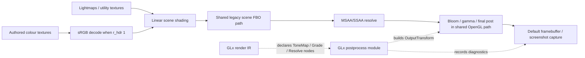
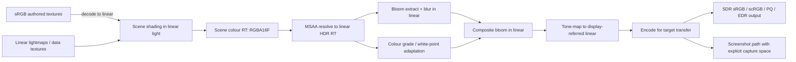

# HDR Pipeline Review of the GLx Renderer in

## Executive summary

The new GLx renderer has a strong **contract layer** for HDR and post-processing, but not yet a strong **owned implementation layer**. The repository clearly defines a modern render-product model with scene-linear output, tone mapping, colour grading, optional hardware HDR output, and typed post nodes; however, the GLx-side code that I could inspect is overwhelmingly **telemetry, policy, and configuration plumbing**, not the actual rendering/shader execution of those stages. The documentation confirms that the current GLx baseline still reuses the compatibility-proven OpenGL FBO + ARB-program path rather than a distinct GLx-owned HDR pipeline. In practice, that means the code is currently better at **describing** and **auditing** an HDR pipeline than at **guaranteeing** a correct one. fileciteturn25file1 fileciteturn25file2 fileciteturn25file4

The most important technical risk is a likely or at least badly documented **render-target format error/ambiguity**: the GLx colour-space audit currently describes the main scene FBO as using `GL_RGBA8`, `GL_RGBA16`, or debug `GL_RGBA4`. For HDR scene-linear rendering, `GL_RGBA16` is an unsigned normalised integer format, not a floating-point HDR format; by entity["organization","Khronos Group","OpenGL standards body"] format semantics, that would clamp scene colour to `[0,1]` and break over-range HDR energy, bloom thresholds above 1, and any meaningful tone-scale pipeline. If the shared renderer path really uses `GL_RGBA16` for HDR, this is a critical correctness defect; if it does not, the documentation is materially misleading and should be corrected immediately. fileciteturn25file3 citeturn11search0turn11search1

The next major issue is that **backend/output-HDR support is declarative but incomplete**. The GLx code selects between SDR sRGB, Windows scRGB, HDR10/PQ, macOS EDR, and Linux experimental HDR backends, but the code I could inspect only builds an `OutputTransform` descriptor and records diagnostics. There is no evidence in the GLx module itself of real PQ/EDR/scRGB encoding shaders, output-primaries handling, HDR metadata emission, ICC application, or a true Linux HDR protocol handoff. The current Linux experimental path is especially weak: it maps to `LinearSrgb`, which is not by itself a valid end-to-end display-output contract. The result is that the module advertises more HDR backend sophistication than it currently enforces. fileciteturn25file1 fileciteturn25file2 fileciteturn25file4 citeturn10search0turn10search5turn8search12turn9search0turn9search2

There is also a serious **contract inconsistency** around luminance defaults. `GLX_RenderIR_DefaultOutputTransform()` defaults to `paperWhiteNits = 80` and `maxOutputNits = 80`, while `GLX_PostProcess_RegisterCvars()` defaults `r_hdrDisplayPaperWhite` to `203` and `r_hdrDisplayMaxLuminance` to `1000`, and the logic tests explicitly assert the 80/80 defaults. That means the pure IR, the runtime cvar surface, and the tests are not using the same physical display assumptions. For an HDR path, this is not a cosmetic discrepancy; it affects exposure interpretation, SDR white anchoring, and the meaning of output transforms. fileciteturn25file1 fileciteturn25file2 fileciteturn26file0

Finally, the repository’s validation surface is good on **architecture-level proof** but weak on **image-science correctness**. The GLx logic tests are excellent at validating tiers, gates, policies, and render-product shapes; the runtime sweep script is excellent at renderer switching, parity screenshots, and performance budgets. But there are no visible unit or image tests for the actual maths that matter in HDR: sRGB decode correctness, half-float vs UNORM storage selection, tone-map monotonicity, PQ encoding, LUT atlas dimension validation, white-point adaptation, or resolve/bloom ordering. As things stand, the project can prove that the pipeline is *described consistently* more easily than it can prove that the pipeline is *numerically correct*. fileciteturn26file0 fileciteturn26file1

## Current architecture and codepath inventory

The HDR-related GLx surface is split across three layers.

The first layer is the **GLx-owned policy and telemetry layer**. `code/rendererglx/glx_postprocess.h` declares the post-process state object and the cvar surface for HDR, tone mapping, grading, output backend choice, paper white, max luminance, bloom thresholding, and diagnostics. `code/rendererglx/glx_postprocess.cpp` implements cvar registration, display-output querying, output-backend selection, `OutputTransform` construction, and extensive per-frame/per-pass telemetry. It does **not** itself implement the GL rendering/shader work for those stages. fileciteturn25file0 fileciteturn25file1

The second layer is the **IR/contract layer**. `code/rendererglx/glx_render_ir.h` defines the GLx render-product vocabulary: frame passes, upload plans, material IR, post nodes, output transfers, scene colour spaces, tone-map operators, colour-grade modes, and tier execution policies. Importantly, it declares `PostNodeKind::Resolve`, `ToneMap`, `Grade`, and `Screenshot`, and it declares that GL3X/GL41/GL46 tiers support scene-linear output and modern post chains. This is where the intended architecture is most explicit. fileciteturn25file2

The third layer is the **shared legacy OpenGL implementation path**. The renderer architecture note states that GLx currently reuses the compatibility-proven OpenGL renderer baseline, and `code/renderer/tr_local.h` still declares the legacy FBO/bloom/gamma surface: `FBO_PostProcess`, `FBO_BlitMS`, `FBO_BlitSS`, `FBO_Bloom`, `FBO_CopyScreen`, and ARB fragment program slots such as `GAMMA_FRAGMENT`, `BLOOM_EXTRACT_FRAGMENT`, `BLUR_FRAGMENT`, and `BLEND2_GAMMA_FRAGMENT`. That strongly indicates that the real post-processing execution still lives in the shared renderer path, not in a GLx-native shader graph. fileciteturn25file4 fileciteturn24file1 fileciteturn23file0

The documentation makes that split explicit. The architecture note says postprocess parity is currently achieved by keeping the shared OpenGL FBO and ARB-program path as the GLx baseline, while at the same time recording richer output-transform and post-node data in GLx. The colour-space audit then states the intended rules for scene-linear mode: sRGB decode for authored colour textures, linear lightmaps/utility textures, linear bloom/grading/tone-map stages, shader-encoded SDR output, and `GL_FRAMEBUFFER_SRGB` disabled on the current final path to avoid double encoding. fileciteturn25file4 fileciteturn25file3

A concise reading of the current flow is therefore:



That is a sensible transitional architecture, but it means many HDR controls are presently **authoritative in configuration** and **advisory in diagnostics**, while implementation ownership remains elsewhere. fileciteturn25file1 fileciteturn25file2 fileciteturn25file4

## Findings by code area

### GLx post-process state and output-transform logic

`GLX_PostProcess_MakeOutputTransform()` is the central function for the GLx-side HDR contract. It derives scene colour space, output transfer, tone-map operator, grading mode, requested/selected/native backend, exposure, bloom thresholding, paper white, max output luminance, display headroom, grading parameters, white-point parameters, and LUT scale. That is the right place to define an HDR pipeline contract. The problem is that this function’s outputs are not, in the code I could inspect, matched by a GLx-owned implementation of the corresponding maths. It is a contract builder, not a renderer. fileciteturn25file1

The function also hard-codes several choices that are too blunt for a production HDR path. Exposure is an arbitrary multiplier clamped to `0.1–8.0`, not a defined EV100 or scene-key value. Bloom threshold is treated as a simple scalar, soft-knee is merely stored, and LUT mode sets `lutSize = 16` without consulting the actual LUT asset. White-point adaptation parameters are stored, but no Bradford or other chromatic-adaptation execution is visible in the GLx module. In other words, the **parameter model is richer than the execution model**. fileciteturn25file1

A second problem is state freshness. `GLX_PostProcess_RecordFrame()` only refreshes display-output information on frame 1 and then every 120 frames. Yet the chosen display backend depends on dynamic properties such as HDR-enabled state, headroom, and display identity. The official entity["software","SDL","cross-platform development library"] window property model explicitly allows HDR-related window properties to change dynamically, so a coarse polling cadence is the wrong abstraction for display-state-sensitive output transforms. fileciteturn25file1 citeturn8search12

### IR contracts and tier claims

`glx_render_ir.h` is well designed as an interface contract: it defines scene colour space separately from output transfer, it distinguishes tone mapping from colour grading, and it allows post nodes for resolve, tone map, grade, bloom, and screenshots. That separation is exactly what a correct HDR pipeline wants. Its tier execution policy tables are also thoughtful: GL12 is fixed-function SDR-only, GL2X is programmable but not scene-linear, and GL3X/GL41/GL46 are expected to support scene-linear output and more modern post chains. fileciteturn25file2

The issue is that the tier tables currently mix **implemented behaviour** and **architectural target state**. The logic tests even assert those tier-support claims, which is useful for long-term direction, but the architecture note simultaneously says the current GLx implementation still reuses the shared OpenGL postprocess baseline. So the IR says “GL3X supports scene-linear output and modern post chain”, while the implementation note says “the current reality is still the compatibility path plus telemetry”. That gap is not fatal, but it should be made explicit in code: the project needs separate flags for “contract target”, “implemented today”, and “gate-ready”. fileciteturn25file2 fileciteturn25file4 fileciteturn26file0

### Shared OpenGL path and render-target semantics

The repository’s colour-space audit is the most revealing document for numeric storage. It says the main scene FBO uses “linear numeric storage” and names `GL_RGBA8`, `GL_RGBA16`, and debug `GL_RGBA4` as the storage classes for the main target. This is fine for compatibility SDR and for a debug-bit-depth mode, but it is **not fine for HDR** if the “16” format is really `GL_RGBA16` rather than `GL_RGBA16F`. By Khronos format semantics, `GL_RGBA16` is an unsigned normalised integer format that stores floating values on `[0,1]`; only `GL_RGBA16F` provides half-float storage for genuine scene-linear HDR. fileciteturn25file3 citeturn11search0turn11search1

That matters immediately for bloom and tone mapping. A threshold above `1.0` is meaningless if the shading target has already clipped at `1.0`. Any output transform that assumes a HDR scene-linear domain also becomes physically decoupled from the data actually stored in the FBO. Even if the actual shared renderer path uses `GL_RGBA16F` and the audit is simply wrong, the documentation is still misleading enough that it will cause bad maintenance decisions later. This is the single most important implementation point to confirm and fix. fileciteturn25file3 fileciteturn24file1 citeturn11search0

### Output backends, transfer functions, and metadata

The GLx code recognises these output transfers/backends: SDR sRGB, linear sRGB, scRGB, HDR10/PQ, macOS EDR, screenshot sRGB, plus an experimental Linux HDR backend. That is a useful taxonomy, but it is incomplete as a real display-pipeline contract. For HDR10/PQ in particular, production output usually needs more than a transfer function tag: you need explicit output primaries/gamut handling, tone scaling into monitor capability, and sometimes metadata or OS colourspace negotiation. The current `OutputTransform` does not carry output primaries, a gamut-mapping mode, a mastering-display description, or HLG. fileciteturn25file1 fileciteturn25file2 citeturn10search0turn10search5turn10search2

The Windows side deserves particular caution. Microsoft’s current guidance is that applications should **not rely on explicit HDR metadata** being sent or honoured consistently, and should instead tone-map into the monitor’s reported capability range; scRGB is explicitly the standard full-range linear BT.709 space that is commonly used with 16-bit float channels for Windows advanced colour. That aligns reasonably well with the project’s backend naming, but the GLx module as inspected only selects and reports backends; it does not show a concrete scRGB/PQ handoff implementation. citeturn9search0turn9search2

The Linux path is the weakest. Mapping the experimental backend to `OutputTransfer::LinearSrgb` is a placeholder, not a display output standard. Without explicit compositor/protocol integration, “linear sRGB” is not enough to define how the pixel stream reaches an HDR monitor. This backend should remain clearly quarantined as experimental until the platform layer owns real colourspace negotiation. fileciteturn25file1 fileciteturn25file4

## Issue register with concrete fixes

The table below lists the highest-confidence corrections and improvements. For long shared files where exact line ranges were not recoverable through the connector output in this session, I use **file + function/API anchor** rather than pretending to have exact line numbers.

| ID | Location | Severity | Root cause | Concrete fix | Validation | Effort |
|---|---|---:|---|---|---|---:|
| TP-A | `code/rendererglx/glx_postprocess.cpp` — `GLX_PostProcess_MakeOutputTransform`, all `Record*`; `code/rendererglx/glx_render_ir.h` — `PostNode`, `OutputTransform` | **Critical** | GLx owns the HDR/post contract and diagnostics, but not the actual postprocess execution. Modern post nodes are declared, not owned. fileciteturn25file1 fileciteturn25file2 fileciteturn25file4 | Move Resolve → Bloom → Grade → ToneMap → OutputEncode into a GLx-owned post chain. Keep legacy path only as an explicit fallback tier. Add GLSL/ARB implementations per tier and make the executor, not the compatibility path, own pass order. | Unit: pass-order hash plus executable-node count. Visual: golden PNG/EXR captures. GPU: one final encode pass only. | 24–40h |
| TP-B | Shared scene FBO path described in `docs/fnql/GLX_COLORSPACE_AUDIT.md`; implementation anchor `code/renderer/tr_arb.c` / FBO init | **Critical** | The audit currently names `GL_RGBA16` rather than `GL_RGBA16F` for scene-linear HDR storage. If true in code, HDR clips at 1.0. If false, docs are wrong. fileciteturn25file3 fileciteturn23file0 citeturn11search0 | In HDR mode force `GL_RGBA16F` for scene colour; optionally allow `GL_R11F_G11F_B10F` for alpha-free bloom scratch targets. Keep `GL_RGBA8` for SDR only; keep `GL_RGBA4` only as explicit debug mode. Log the actual internal format in `glxpostprocess` and assert it in tests. | GL test: query internal formats. Visual: render >1.0 emissive wedge; bloom threshold >1 still works. | 4–8h |
| TP-C | `code/rendererglx/glx_render_ir.h` — `GLX_RenderIR_DefaultOutputTransform`; `code/rendererglx/glx_postprocess.cpp` — `GLX_PostProcess_RegisterCvars`; `tests/glx/glx_logic_tests.cpp` | **Major** | Defaults are inconsistent: IR defaults to 80/80 nits, runtime cvars default to 203/1000, tests assert 80/80. fileciteturn25file1 fileciteturn25file2 fileciteturn26file0 | Pick one coherent default model. Recommended: keep scene defaults consistent with runtime cvars, and distinguish `paperWhiteNits`, `displayMaxNits`, and “uninitialised/unknown display” explicitly. Update tests and docs together. | Unit: default-output-transform snapshot. Diagnostic: `glxpostprocess` startup snapshot before/after FBO init. | 2–4h |
| TP-D | `code/rendererglx/glx_postprocess.cpp` — LUT handling in `GLX_PostProcess_MakeOutputTransform` | **Major** | `lutSize` is hard-coded to `16` when LUT grading is enabled; there is no visible atlas-dimension parsing or validity check. fileciteturn25file1 | Load LUT metadata from the asset, infer `N` from `width = N*N`, `height = N`, reject malformed atlases, and store actual `lutSize` in the transform. Fail closed to identity if invalid. | Unit: 16/32/64 LUT size parsing. Visual: identity LUT must be no-op; warm LUT must match CPU reference. | 6–10h |
| TP-E | `code/rendererglx/glx_postprocess.cpp` — backend selection and transfer mapping; `code/rendererglx/glx_render_ir.h` — `OutputTransfer` | **Major** | Backend selection lacks output primaries/gamut mapping and does not expose HLG; HDR10/PQ, scRGB, and EDR are treated mainly as transfer/backend labels. fileciteturn25file1 fileciteturn25file2 citeturn10search0turn10search5turn9search2 | Extend `OutputTransform` with output primaries, gamut mapping, and a mastering/display capability block. Keep HLG explicitly unsupported or implement it deliberately; do not leave it implied. | CPU reference tests for PQ/HLG transfer, gamut mapping, and nit scaling. | 12–20h |
| TP-F | `code/rendererglx/glx_postprocess.cpp` — Linux experimental backend maps to `LinearSrgb` | **Major** | `LinearSrgb` is a placeholder, not a complete Linux HDR output contract. fileciteturn25file1 | Keep this backend developer-only until the platform layer owns an explicit compositor/protocol HDR path. Rename diagnostics to make “telemetry/prototype only” unmistakable. | Runtime: ensure unsupported Linux setups never silently select HDR. | 3–6h |
| TP-G | `code/rendererglx/glx_postprocess.cpp` — ICC/profile fields | **Major** | ICC availability and byte count are tracked, but there is no visible colour-management application stage. fileciteturn25file1 | Either remove ICC hints from the “active pipeline” story until they are used, or implement a display-management stage for SDR/HDR output. | CPU reference: compare shader output against a CMS-transformed reference image. | 8–20h |
| TP-H | `code/rendererglx/glx_postprocess.cpp` — `GLX_PostProcess_RecordFrame` | **Major** | Display-output state is only re-polled every 120 frames, which is too stale for display moves/HDR toggles. fileciteturn25file1 citeturn8search12 | Prefer event-driven invalidation; otherwise shorten the poll interval drastically and also poll on display/window changes. | Manual/automated: move window between HDR and SDR displays and verify one-frame or near-one-frame convergence. | 2–6h |
| TP-I | `code/rendererglx/glx_postprocess.cpp` — exposure, tone-map selection | **Major** | Exposure is an arbitrary multiplier, not EV100 or another stable scene-referred quantity. Tone-map operator naming is better defined than its photometric contract. fileciteturn25file1 citeturn7search0turn7search6 | Represent exposure as log2 EV steps or explicitly as a scene-key/middle-grey calibration; define how paper white and display max interact with each operator. | Grey-card reference tests; highlight shoulder monotonicity tests. | 4–8h |
| TP-J | `tests/glx/glx_logic_tests.cpp`; `scripts/glx_runtime_sweep.py` | **Major** | Tests validate tier/policy/profile correctness, but not radiometric correctness: no visible tests for sRGB decode, PQ encode, LUT sampling, internal format selection, or resolve order. fileciteturn26file0 fileciteturn26file1 | Add CPU math tests and image-based shader tests. Extend sweeps to compare EXR/PNG references, not just gameplay screenshots and performance counters. | Unit + visual + GPU capture. | 8–16h |
| TP-K | `code/rendererglx/glx_render_ir.h` tier policy tables; `docs/fnql/GLX_RENDERER.md` | **Major** | Tier tables over-promise relative to current runtime ownership: “scene-linear output” and “optional hardware HDR output” are contract goals more than present implementation facts. fileciteturn25file2 fileciteturn25file4 | Split “planned” from “implemented” in diagnostics and internal feature flags. Gate release claims on implemented flags, not target-tier descriptions. | Logic test: implemented-vs-target matrix must stay coherent. | 3–5h |
| TP-L | `code/rendererglx/glx_postprocess.cpp` — `GLX_PostProcess_HdrPrecisionMode`; `OutputTransform.precisionMode` | **Minor** | User intent (`auto`) is collapsed into a resolved mode (`8` or `16`), losing traceability. fileciteturn25file1 fileciteturn25file2 | Store both requested precision and resolved precision. | Unit: cvar round-trip and diagnostic print-out. | 1–2h |

## Corrected target pipeline

The correct long-term target is not complicated conceptually. The project already has nearly all the right nouns; it now needs them to become executable stages with precise numeric semantics.



That target follows the repository’s intended scene-linear model and aligns with the official urlOpenGL registryturn6search5 semantics around sRGB decode, half-float storage, and framebuffer encoding, as well as with modern ACES- and Reinhard-style output thinking. fileciteturn25file2 fileciteturn25file3 citeturn6search0turn11search0turn7search0turn7search6

A practical scene-target selection patch would look like this:

```cpp
static GLenum ChooseSceneColorInternalFormat(bool hdrEnabled, int requestedPrecision)
{
    if (!hdrEnabled) {
        return GL_RGBA8;          // or GL_SRGB8_ALPHA8 if using fixed-function sRGB encode on write
    }

    if (requestedPrecision == -1) {
        return GL_RGBA4;          // debug only
    }

    // Always floating point in HDR mode.
    return GL_RGBA16F;
}
```

The important rule is simple: **HDR scene storage must be floating-point**. `GL_RGBA16F` is the conservative default; `GL_R11F_G11F_B10F` is a possible optimisation for scratch buffers without alpha, especially bloom ping-pong targets. citeturn11search0

A corrected final-pass contract should also make transfer choice explicit:

```glsl
vec3 scene = texture(uScene, uv).rgb;
vec3 bloom = texture(uBloom, uv).rgb;

vec3 linearScene = scene + bloom;
linearScene = ApplyWhitePointAdaptation(linearScene, srcWhiteK, dstWhiteK);
linearScene = ApplyLiftGammaGainOrLUT(linearScene);
vec3 displayLinear = ApplyToneMap(linearScene, exposure, paperWhiteNits, maxOutputNits);

vec3 encoded = EncodeForTransfer(displayLinear, outputTransfer, paperWhiteNits, maxOutputNits);
outColor = vec4(encoded, 1.0);
```

For SDR, that final encode can remain a shader encode **if and only if** all blending is completed in linear space before that pass. If the engine ever wants to write linear values directly into an actual sRGB framebuffer and preserve correct blend behaviour there, it should instead use an sRGB-capable target with `GL_FRAMEBUFFER_SRGB` enabled, because OpenGL will then linearise destination values for blending and convert the result back to sRGB on store. citeturn6search0turn11search0

### Render-target format comparison

The repository’s declared/current state and the recommended state are compared below. This table is derived from the GLx colour audit, the GLx postprocess state, and Khronos format semantics. fileciteturn25file1 fileciteturn25file3 citeturn11search0turn6search0

| Stage | Current declared / observable state | Problem | Recommended replacement |
|---|---|---|---|
| Scene colour target | `GL_RGBA8`, `GL_RGBA16`, or debug `GL_RGBA4` in audit | `GL_RGBA16` is not HDR-capable if it is UNORM | `GL_RGBA16F` in HDR mode; `GL_RGBA8` only for SDR |
| Bloom scratch chain | “linear numeric storage”, not precisely owned by GLx | Ambiguous format, unclear headroom and bandwidth trade-off | `GL_R11F_G11F_B10F` or `GL_RGBA16F` |
| Final SDR output | Shader-encoded sRGB; `GL_FRAMEBUFFER_SRGB` disabled | Correct only if all blending happens before final encode | Keep current model, but assert ordering; or move to sRGB FBO + fixed-function encode |
| Screenshot / capture | SDR sRGB bytes after final output transform | Good for current parity, but capture-space contract must stay explicit | Keep SDR sRGB for standard screenshots; add explicit HDR capture mode later |
| Hardware HDR output | Backend enum/selection only | Missing explicit primaries/gamut/metadata/output handoff | Platform-specific scRGB / PQ / EDR path with defined colour contract |

### Tone-map operator comparison

The current operator surface is small and sensible, but it should be used more deliberately. fileciteturn25file1 fileciteturn25file2 citeturn7search0turn7search6

| Operator | Current status | Best use | Recommendation |
|---|---|---|---|
| Legacy | Enumerated; compatibility-oriented | Preserve classic SDR appearance under `r_hdr 0` | Keep, but confine to compatibility path |
| Reinhard | Enumerated | Debug and simple HDR compression | Keep as a developer/reference operator |
| ACES | Enumerated | Better default SDR tone scale than Reinhard in many content sets | Make this the default for scene-linear SDR output once implemented properly |
| HDR10/PQ output | Backend exists, but end-to-end path incomplete | Hardware HDR displays | Use a display-targeted output transform into PQ, not a generic SDR filmic curve blindly re-used |

## Validation plan and benchmark corpus

The existing GLx sweep harness is a strong foundation, but HDR needs a **purpose-built image-science corpus** in addition to gameplay maps and demos. The fastest path is to add a small set of deterministic reference images and expected numerical outcomes into the current sweep / proof system. fileciteturn26file1

### Recommended visual and numerical test cases

| Input | Purpose | Expected outcome |
|---|---|---|
| `greycard_18pct.exr` | Exposure + middle-grey anchoring | 18% grey lands at the configured display-referred target after tone mapping |
| `specular_wedge_0_4000nits.exr` | Highlight roll-off | Monotonic compression; no premature clipping; bloom kicks in only above threshold |
| `bloom_threshold_ramp.exr` | Bloom threshold + soft knee | Hard threshold mode shows a sharp onset; soft-knee mode shows smooth onset |
| `srgb_vs_linear_checker.png` | Texture decode correctness | Authored sRGB inputs match linearised reference when `r_srgbTextures 1` |
| `identity_lut_16.png` and `warm_lut_32.png` | LUT validation | Identity LUT is a no-op; warm LUT matches CPU reference; malformed LUT is rejected |
| `pq_code_steps.exr` | PQ output encoding | Encoded values are monotonic and map to expected nit points |
| `msaa_starburst.map` | Resolve ordering | Resolve occurs before bloom/tone map; no double-filtered halos |
| `ui_over_bright_scene.map` | Final blend correctness | UI remains crisp and correctly composited without non-linear blend artefacts |

These should be paired with CPU reference implementations for sRGB encode/decode, PQ encode/decode, Reinhard, the selected ACES fit, and LUT addressing. The Linux kernel documentation reproduces the ST 2084 transfer constants, and the current ITU BT.2100 standard remains the relevant HDR-system reference for PQ and HLG. ACES documentation is the right primary reference for a modern filmic tone scale. citeturn10search5turn10search0turn7search0turn7search6

### Recommended performance benchmarks

The existing sweep script already captures compact GLx performance counters and enforces budgets. HDR-specific benchmarking should add per-pass GPU timings for:

- scene shading into HDR RT,
- MSAA resolve,
- bloom extract,
- each blur pass,
- grade/LUT pass,
- tone-map/output-encode pass,
- screenshot/capture path. fileciteturn26file1

The key acceptance metrics should be:

- **zero** stream rejects and same-frame wrap rejects in RC profiles,
- **zero** material compile/link/precache failures,
- **zero** static MDI errors and postprocess FBO failures,
- stable GPU frame-time deltas between SDR and HDR modes,
- bounded bandwidth growth from RGBA8 to RGBA16F scene targets,
- screenshot RMS / changed-pixel thresholds for approved proof scenes. fileciteturn26file1

## Prioritized action plan

### Short-term fixes

The first tranche should be about correctness and honesty.

Confirm the actual HDR scene render-target format in the shared FBO path. If it is `GL_RGBA16`, change it to `GL_RGBA16F` immediately; if it is already half-float, fix the colour-space audit and diagnostics so they stop implying otherwise. Unify default paper white / max luminance values between the IR, runtime cvars, tests, and documentation. Replace the hard-coded LUT size with a real atlas parser and fail-closed behaviour. Shorten or invalidate the 120-frame display-output polling window. Mark Linux experimental HDR as telemetry-only until it has a real platform handoff. fileciteturn25file1 fileciteturn25file2 fileciteturn25file3 fileciteturn26file0

Estimated effort for this batch: **18–30 hours**.

### Medium-term refactors

The second tranche should make GLx **own the post chain**.

Implement actual GLx-owned post nodes for resolve, bloom extract/blur, grade/LUT, tone map, and output encoding. Make the pass order executable from the IR, not merely inspectable in telemetry. Add explicit output-primaries/gamut fields to `OutputTransform`. Split “target tier capability” from “implemented now” in diagnostics and proof gates. Add image-based tests for sRGB decode, PQ, LUTs, and format selection into the existing logic/sweep framework. fileciteturn25file2 fileciteturn25file4 fileciteturn26file1

Estimated effort for this batch: **32–56 hours**.

### Long-term improvements

The final tranche is about display-grade HDR and mature colour management.

Add proper platform output handoff for Windows scRGB / HDR10, macOS EDR, and a real Linux HDR protocol path if the project wants to ship it. Introduce output-primaries and gamut mapping. Decide whether HLG is in scope; if not, state that explicitly, and if yes, add it as a first-class output transfer rather than an implied “future”. Consume ICC/display-profile information or stop surfacing it as if it were active pipeline state. Explore post-chain optimisation, such as half-resolution bloom, `R11F_G11F_B10F` scratch buffers, or tier-specific compute/DSA paths once correctness is locked in. fileciteturn25file1 fileciteturn25file2 citeturn9search0turn9search2turn10search0

Estimated effort for this batch: **40–80 hours**, depending on how much platform-handshake work is done inside versus outside the renderer module.

## Open questions and limitations

The highest-confidence findings in this report come from the GLx-owned postprocess code, the render-IR contract, the colour-space audit, the renderer architecture notes, the logic tests, and the sweep harness. The one important place I could not fully expand through the connector output in this session was the long shared implementation file that actually owns the current OpenGL FBO/ARB post path. Because of that, findings about exact internal formats and exact pass-order execution in the shared renderer are anchored to exported APIs, architecture notes, and the colour audit rather than a complete line-by-line reading of every shared postprocess shader/program block. The first short-term task should therefore confirm the actual formats and pass order in that shared implementation before code changes begin. fileciteturn25file3 fileciteturn25file4 fileciteturn24file1 fileciteturn23file0

Even with that limitation, the central conclusion is firm: the GLx renderer already has the right **vocabulary** for a modern HDR pipeline, but it still needs to convert that vocabulary into a single, owned, numerically explicit, and test-backed implementation. Right now, the biggest risks are not “missing fancy features”; they are **format ambiguity**, **contract/implementation drift**, and **backend claims that are ahead of the actual executable path**. fileciteturn25file1 fileciteturn25file2 fileciteturn25file4