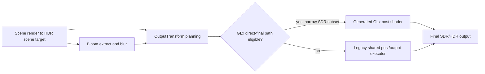
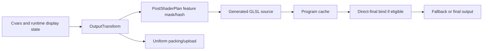

# HDR Review of the GLx Renderer in FnQL

## Executive summary

The strongest high-confidence conclusion is that HDR in this repository is **architecturally split** across two layers: a newer GLx-native planning/reference layer in `code/rendererglx/` and a still-important legacy/shared execution layer in `code/renderer2/`. The GLx side already has a clear IR for `OutputTransform` and `PostNode`, CPU reference color math, a post-shader feature planner, and a generated GLSL path with program caching. But the executed GLx-owned path is still narrow: the generated post shader’s **direct-final path is explicitly experimental and currently limited to an eligible scene-linear SDR subset**, while bloom-final, greyscale, blit/capture, and hardware-HDR output shapes still fall back to the legacy ARB/FBO executor. In practice, that means the repository has made major progress on **HDR architecture and validation**, but not yet on **full end-to-end GLx ownership of HDR output**. fileciteturn40file0L3-L3 fileciteturn19file0L3-L3 fileciteturn16file0L3-L3 fileciteturn36file0L3-L3 fileciteturn37file0L3-L3

The second major conclusion is that the implementation is **conceptually ahead of its execution details**. The IR exposes scene color space, tone map operator, grade mode, output transfer, output primaries, gamut map mode, requested/selected backend, exposure, bloom threshold, paper white, max output nits, headroom, LUT sizing, and white-point adaptation. However, not all of those abstractions are fully realized in the current executable path. Most importantly, the visible code shows that **BT.2020/PQ is a first-class planned path, but Display P3 and Native primaries are represented in the IR without equivalent feature-bit coverage in the post-shader plan or equivalent non-BT.2020 reference encoding logic**. That mismatch is significant because it means the engine’s public control surface is broader than the part of the HDR path that is clearly implemented and proven. fileciteturn40file0L3-L3 fileciteturn15file0L3-L3 fileciteturn20file0L3-L3

The third major conclusion is that the current “HDR quality” story is mixed. Some decisions are solid: `RGBA16F` scene storage is a sensible default for a scene-linear target; the repository’s color-space audit explicitly states that SDR final output is shader-encoded to sRGB with `GL_FRAMEBUFFER_SRGB` disabled to avoid double encoding; and the GLx reference layer correctly models exposure, optional grading, tone mapping, and transfer encoding in that order. But several pieces still need tightening: auto-exposure in the shared renderer remains frame-count based and not time-constant based; the current “ACES” implementation is a common fitted per-channel approximation rather than the official ACES output transform; the current “Reinhard” implementation is the simple per-channel `x / (1 + x)` form rather than the full photographic operator from the original paper; and NaN/Inf hardening is not yet strong enough for untrusted cvar inputs and pathological frame statistics. fileciteturn36file0L3-L3 fileciteturn20file0L3-L3 fileciteturn17file0L3-L3 fileciteturn28file0L3-L3 fileciteturn29file0L3-L3 citeturn10search1turn10search4turn5search1

The overall recommendation is therefore straightforward: **make GLx own the full HDR/post/output chain first, then tighten correctness, then optimize formats and pass structure**. That ordering reduces architectural risk, keeps backward compatibility manageable, and aligns with the repo’s own feature matrix, which already treats ownership and promotion proof as the gating issue. fileciteturn37file0L3-L3

External validation for the recommendations below is anchored in official or primary material from the urlKhronos OpenGL registryturn5search5 and wiki, the urlSDL HDR/window colorspace docsturn7search0, urlMicrosoft Advanced Color docsturn4search0, urlApple HDR/EDR docsturn8search0, the staged urlWayland color-management protocolturn9search0, the original Reinhard paper, official ACES documentation, and official docs for timer queries and image-quality metrics. citeturn5search1turn6search1turn7search0turn4search0turn8search0turn9search0turn10search1turn10search4turn15search0turn14search0turn14search3

## Current implementation map

The current HDR implementation spans both the GLx-native renderer and the shared legacy OpenGL postprocess/FBO stack. The table below maps the main files to their current responsibilities. fileciteturn40file0L3-L3 fileciteturn20file0L3-L3 fileciteturn16file0L3-L3 fileciteturn28file0L3-L3 fileciteturn32file0L3-L3

| File path | Current responsibility |
|---|---|
| `code/rendererglx/glx_render_ir.h` | Defines the render IR, `PostNode`, `OutputTransform`, pass schedule, post/output fallback reasons, and per-tier execution policy. fileciteturn40file0L3-L3 |
| `code/rendererglx/glx_color_math.h` | CPU reference math for sRGB decode/encode, simple Reinhard and ACES-fitted tone curves, PQ encoding, Bradford white-point adaptation, LUT addressing/sampling, and bloom weighting helpers. fileciteturn17file0L3-L3 |
| `code/rendererglx/glx_post_output_reference.h` | CPU reference output pipeline: exposure → color grade → tone map → transfer encode. Also contains BT.2020 conversion for HDR10/PQ encode. fileciteturn20file0L3-L3 |
| `code/rendererglx/glx_post_shader_plan.h` | Converts `OutputTransform` into a reusable shader feature mask and hash. Features include scene-linear, L/G/G grade, LUT, Reinhard, ACES, sRGB encode, HDR10/PQ encode, BT.2020 output, and gamut compression. fileciteturn15file0L3-L3 |
| `code/rendererglx/glx_post_shader_source.h` | Generated GLSL 1.20 compatibility-profile source for the post/output shader family. The repo’s color-space audit says it covers SDR sRGB, ACES/Reinhard, L/G/G, Bradford hooks, LUT sampling, BT.2020 conversion, gamut compression, and HDR10 PQ encode. fileciteturn14file0L3-L3 fileciteturn36file0L3-L3 |
| `code/rendererglx/glx_post_shader.cpp` / `.h` | Compiles/caches generated programs, uploads uniforms, tracks diagnostics, and can bind an experimental direct-final path. The direct-final path is constrained to scene-linear SDR eligibility and is disabled by default. fileciteturn16file0L3-L3 fileciteturn19file0L3-L3 |
| `code/rendererglx/glx_executor.cpp` | Tier-aware consumer of `PostNode` and `OutputTransform`, but currently used more as a validator/ownership ledger than as a complete HDR executor. fileciteturn38file0L3-L3 |
| `code/renderer2/tr_postprocess.c` / `.h` | Legacy/shared postprocess execution: auto-exposure reduction, tone mapping, gamma pass, blur, sun rays, and bloom-related full-screen processing. This still matters because GLx falls back here for several post/output shapes. fileciteturn28file0L3-L3 fileciteturn27file0L3-L3 |
| `code/renderer2/glsl/tonemap_fp.glsl` | Legacy tone map fragment shader using the repo’s filmic curve, auto-exposure inputs, and optional `USE_PBR` square/sqrt gamma approximations. fileciteturn29file0L3-L3 |
| `code/renderer2/tr_fbo.c` | FBO creation and format selection. When `r_hdr` is enabled and float textures are available, it selects `GL_RGBA16F_ARB` for the HDR render target. fileciteturn32file0L3-L3 |
| `tests/glx/glx_logic_tests.cpp` and `tests/glx/glx_runtime_sweep_tests.py` | Logic tests and runtime sweep/testing harness, with strong metadata coverage but still limited real-image HDR fidelity coverage. fileciteturn21file0L3-L3 fileciteturn24file0L3-L3 |

The current render and ownership flow is best understood as follows. The repository’s own docs and code show a modern IR and shader-planning layer, but only partial execution ownership in GLx today. fileciteturn37file0L3-L3 fileciteturn36file0L3-L3 fileciteturn16file0L3-L3



The control/data flow for the GLx-native side is also already clear in the code. fileciteturn40file0L3-L3 fileciteturn15file0L3-L3 fileciteturn16file0L3-L3



## Code-level critique

The most important code-level issue is **partial implementation behind a broader public API**. `OutputTransform` already exposes multiple output transfers, scene spaces, tone-map operators, output primaries, gamut map modes, paper white, max output nits, and display headroom. But `glx_post_shader_plan.h` only emits an explicit output-primaries feature for `Bt2020`, and `glx_post_output_reference.h` only applies an explicit primaries transform in the HDR10/PQ path by converting linear sRGB to BT.2020 before PQ encode. Linear outputs otherwise just return the clamped linear color. That means `DisplayP3` and `Native` currently exist as public IR states without obvious fully implemented transform paths in the visible reference code. This is a correctness and maintenance risk because developers can think they are selecting a complete path when they are really selecting an underdefined state. fileciteturn40file0L3-L3 fileciteturn15file0L3-L3 fileciteturn20file0L3-L3

The repository’s “ACES” naming is also too generous. `GLX_ColorMath_ToneMapAcesFitted()` uses the common 5-parameter fitted curve with constants `2.51, 0.03, 2.43, 0.59, 0.14`, clamps to `[0, 1]`, and is applied per channel. That is not the official ACES output transform as documented by ACES itself, which uses a more complete path involving tonescale, chroma compression, gamut compression, white limiting, and display encoding. The implementation may be perfectly usable as a stylized filmic curve, but it should either be renamed to something like `AcesFittedLegacy` or a true ACES output transform should be added as a separate operator. The same naming problem exists for “Reinhard”: the code implements the simple `x / (1 + x)` curve, not the full photographic operator from Reinhard et al. 2002. That naming mismatch matters because it muddies test expectations and makes it harder to compare the engine against external references. fileciteturn17file0L3-L3 fileciteturn20file0L3-L3 citeturn10search1turn10search4

Color-space handling is noticeably better on the GLx-native side than on the legacy/shared side, but it is not yet fully unified. The GLx audit explicitly documents the intended modern SDR contract: authored color textures decode from sRGB when scene-linear HDR is active, bloom/grade/tone map are done in linear space, the final SDR path encodes to sRGB in shader, and `GL_FRAMEBUFFER_SRGB` remains disabled to avoid double encoding. That is the correct contract under OpenGL’s sRGB rules, because `GL_FRAMEBUFFER_SRGB` should only be enabled when the destination attachment is sRGB-encoded and the shader outputs linear values intended for automatic conversion and correct blend-space linearization. The visible shared legacy path, however, still has separate tone-map and gamma passes, and the legacy tone-map shader still uses `square/sqrt` approximations under `USE_PBR`. The repository should converge on one transfer-encoding contract and one reference implementation, then mechanically test every execution path against it. fileciteturn36file0L3-L3 fileciteturn28file0L3-L3 fileciteturn29file0L3-L3 citeturn5search1

Exposure control is an area where the legacy code is clearly behind the newer architecture. In `RB_ToneMap()`, auto-exposure is refreshed only when the frame gap exceeds a threshold or every five frames, the luminance reduction uses a fixed `256x256` seed and repeated blits down to `1x1`, and adaptation uses a constant blend alpha of `0.03` for float and `0.1` for non-float targets. That makes the effective adaptation speed dependent on frame cadence and format choice rather than elapsed time. It can produce visible instability under variable frame rate, pause/resume, map loads, or GPU stalls. The fix is to move to a **time-constant adaptation model** with clamped exposure and a better luminance statistic, ideally a histogram percentile on GL4.2+ tiers and a reduced fallback on older tiers. fileciteturn28file0L3-L3 citeturn15search0

A related issue is **numeric hardening**. The current reference code protects some cases by clamping negatives and using minimum denominators, but it still assumes a fairly well-behaved input domain. Exposure can be forced to zero, gamma can be near zero, paper white and max output can be mis-set, and downscaled exposure statistics can produce bad values if upstream data goes pathological. In desktop GLSL 1.20 there is no convenient modern `isnan()`/`isinf()` path, so the repository should add explicit finite-value sanitization on the CPU side and conservative guard macros on the shader side for every output transform input. This is both a stability issue and a security-style robustness issue: cvar-driven engines need to fail soft, not emit NaNs into the frame graph. fileciteturn17file0L3-L3 fileciteturn20file0L3-L3 fileciteturn16file0L3-L3

Bloom and flare are functionally rich but still too transitional. The color math layer already contains bloom metric and weight helpers with threshold modes and a soft knee, which is the right direction. But the repo’s own docs say the generated GLx post shader still does **not** own bloom-final, greyscale, blit/capture, or hardware-HDR shapes; those keep using the legacy executor. That means bloom correctness is still partly dependent on the older FBO/blit path. Architecturally, bloom extraction, blur, and additive recomposition should all be scene-linear and tested against the same `OutputTransform` contract as the final tone-map/output stage. Until that is true, bloom can remain a source of feature drift between the “planned” GLx HDR design and the “actually executed” image. fileciteturn17file0L3-L3 fileciteturn36file0L3-L3 fileciteturn37file0L3-L3

Program and resource management are serviceable but not ready for a larger HDR surface area. `glx_post_shader.cpp` uses a fixed program-limit array of 32 entries, no eviction policy, and only a small precache set. That is fine while the direct-final path covers a narrow subset, but as soon as the repository expands into multiple output transfers, multiple primaries, LUT variations, bloom ownership, and true hardware-HDR paths, 32 permutations is small enough to become a real operational limit. The existing diagnostics counters are useful; the next step is to add a real eviction policy, stronger program-cold-start telemetry, and explicit decisions about how shader programs are keyed across tiers and output backends. fileciteturn19file0L3-L3 fileciteturn16file0L3-L3

A final code-level point concerns shader targets. The generator deliberately emits deterministic GLSL 1.20 compatibility-profile code, which is the right compatibility move for GL2X-era targets, but it is also a long-term constraint. HDR output paths benefit from explicit interface locations, uniform blocks, better integer support, better debug tooling, and cleaner specialization choices. The tier policy already distinguishes GL2X, GL3X, GL41, and GL46. The implementation should mirror that by keeping GLSL 1.20 as a fallback generator while also adding a modern GLSL 330/410 path for GL3X+ and GL41+ tiers. Since desktop GLSL 1.20 has no precision qualifiers, the correct critique here is not “missing precision qualifiers,” but “missing a modern shader target where precision, interfaces, and debug ergonomics can be expressed more robustly.” fileciteturn14file0L3-L3 fileciteturn40file0L3-L3

A useful shape for the corrected output path is shown below. This largely matches the repo’s intended math order, but it adds the missing explicit primaries/gamut step, pervasive sanitization, and a hard separation between scene-linear intermediates and transfer encoding. fileciteturn20file0L3-L3 fileciteturn36file0L3-L3

```cpp
// CPU-side pseudocode for the canonical output contract
OutputSample EvaluateOutput(const SceneSample& scene, const OutputTransform& t) {
    OutputSample s{};
    Vec3 color = sanitizeFinite(scene.linearRgb);

    float exposure = clampFinite(t.exposure, 0.0f, 64.0f, 1.0f);
    color *= exposure;
    color = max(color, Vec3(0.0f));

    color = ApplyColorGrade(color, t);      // L/G/G, white-point adaptation, LUT
    color = ApplyBloom(color, t);           // if owned by the same contract
    color = ApplyToneMap(color, t.toneMap); // true operator naming
    color = MapPrimaries(color, t);         // sRGB / P3 / BT.2020 / native
    color = GamutMap(color, t);             // clip or compress, explicit and tested
    color = EncodeTransfer(color, t);       // sRGB / scRGB / PQ / EDR

    s.encoded = sanitizeFinite(color);
    return s;
}
```

And the exposure adaptation itself should be time-based rather than frame-count based. fileciteturn28file0L3-L3

```cpp
// Time-constant adaptation pseudocode
float AdaptExposure(float currentEV, float targetEV, float dtSeconds) {
    const float tauUp   = 0.25f; // brighten quickly
    const float tauDown = 0.80f; // darken more slowly
    const float tau = (targetEV > currentEV) ? tauUp : tauDown;
    const float alpha = 1.0f - std::exp(-dtSeconds / tau);
    return std::lerp(currentEV, targetEV, alpha);
}
```

## Performance and profiling

The current implementation is dominated by exactly the expensive work you would expect: repeated full-screen passes, repeated FBO blits, and format-heavy intermediate traffic. `FBO_BlitFromTexture()` binds the destination FBO, sets viewport and scissor, binds the source texture, binds a shader, updates uniforms, and draws an immediate quad. `RB_ToneMap()` performs an initial exposure-prep pass, a repeated downscale chain from `256x256` to `1x1`, a luminance-adaptation blend, and then the final tone-map pass. `RB_BokehBlur()`, `RB_GaussianBlur()`, and `RB_SunRays()` all add more post-process passes and more bandwidth pressure. That makes the likely bottlenecks very clear: bandwidth on the intermediate buffers, CPU overhead from stateful full-screen blits, and fragmentation of work into many small passes. fileciteturn32file0L3-L3 fileciteturn28file0L3-L3

For formats, `RGBA16F` is a sensible main scene target because the HDR scene can require range, precision, and eventually negative values for some extended-linear or gamut-mapping scenarios. But it is not equally appropriate for every intermediate. The OpenGL format docs make clear that half-float and compact float formats are standard tools here, and OpenGL also has compact float formats like `GL_R11F_G11F_B10F`. A practical improvement is to keep `RGBA16F` for the main scene target and use narrower positive-only intermediates for extract/blur/recombine stages where alpha and negative color are not required. A documented example from official performance material shows that changing an HDR intermediate from `RGBA16F` to `R11G11B10F` reduced texture latency in a post-processing pass because of better cache behavior and lower bandwidth. That does **not** justify changing the scene target blindly, but it is strong evidence for selectively shrinking the bloom chain. fileciteturn32file0L3-L3 citeturn6search0turn6search1turn13search1

Another likely hitch point is the flare path’s occlusion query handling. The code toggles query indices and then calls `glGetQueryObjectuiv(..., GL_QUERY_RESULT, ...)` on the prior query. That is better than pulling the active query immediately, but it can still block if the previous frame’s result is not ready. The debug-only `GL_QUERY_RESULT_AVAILABLE` path is commented out. Since timer queries and asynchronous query results are already part of the GL3X+ tier policy, the repo should use proper asynchronous collection for every post-process profiling path and any flare visibility path that can stall the CPU. fileciteturn28file0L3-L3 fileciteturn40file0L3-L3 citeturn15search0

The profiling plan should therefore be pass-based and tier-aware. For GL3X+ tiers, use GPU timer queries around: scene render, bloom extract, each blur phase, tonemap/final output, screenshot/capture, and any exposure-reduction pass. Record bytes-per-pixel times logical-resolved by intermediate format, and report both **per-pass time** and **per-frame bandwidth estimate**. For GL2X or constrained tiers, record CPU-side counts: number of FBO binds, number of full-screen draws, number of clears, number of viewport/scissor changes, and number of program binds. This can integrate naturally with the existing diagnostics model and gives you actionable before/after numbers for every format or ownership change. fileciteturn38file0L3-L3 fileciteturn24file0L3-L3 citeturn15search0

The concrete profiling tests I would prioritize are these: first, a **format sweep** comparing `RGBA16F` scene plus `RGBA16F` bloom against `RGBA16F` scene plus `R11G11B10F` or `RG16F` bloom; second, a **pass-collapse experiment** comparing today’s multi-blit auto-exposure chain with a histogram or mip-backed reduction on GL4-class tiers; third, an **ownership experiment** comparing legacy final output versus GLx direct-final on the currently eligible scene-linear SDR subset; and fourth, a **driver variance test** across at least one Intel, one AMD, and one NVIDIA desktop GPU, because FBO and shader compilation behavior tends to diverge there. Official guidance also supports minimizing unnecessary framebuffer reads, minimizing redundant clears, and being careful with blended full-screen work because blending increases bandwidth pressure. fileciteturn28file0L3-L3 fileciteturn32file0L3-L3 citeturn13search4turn13search5

## Compatibility and portability

The good news is that the repository already has a strong conceptual compatibility model. `glx_render_ir.h` defines five product tiers — `GL12`, `GL2X`, `GL3X`, `GL41`, and `GL46` — and the tier policy is explicit about what is unavailable at each level. In that policy, true scene-linear output and the modern post chain do not become real citizens until `GL3X+`, while `GL41` explicitly models the macOS OpenGL 4.1 ceiling, and `GL46` is the fully modern high-end path. That is exactly the right structure for an HDR-capable OpenGL-lineage renderer. fileciteturn40file0L3-L3

The portability risk is that the implementation surface is currently broader than the proven executor surface. On Windows, official advanced-color guidance expects applications to deal dynamically with SDR reference white, FP16/scRGB-style composition, HDR10 signaling, and capability changes as windows move between displays or as the user toggles HDR state. SDL’s HDR/window properties also expose exactly those changing pieces of state: HDR enabled, SDR white level, and HDR headroom. On Apple platforms, EDR headroom is inherently dynamic, and Apple’s docs make clear that EDR availability can change and that explicit HDR10 metadata is available when needed. On Linux/Wayland, the current color-management/HDR protocol work is still staged and explicitly marked as testing-phase. So, the correct portability stance is: **Windows and Apple can justify real HDR backends now; Linux HDR should remain explicit, conservative, and staged; all three need runtime capability re-resolution, not startup-only selection.** citeturn4search0turn4search2turn7search0turn8search0turn8search2turn8search11turn11search0turn11search1turn9search0

OpenGL-specific fallbacks also need to stay explicit. The repository is correct to keep `RGBA16F` scene storage conditional on float support and to verify framebuffer completeness. The next compatibility step is to make format fallback more deliberate: query or probe the color-renderability/support of the requested internal formats, prefer `RGBA16F` for scene-linear main targets, allow `RGBA8`/`RGBA16`/debug formats where documented, use `R11G11B10F` only where the pass is positive-only and alpha-free, and never assume that a compact float format is a safe replacement for a general scene target. Official Khronos documentation is clear that image format support and behavior vary by format class and target, and the repo should treat that as a runtime negotiation problem, not a compile-time assumption. fileciteturn32file0L3-L3 citeturn6search1turn6search0

The recommended fallback matrix is therefore simple. Keep `r_hdr 0` and legacy SDR fully stable. Allow `r_hdr 1` scene-linear SDR on GL3X+ first. Keep `GL2X` and `GL12` on their documented compatibility-lite or fixed-function-lite paths. Treat Windows scRGB/HDR10 and Apple EDR as optional hardware outputs selected only when the runtime display state is valid for them. Treat Linux HDR as opt-in experimental until there is stable compositor/protocol proof on the actual platforms you support. This aligns with both the repo’s feature matrix and the external platform docs. fileciteturn37file0L3-L3 fileciteturn35file0L3-L3 citeturn4search0turn7search0turn8search0turn9search0

## Testing and validation

The current test posture is better than average for an engine repository, but it is still stronger on **logic and metadata** than on **actual HDR image fidelity**. The logic tests cover the CPU reference helpers and the runtime sweep harness enforces a lot of expected metadata structure, but the visible sweep code is heavily synthetic and manifest-driven. That is useful for promotion gating, but it is not enough on its own to prove that the generated shader outputs continue to match the reference path pixel-for-pixel across exposure, LUT, bloom, tone map, transfer, and platform output choices. fileciteturn21file0L3-L3 fileciteturn24file0L3-L3

The first missing test layer should be **shader-vs-reference equivalence**. For each supported operator combination, render a deterministic small LUT/ramp test texture through the GPU shader and compare the result against `glx_post_output_reference.h` evaluated on the CPU. That comparison should run across at least: no grade, L/G/G, LUT, L/G/G+LUT, simple Reinhard, current ACES fitted, sRGB encode, PQ encode, and a matrix of exposure/paper-white/max-output values. Use PSNR and SSIM as headline metrics and keep per-channel histograms plus clip ratios as debugging aids. SSIM remains a standard perceptual structural metric, and histogram comparison is a practical way to quickly detect transfer or clipping regressions that may not be obvious in a single scalar metric. fileciteturn20file0L3-L3 fileciteturn17file0L3-L3 citeturn14search0turn14search3

The second missing layer is **scene regression coverage**. The repository already has broad proof ambitions in its feature matrix; the HDR side should add a compact but brutal image corpus: a grayscale ramp and step wedge, a saturated RGB primaries scene, emissive particle bursts, a map with strong specular highlights, a HUD-over-bright-world scene, a bloom-threshold sweep, a low-light/bright-light exposure transition scene, and one scene specifically designed to exercise out-of-gamut colors so that gamut compression and clipping bugs are visible. Every scene should emit the screenshot, a `.histogram.json`, a false-color luma map, and the selected `OutputTransform` metadata. The repo’s own audit already points toward exactly this style of evidence; it just needs to be pushed harder on actual image comparison. fileciteturn36file0L3-L3 fileciteturn24file0L3-L3

The third missing layer is **negative testing and robustness testing**. Add explicit tests for: exposure < 0, exposure = NaN, gamma = 0, absurd paper white/max-output combinations, invalid LUT dimensions, LUT size mismatches versus atlas geometry, zero-sized minimized windows, headroom changes mid-run, and capability changes from HDR-enabled to SDR-only while the renderer is live. These tests matter because the repository is not just a math library; it is a cvar-driven runtime system that must remain stable under bad inputs and dynamic display events. The platform docs and SDL docs both make clear that output capabilities can change at runtime. fileciteturn16file0L3-L3 fileciteturn20file0L3-L3 citeturn7search0turn4search0turn8search11

A practical automated harness can be built by extending the existing GLx runtime sweep: keep its metadata discipline, but add a real offscreen render mode that drives a small deterministic scene into an FBO, captures the relevant stages, and computes image metrics against checked-in baselines or CPU references. For GL3X+ tiers, pair this with timer queries so every regression run produces both image-correctness evidence and pass-level timing evidence. That keeps correctness and performance from drifting independently. fileciteturn24file0L3-L3 citeturn15search0

## Prioritized task list

The table below is the recommended implementation order. I have grouped effort conservatively: **S** = a few days, **M** = roughly 1–2 weeks, **L** = multiple weeks, **XL** = architectural/multi-phase. “Risk” means risk to stability and visual parity during rollout.

| Priority | Task | Why it matters | Effort | Risk | Backward-compatibility / migration |
|---|---|---|---|---|---|
| **P0** | **Make GLx own the full post/output chain**: bloom-final, greyscale, screenshot/blit, and hardware-HDR output, not just the current narrow direct-final SDR subset. fileciteturn16file0L3-L3 fileciteturn19file0L3-L3 fileciteturn36file0L3-L3 | This is the architectural blocker. Everything else is secondary until ownership stops falling back. | **XL** | **High** | Keep the current fallback path as default; stage GLx ownership behind the existing experimental toggle until proof scenes pass. |
| **P0** | **Centralize and enforce one output contract**: one reference order, one SDR sRGB policy, explicit primaries transform, explicit gamut mapping, explicit transfer encode. fileciteturn20file0L3-L3 fileciteturn36file0L3-L3 citeturn5search1 | Prevents double-encoding, drift between legacy and GLx paths, and future HDR backend bugs. | **L** | **High** | Preserve the current visual path as “legacy contract” until comparisons are signed off. |
| **P0** | **Add CPU and shader-side sanitization for NaN/Inf/out-of-range exposure, gamma, LUT, white-point, paper-white, and max-output values.** fileciteturn17file0L3-L3 fileciteturn20file0L3-L3 | This is the biggest low-level stability win for the least engineering cost. | **M** | **Low** | Safe to ship early; should only improve fault tolerance. |
| **P0** | **Replace frame-count-based auto-exposure with time-constant adaptation and better luminance statistics.** fileciteturn28file0L3-L3 | Fixes real perceptual instability and removes frame-rate dependence from exposure adaptation. | **M/L** | **Medium** | Introduce as a new mode first; keep the current behavior available for parity comparisons. |
| **P1** | **Implement or explicitly remove unsupported output primaries states** (`DisplayP3`, `Native`) until they are real. fileciteturn40file0L3-L3 fileciteturn15file0L3-L3 fileciteturn20file0L3-L3 | Shrinks the gap between the public API and what actually exists. | **M** | **Medium** | If removed, keep legacy aliases and log a warning; if implemented, add side-by-side image tests first. |
| **P1** | **Relabel current tone-map operators honestly and add true operators separately**: keep current simple Reinhard and ACES-fitted behavior, but name them clearly; add a truer ACES option later. fileciteturn17file0L3-L3 citeturn10search1turn10search4 | Improves correctness, documentation clarity, and testing fidelity without forcing immediate image changes. | **M** | **Low** | Best migration is additive: keep legacy names as compatibility aliases for one release cycle. |
| **P1** | **Split intermediate storage by pass role**: keep scene target `RGBA16F`; evaluate `R11G11B10F` or `RG16F` for positive-only bloom/extract intermediates. fileciteturn32file0L3-L3 citeturn6search0turn6search1turn13search1 | Reduces bandwidth without sacrificing scene-target correctness. | **M** | **Medium** | Change intermediates only after pass-level image diffs and timer-query measurements are green. |
| **P1** | **Introduce a modern GLSL generator for GL3X+/GL41+ while keeping GLSL 1.20 fallback.** fileciteturn14file0L3-L3 fileciteturn40file0L3-L3 | Improves robustness, diagnostics, and future extensibility. | **L** | **Medium** | Keep 1.20 as the reference fallback until all tiers are covered. |
| **P1** | **Add shader-cache eviction / LRU and stronger permutation diagnostics.** fileciteturn16file0L3-L3 fileciteturn19file0L3-L3 | Prevents the fixed 32-program cache from becoming a future failure mode. | **S/M** | **Low** | Safe to add now; cache metrics already exist. |
| **P2** | **Unify bloom and flare under the same scene-linear contract and test them there.** fileciteturn17file0L3-L3 fileciteturn28file0L3-L3 | Removes one of the major remaining sources of output drift. | **M/L** | **Medium** | Keep old flare behavior as a compatibility toggle until scene-linear parity is approved. |
| **P2** | **Add real image-based regression tests**: shader-vs-reference ramps, scene corpus, PSNR/SSIM, histograms, false-color exposure maps. fileciteturn24file0L3-L3 citeturn14search0turn14search3 | Needed before making GLx HDR the default trusted path. | **M** | **Low** | Additive; no user-visible change until used for gating. |
| **P2** | **Add pass-level GPU timing with timer queries and keep counts for blits, binds, clears, and full-screen passes.** citeturn15search0 | Makes optimization work evidence-driven instead of speculative. | **S/M** | **Low** | Additive and easy to gate by tier. |
| **P2** | **Harden dynamic display-state handling** for Windows Advanced Color, Apple EDR headroom, and capability changes at runtime. citeturn4search0turn7search0turn8search11 | Required for real HDR backends to behave correctly on live desktop systems. | **M** | **Medium** | Keep all hardware-HDR outputs optional until runtime-change tests are green. |
| **P3** | **Rework exposure reduction to histogram/percentile on modern tiers** with a conservative fallback path on older tiers. citeturn15search0 | Better perceptual behavior and often fewer artifacts than simple mip/blit reduction. | **L** | **Medium** | Add as a tiered new algorithm, not a silent replacement. |
| **P3** | **Review capture/export policy for HDR-aware screenshots** while preserving SDR-sRGB defaults. fileciteturn36file0L3-L3 | Needed eventually if hardware HDR output becomes first-class. | **M** | **Low** | Keep SDR captures default; add explicit HDR capture modes later. |

The migration sequence should be: **tests and sanitization first**, **ownership second**, **operator/primaries correctness third**, and **format/performance optimization last**. That is the lowest-risk route because it avoids optimizing a mixed-ownership pipeline that still lacks a single source of truth. fileciteturn37file0L3-L3

## Open questions and limitations

I was able to inspect the key GLx IR, color math, reference output, shader-plan, shader-cache/binder, legacy postprocess, tone-map shader, FBO setup, and testing/docs. What I did **not** fully inspect branch-by-branch, due the size of the generated shader body and the token budget, was every emitted permutation inside `glx_post_shader_source.h`. So the report’s highest-confidence execution conclusions rely on the public feature plan, the explicit direct-final binder limits, the shared legacy execution code, and the repository’s own audit/feature-matrix documentation. I do not think that limitation changes the main conclusions, but it is the one place where a future line-by-line shader-body review could still refine a few implementation details. fileciteturn14file0L3-L3 fileciteturn15file0L3-L3 fileciteturn16file0L3-L3 fileciteturn36file0L3-L3 fileciteturn37file0L3-L3

The other deliberate limitation is that the target GL version was unspecified. The repository’s own tier model handles that uncertainty well, so the recommendations above are framed in tiered form rather than assuming a single minimum API level. That is the right choice here. fileciteturn40file0L3-L3