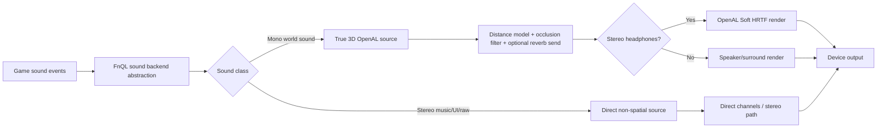
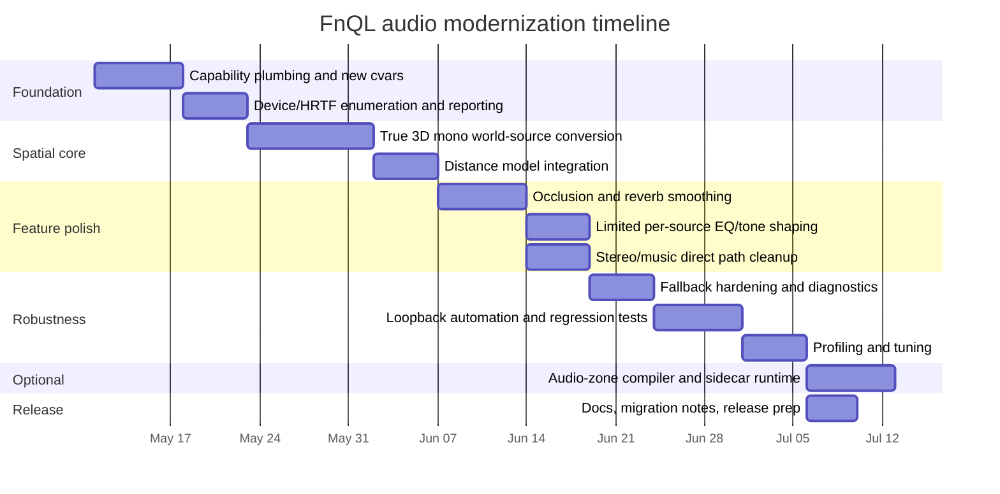

# Modernizing FnQL Audio with HRTF and Contemporary Spatial Audio

## Executive summary

FnQL already has a meaningful modern audio foundation: the client defaults to an entity["software","OpenAL","cross-platform 3D audio API"] backend, keeps the legacy mixer as fallback, exposes device selection, and already ships runtime features for EFX reverb, geometry-driven occlusion, doppler, debug overlay, music streaming, and Windows DLL staging. The core modernization opportunity is not “replace the audio system,” but “finish the last 30–40% of the transition from pseudo-spatial OpenAL usage to true 3D OpenAL Soft usage.” fileciteturn11file0 fileciteturn11file1 fileciteturn12file0 fileciteturn12file1

The most important finding from the repo review is that FnQL appears to use OpenAL largely as a capable mixer/EFX/output layer while still preserving a Quake-style engine-side spatialization model. In practice, that means the project has reverb and occlusion already, but it is not yet taking full advantage of OpenAL Soft’s HRTF-capable source rendering, distance models, richer output modes, device capabilities, or latency/reporting extensions. That is why HRTF, better headphone rendering, improved distance attenuation, and cleaner device/runtime controls are the highest-value next steps. fileciteturn11file0 fileciteturn12file1

The recommended architecture is to stay on entity["software","OpenAL Soft","3D audio API implementation"] as the primary renderer and add capability-driven use of its modern extensions that are already present in FnQL’s vendored headers, especially `ALC_SOFT_HRTF`, loopback/device clock/output limiter support, source spatialization controls, and multi-channel formats. This choice best matches the project’s constraints: no custom assets, scripts, mods, or external user content should be required for the feature set to work. External binaural SDKs can be stronger for full acoustic simulation, but they add significant dependency, integration, and content complexity that is not justified for FnQL’s current goals. fileciteturn15file0 citeturn2search0turn15search12turn15search2

The actionable plan is therefore:

- keep FnQL’s OpenAL backend;
- convert world mono sources from relative pan-based playback to true positional playback;
- request and query HRTF at context creation when appropriate;
- expose modern, latched audio cvars for HRTF, distance model, output mode, source counts, and preferred mix frequency/refresh;
- preserve current reverb and occlusion logic, but smooth and classify it better;
- keep stereo UI/music non-spatial;
- use loopback and deterministic tests to validate gains, filters, HRTF state, and fallback paths;
- leave map-zone sidecars as an optional later enhancement, compiled by a built-in repo tool and never required for default gameplay. fileciteturn11file0 fileciteturn11file1 fileciteturn12file0 fileciteturn15file0 citeturn9view0turn17view0turn17view1

## Current OpenAL usage in FnQL

FnQL’s current client sound entrypoint is `code/client/snd_main.c`, which initializes cvars such as `s_backend`, `s_backendActive`, `s_alDevice`, `s_volume`, `s_musicVolume`, `s_doppler`, and focus muting controls, then attempts `S_OpenAL_Init(&si)` before falling back to the legacy backend if OpenAL startup fails. The public docs mirror that behavior and document OpenAL as the intended default path. fileciteturn11file1 fileciteturn12file1 fileciteturn12file2

At build time, FnQL explicitly compiles `code/audio/AudioSystem.cpp`, includes vendored OpenAL headers from `code/openal/include`, and copies a Windows `OpenAL32.dll` into the client output when present. The maintainer notes also call out OpenAL as the default client audio path and state that dedicated builds should remain free of an OpenAL runtime dependency. fileciteturn12file0 fileciteturn12file2

The backend interface in `snd_local.h` is still the classic Quake sound abstraction: `StartSound`, `StartLocalSound`, `RawSamples`, `Respatialize`, looping sound methods, and debug hooks. That abstraction is good enough to modernize in-place, but it also means the modern feature set has to be threaded through an interface that was originally designed around a software mixer rather than around an extensible device/capability model. fileciteturn11file2

### What the repo already has

The repo already has several genuinely modern pieces:

| Area | Current state | Evidence |
|---|---|---|
| Backend model | OpenAL default, legacy fallback | `snd_main.c`, Audio guide |
| Device selection | `s_alDevice` cvar | `snd_main.c`, Audio guide |
| Environmental reverb | `s_alReverb`, `s_alReverbGain`, EFX-dependent | Audio guide, technical notes |
| Geometry occlusion | `s_alOcclusion`, `s_alOcclusionStrength` | Audio guide, technical notes |
| Doppler | `s_doppler` exposed and documented | `snd_main.c`, Audio guide |
| Debugging | `s_info`, `s_alDebugDump`, overlay/voice inspection | Audio guide |
| Build/runtime packaging | Vendored headers and Windows DLL staging | CMake, technical notes |
| Modern extension headers | HRTF, loopback, output limiter, device clock, multi-channel, source spatialize tokens already vendored | `alext.h` |

fileciteturn11file1 fileciteturn12file0 fileciteturn12file1 fileciteturn12file2 fileciteturn15file0

### The most important limitations

The main limitations are architectural, not cosmetic.

`AudioSystem.cpp` appears to keep source spatialization largely in engine code, then feeds OpenAL sources in a way that limits “true” OpenAL 3D rendering. The backend already does reverb, occlusion, and streaming, but the modernization target should be to let OpenAL Soft spatialize mono world sources directly, with HRTF over stereo/headphone output, instead of primarily emulating classic left/right panning behavior through OpenAL sources. That is the single highest-value change in the whole plan. fileciteturn11file0

FnQL’s current public controls do not expose HRTF mode, HRTF selection, output mode, preferred mix frequency/refresh, source-count hints, or explicit distance-model selection. The player-facing guide also documents reverb and occlusion but not HRTF, which is strong evidence that HRTF is not yet a first-class runtime feature in the user-visible backend contract. fileciteturn11file1 fileciteturn12file1

The repo’s vendored headers are ahead of the backend’s current feature use. `alext.h` already contains the enums and API typedefs for `ALC_SOFT_HRTF`, `ALC_SOFT_output_limiter`, `ALC_SOFT_device_clock`, `AL_SOFT_source_spatialize`, `AL_SOFT_direct_channels`, loopback rendering, and multi-channel buffer/sample APIs. That materially lowers implementation risk because the necessary declarations are already in-tree. fileciteturn15file0

## Target feature set and why it is worth adding

The technical rationale for HRTF is straightforward. Head-related transfer functions add spectral and timing cues that support elevation, front/back discrimination, and stronger headphone spatialization than ordinary pairwise panning. They are now a mainstream way to create virtual 3D auditory environments, but generic HRTFs still have known limitations such as poorer externalization and front/back errors for some listeners, which is why FnQL should ship HRTF as `auto/on/off`, not as a forced-only mode. citeturn11search1turn11search3turn11search7

OpenAL and OpenAL Soft are well suited to this. The OpenAL model is explicitly based on sources, buffers, and a listener in 3D space, and OpenAL Soft’s official feature set includes distance attenuation, doppler, streaming, multi-channel support, EFX, and HRTF-capable stereo output. OpenAL’s context model also gives FnQL standard places to request mix frequency, refresh, and source-count hints during context creation. citeturn18search5turn2search0turn17view0turn17view1turn17view2turn17view3

### Recommended target features

| Feature | Recommendation | Why it belongs in scope |
|---|---|---|
| HRTF | Yes, first-class | Biggest perceptual win on headphones; modernizes positional play without new assets |
| Distance models | Yes | Removes ad hoc attenuation behavior and aligns with OpenAL model choices |
| Occlusion | Keep and refine | Already present; improve smoothing and classification instead of rewriting |
| Reverb | Keep and refine | Already present; make transitions and reporting cleaner |
| Doppler | Keep, stabilize | Already in project; validate scaling and reduce artifacts |
| Multi-channel playback | Yes, but opportunistic | Preserve stereo/music today; permit surround buffers when available, without requiring surround assets |
| Per-source EQ | Yes, limited | Implement as practical low-/high-/band-pass tone shaping, not a DAW-style EQ |
| Binaural rendering | Yes | Achieved through HRTF for mono world sounds over stereo/headphones |
| Device selection | Expand | Keep exact-name selection, add enumeration/reporting and better fallback |
| Low-latency settings | Yes | Add mix frequency/refresh hints in-engine and document OpenAL Soft config-level tuning |
| Optional map zones | Nice-to-have only | Helpful for hand-tuned environmental transitions, but must never be required |

The distance-model part should use OpenAL’s standard models rather than a one-off custom curve. OpenAL 1.1 defines inverse, linear, and exponential models, including clamped variants; for a fast arena shooter, `AL_INVERSE_DISTANCE_CLAMPED` is the best default because it is intuitive, familiar, and avoids pathological near-field behavior. citeturn14view0turn14view1

For per-source EQ, the right interpretation for FnQL is not “full per-voice studio EQ.” The practical interpretation is “cheap, robust direct-path tone shaping,” especially for occlusion, water, muffling, UI isolation, and source-class coloration. That can be done with EFX filter types and source/filter sends without needing any custom content. fileciteturn11file0 citeturn2search0turn18search11

## Design options and chosen architecture

Three architectures are realistic.

### Comparison of alternatives

| Alternative | Strengths | Weaknesses | Fit for FnQL | Verdict |
|---|---|---|---|---|
| Stay on OpenAL Soft and use its modern extensions | Lowest integration risk; already in repo; no new asset requirement; preserves legacy fallback; good enough for HRTF, EFX, device handling, streaming, multi-channel, debugging | Less ambitious than a full acoustic-simulation stack; generic HRTF limitations remain | Excellent | **Chosen** |
| Replace direct-path rendering with entity["software","Steam Audio","spatial audio SDK"] | Strong HRTF, propagation, occlusion, reverb, custom SOFA HRTFs, geometry-aware pipeline | More dependency/integration cost; geometry/material work grows quickly; some benefits are best when scene data or authored acoustic metadata exist | Medium | Not recommended now |
| Replace direct-path rendering with entity["software","Resonance Audio","spatial audio SDK"] | Efficient HOA/HRTF pipeline; scales well with many sources; good room modeling | Larger architectural shift; best fit is usually engine/plugin ecosystems and explicit room modeling; more invasive than needed | Medium | Not recommended now |

citeturn15search12turn15search14turn15search2turn15search7

The reason not to choose an external renderer first is not that they are weak. It is the opposite: they are powerful, but that power is most valuable when the project is willing to take on deeper geometry, material, HRTF-content, or toolchain integration. Steam Audio, for example, explicitly supports custom HRTFs from SOFA files and richer propagation features, while Resonance Audio leans into a higher-order Ambisonic internal representation for performance. Those are attractive, but they are a mismatch for “modernize the existing audio system now, with no required custom assets or user content.” citeturn15search3turn15search12turn15search13turn16search7turn16search9

### Chosen architecture

The chosen architecture is:

1. **Keep FnQL’s OpenAL backend as the single modern backend.**
2. **Promote mono world sounds to true positional OpenAL sources.**
3. **Request/query HRTF when stereo/headphone rendering is appropriate.**
4. **Keep stereo music/UI/local sounds direct and non-spatial.**
5. **Retain current reverb and occlusion systems, but make them better citizens of the new source model.**
6. **Use capability detection, not hard assumptions.**
7. **Keep the legacy backend untouched as the safety net.**

This is also strongly supported by the repo’s vendored header state: the extension surface needed for HRTF, output mode, output limiter, device clock/latency, loopback rendering, deferred updates, source spatialize, and direct channels is already available in-tree. fileciteturn15file0

### Proposed runtime flow



## Step-by-step implementation plan

### Phase plan at a glance

The implementation should be staged so that each phase is shippable.

| Phase | Goal | Outcome |
|---|---|---|
| Foundation | Capability plumbing and cvars | HRTF/device/output status visible and controllable |
| Spatial core | True 3D world-source rendering | OpenAL really does positional rendering |
| Feature polish | Distance, reverb, occlusion, per-source tone shaping | Better realism without content changes |
| Robustness | Fallbacks, profiling, automated tests | Safe rollout and regression resistance |
| Optional environmental authoring | Built-in audio-zone compiler | Map-specific polish without becoming a requirement |

### Agent task board

| Check-off task | Effort | Files | Required changes | Tests |
|---|---|---|---|---|
| ☑ Add capability discovery layer for modern OpenAL Soft extensions | Medium | `code/audio/AudioSystem.cpp` | Load/query `ALC_SOFT_HRTF`, `alcGetStringiSOFT`, `alcResetDeviceSOFT`, device clock, output limiter, optional deferred updates, loopback, direct channels, source spatialize | Startup log contains capability matrix; no crash on missing extensions |
| ☑ Add new latched cvars for HRTF/output/distance/source-count hints | Low | `code/client/snd_main.c`, `code/client/snd_local.h`, docs | Add `s_alHrtf`, `s_alHrtfId`, `s_alOutputMode`, `s_alDistanceModel`, `s_alFrequency`, `s_alRefresh`, `s_alMonoSources`, `s_alStereoSources`, `s_alOutputLimiter` | `s_info` prints requested vs active values |
| ☑ Request HRTF during context creation and report status | Medium | `code/audio/AudioSystem.cpp` | Build attr list with standard ALC context attrs and HRTF attrs when supported; retry creation on failure | `ALC_HRTF_STATUS_SOFT` visible; fallback path exercised |
| ☑ Enumerate playback devices and available HRTFs | Medium | `code/audio/AudioSystem.cpp`, `code/client/snd_main.c` | Add `s_alListDevices` / `s_alListHrtfs` console commands or expand `s_info` | Device list and HRTF list print correctly |
| ☑ Convert mono world sounds to true positional sources | High | `code/audio/AudioSystem.cpp` | Stop forcing world sounds through relative pan-only behavior; use listener/source position, velocity, and orientation; keep local/UI sounds relative | Head-turn and source-orbit tests show true angular movement |
| ☑ Apply standard distance models | Medium | `code/audio/AudioSystem.cpp` | Default to inverse-clamped; set per-source reference/max distance and rolloff | Measured gain roughly follows chosen model |
| ☑ Preserve direct stereo path for UI/music/raw samples | Medium | `code/audio/AudioSystem.cpp` | Keep stereo music/UI non-spatial; use direct channels or non-spatial flags when available | Music/UI are stable and not image-shifted by HRTF |
| ☑ Refine occlusion smoothing and filter control | Medium | `code/audio/AudioSystem.cpp` | Separate direct path attenuation from filter sweep; add smoothing/hysteresis | Walking behind walls does not zipper or pump |
| ☑ Refine reverb send behavior and reporting | Medium | `code/audio/AudioSystem.cpp`, docs | Keep current EFX path, but make room transitions smoother and expose active environment in debug info | Reverb transitions are smooth and debuggable |
| ☑ Add limited per-source EQ/tone shaping | Medium | `code/audio/AudioSystem.cpp` | Implement low-/high-/band-pass presets by sound class and occlusion state; do not require assets | Filter preset test matrix passes |
| ☑ Add low-latency standard hints and diagnostics | Medium | `code/audio/AudioSystem.cpp`, docs | Use `ALC_FREQUENCY`/`ALC_REFRESH`; if present, report device latency/clock; document config-level tuning | No regressions on default settings; diagnostics visible |
| ☑ Add deterministic loopback test harness | High | new `tests/audio/` repo-local test harness | Use loopback path for headless rendering assertions | CI can validate HRTF state, gains, filters |
| ☑ Update docs and migration notes | Low | `docs/AUDIO.md`, `docs/fnql/TECHNICAL.md`, README templates | Document defaults, fallback behavior, troubleshooting | Manual doc review |
| ☑ Optional: add built-in audio-zone compiler and runtime sidecar support | High | new `code/tools/audiozones/`, `CMakeLists.txt`, runtime load path in `AudioSystem.cpp` | Compile `.audiozones` sidecars to compact binary, completely optional | Zone-enabled maps override defaults; missing zones harmless |

fileciteturn11file0 fileciteturn11file1 fileciteturn12file0 fileciteturn15file0

### Suggested new cvars

A clean set of user-facing controls would be:

| Cvar | Default | Type | Notes |
|---|---|---|---|
| `s_alHrtf` | `auto` | latched | `auto`, `off`, `on` |
| `s_alHrtfId` | `` | latched | preferred HRTF name or numeric ID; blank = default |
| `s_alOutputMode` | `auto` | latched | `auto`, `headphones`, `speakers`, `surround` |
| `s_alDistanceModel` | `inverse_clamped` | latched | OpenAL model selector |
| `s_alFrequency` | `48000` | latched | requested mix rate |
| `s_alRefresh` | `100` | latched | requested update frequency |
| `s_alMonoSources` | `64` | latched | source-count hint |
| `s_alStereoSources` | `8` | latched | stereo source-count hint |
| `s_alOutputLimiter` | `1` | latched | request output limiter if supported |
| `s_alSpatializeStereo` | `0` | latched | keep stereo assets non-spatial by default |
| `s_alSourceClassDebug` | `0` | cheat/dev | richer debug dump |

### Pseudo-code for device/context creation

```cpp
ALCdevice* OpenPlaybackDevice(const char* requestedDeviceName) {
    return alcOpenDevice((requestedDeviceName && requestedDeviceName[0]) ? requestedDeviceName : nullptr);
}

ALCcontext* CreateBestContext(ALCdevice* device) {
    CapabilityInfo caps = QueryCaps(device);

    std::vector<ALCint> attrs;
    attrs.push_back(ALC_FREQUENCY);      attrs.push_back(s_alFrequency->integer);
    attrs.push_back(ALC_REFRESH);        attrs.push_back(s_alRefresh->integer);
    attrs.push_back(ALC_MONO_SOURCES);   attrs.push_back(s_alMonoSources->integer);
    attrs.push_back(ALC_STEREO_SOURCES); attrs.push_back(s_alStereoSources->integer);

    if (caps.hasSoftHrtf && RequestsStereoOrHeadphones()) {
        attrs.push_back(ALC_HRTF_SOFT);
        attrs.push_back(HrtfRequestEnumFromCvar(s_alHrtf));   // off / on / don't-care
        if (SelectedHrtfIdIsValid()) {
            attrs.push_back(ALC_HRTF_ID_SOFT);
            attrs.push_back(GetSelectedHrtfId());
        }
    }

    if (caps.hasOutputLimiter) {
        attrs.push_back(ALC_OUTPUT_LIMITER_SOFT);
        attrs.push_back(s_alOutputLimiter->integer ? ALC_TRUE : ALC_FALSE);
    }

    attrs.push_back(0);

    if (auto* ctx = alcCreateContext(device, attrs.data())) return ctx;

    // Retry without HRTF/output-limiter.
    if (auto* ctx = alcCreateContext(device, nullptr)) return ctx;

    return nullptr;
}
```

This approach is aligned with the standard OpenAL context-attribute model and with the HRTF extension’s request/query design. citeturn17view0turn17view1turn9view0turn2search5

### Pseudo-code for world-source routing

```cpp
void ConfigureVoice(Voice& v, const SourceDesc& src) {
    const bool isWorldMono = (src.channels == 1) && !src.isLocalUi && !src.isMusic;

    if (isWorldMono) {
        alSourcei(v.alSource, AL_SOURCE_RELATIVE, AL_FALSE);
        alSource3f(v.alSource, AL_POSITION, src.pos.x, src.pos.y, src.pos.z);
        alSource3f(v.alSource, AL_VELOCITY, src.vel.x, src.vel.y, src.vel.z);
        alSourcef(v.alSource, AL_REFERENCE_DISTANCE, src.refDistance);
        alSourcef(v.alSource, AL_MAX_DISTANCE, src.maxDistance);
        alSourcef(v.alSource, AL_ROLLOFF_FACTOR, src.rolloff);
        MaybeEnableSpatializeSoft(v.alSource, true);
    } else {
        alSourcei(v.alSource, AL_SOURCE_RELATIVE, AL_TRUE);
        alSource3f(v.alSource, AL_POSITION, 0.0f, 0.0f, -1.0f);
        MaybeEnableSpatializeSoft(v.alSource, false);
        MaybeEnableDirectChannels(v.alSource, true);
    }

    ApplyOcclusionAndToneFilters(v, src);
    ApplyReverbSend(v, src);
}
```

### Optional map zone system

This is the right scope for the “nice-to-have” follow-up the user asked for.

The proposal is **not** to make authored map zones necessary. It is to create a path for higher-quality per-map environmental tuning later.

A good design would be:

- text source file: `maps/<mapname>.audiozones`
- compiled binary: `maps/<mapname>.azb`
- built-in compiler target: `fnql-audiozonesc`
- runtime behavior: if `.azb` exists, use it; otherwise use generic trace-based occlusion + default environment heuristics exactly as today

Each zone would optionally define:
- bounds or brush references
- environment class
- reverb preset/gain bias
- occlusion multiplier
- LPF/HPF bias
- transition times
- priority

That preserves “no required custom assets” while allowing maintainers to incrementally hand-tune high-value maps later. The tool should ship in-tree and be buildable from CMake so it is part of the project, not an external dependency. fileciteturn12file0

## Compatibility, performance, and verification

### Compatibility and fallback strategy

The fallback ladder should be explicit, deterministic, and noisy in logs:

1. Try requested OpenAL device + requested context attrs + requested HRTF.
2. If that fails, retry same device with standard attrs but without HRTF-specific attrs.
3. If that fails, retry same device with null/default attrs.
4. If that fails, follow current behavior and fall back to legacy.
5. Always print requested device, actual device, HRTF request, HRTF status, output mode, EFX availability, and source-count hints in `s_info`. fileciteturn11file1 fileciteturn12file1 citeturn2search5turn15file0

HRTF must not be assumed to work on every device/output combination. The HRTF proposal specifically includes status reporting for enabled, disabled, denied, required, headphones-detected, and unsupported-format outcomes, and the practical OpenAL Soft workflow is to enumerate available HRTFs and report what actually happened to the user. citeturn2search5turn9view0

Backward compatibility risk is low because audio rendering is client-side, and FnQL’s own technical notes explicitly treat compatibility-sensitive areas as things like demos, networking, filesystem search order, VM ABI, and renderer defaults. The plan here does not change those surfaces. It changes client rendering behavior, cvar plumbing, and diagnostics. fileciteturn12file2

### Performance considerations

HRTF is perceptually valuable, but it is not free. OpenAL Soft’s own config sample distinguishes between full HRTF mode and ambisonic HRTF modes with different CPU/clarity trade-offs, and external renderers like Resonance Audio make similar performance/quality trade-offs by projecting sources into a global Ambisonic field instead of filtering every source independently. For FnQL, the right first target is still ordinary OpenAL Soft HRTF over a capped number of mono world voices. citeturn6view0turn15search2

The practical profiling checklist is:

| Item | Why it matters | Accept / reject guidance |
|---|---|---|
| Active mono spatialized voice count | HRTF cost scales with active 3D voices | Cap high-cost voices by priority |
| Listener/source update count per frame | Property churn can dominate | Only update when materially changed |
| Occlusion trace count | CPU hot spot in firefights | Batch or rate-limit if needed |
| Filter updates per frame | Can cause zippering and overhead | Smooth with hysteresis/time constants |
| Reverb environment switches | Effect-slot thrash is avoidable | Crossfade, do not hard-flip every frame |
| Mix frequency | Higher rates cost more | Default 48 kHz; avoid forcing 96/192 kHz |
| Refresh rate | Too low hurts responsiveness; too high adds overhead | Start around 100 Hz |
| Device latency/clock reporting | Helps explain crackle and sluggishness | Report when supported |
| Idle CPU | Important for menu/background usage | Avoid unnecessary post-processing churn |

citeturn17view0turn17view1turn6view3turn6view4turn8search10turn12search11

The repo should also be conservative about “per-source EQ.” Use it only where it clearly adds gameplay value: occluded enemy fire, underwater muffling, heavy doors, or UI/music isolation. Do not add expensive, always-on coloration passes just because the API permits them. That preserves the technical notes’ “performance regressions need a clear reason and measurement” principle. fileciteturn12file2

### Automated verification tests

The strongest automated strategy is to use loopback rendering where available so tests do not require a real output device. FnQL’s vendored headers already include the loopback and related modern extension definitions, making this feasible as an in-repo test harness. fileciteturn15file0

Recommended automated tests:

| Test | Method | Expected measurable outcome |
|---|---|---|
| HRTF request/status test | Create context with `s_alHrtf=on/auto/off` equivalents | Status is reported correctly; no init crash |
| Device fallback test | Request invalid device name | Clean fallback to default or legacy with log reason |
| Distance model test | Render source at fixed distances | Gain follows chosen model within tolerance |
| World-vs-local routing test | Compare mono world sound vs stereo UI sound | World sound spatializes; UI/music remain direct |
| Occlusion filter test | Toggle blocked/unblocked path | LPF and gain move smoothly over configured interval |
| Reverb send test | Step through environment classes | Send gains change smoothly; no hard pops |
| Multi-channel acceptance test | Feed stereo and optional 5.1 test buffers | Stereo path preserved; surround accepted only if supported |
| Idle-cost test | No active sources | CPU stays below target threshold in backend-only test harness |

### Manual verification tests

Manual QA should focus on perception, not just correctness.

| Scenario | Expected result |
|---|---|
| Source circles player with headphones | Clear front-side-rear motion; stronger angle discrimination than current pan-only baseline |
| Vertical source sweep | Audible elevation change on HRTF-capable stereo/headphone output |
| Rocket or rail passing by | Doppler effect remains plausible and does not warble or pop |
| Door/wall occlusion | Slightly muffled and attenuated direct path, not “blanketed mud” |
| Indoor/outdoor transition | Reverb changes are noticeable but not exaggerated |
| Alt-tab / minimize | Existing mute semantics preserved |
| Switching devices + `snd_restart` | Requested and active device states are correctly reported |
| Speaker setup without headphones | HRTF disables gracefully and speaker rendering remains good |

### What success should look like

If the implementation is correct, the measurable outcomes should be:

- headphone users can reliably tell that the system is no longer simple pairwise pan-only audio;
- `s_info` becomes the single source of truth for backend, device, HRTF state, EFX state, and active output mode;
- stereo UI/music remain stable and unfazed by HRTF;
- no regression occurs in demo/network compatibility because the changes are client render-side only;
- legacy fallback remains intact;
- the default path works with no custom assets and no user-provided content. fileciteturn11file1 fileciteturn12file2 citeturn11search1turn2search0

## Migration notes, timeline, assumptions, and prioritized sources

### Migration and backward compatibility

The migration should preserve all existing player-facing controls and only add new ones. Specifically:

- **keep** `s_backend`, `s_backendActive`, `s_alDevice`, `s_alReverb`, `s_alOcclusion`, `s_alReverbGain`, `s_alOcclusionStrength`, `s_doppler`, `s_info`, `s_alDebugDump`;
- **add** modern controls rather than repurposing old ones;
- **default** `s_alHrtf` to `auto`, not `on`, because generic HRTFs can be excellent for many players but still create externalization/front/back problems for some listeners;
- **leave** legacy backend behavior alone;
- **document** that `snd_restart` is still the mechanism for latching device/HRTF/backend changes. fileciteturn11file1 fileciteturn12file1 citeturn11search1turn11search3

### Recommended OpenAL Soft HRTF enablement

Engine-side recommended startup:

```cfg
seta s_backend "openal"
seta s_alDevice ""
seta s_alHrtf "auto"
seta s_alDistanceModel "inverse_clamped"
seta s_alFrequency "48000"
seta s_alRefresh "100"
snd_restart
```

Recommended OpenAL Soft config example for users or test rigs:

```ini
[general]
stereo-mode = headphones
hrtf = on
frequency = 48000
period_size = 256
periods = 3
output-limiter = true
```

Those settings align with OpenAL Soft’s documented config surface for HRTF, period size/count, stereo mode, frequency, and output limiting. For deeper troubleshooting, OpenAL Soft also documents trace logging via `ALSOFT_LOGLEVEL` and optionally `ALSOFT_LOGFILE`. citeturn6view0turn6view3turn6view4turn6view5turn9view0

A good practical verification workflow is:

1. run FnQL with `s_backend openal`;
2. use `s_info` to confirm active backend/device/HRTF status;
3. if available on the machine, run OpenAL Soft’s `openal-info` utility to inspect devices, extensions, HRTFs, filters, and effects;
4. if device/HRTF behavior is surprising, enable OpenAL Soft tracing. citeturn3search0turn18search11turn9view0

### Timeline



### Assumptions and constraints

This report assumes the following:

- FnQL should remain a client-side modernization of the classic entity["video_game","Quake III Arena","1999 arena shooter"] audio model, not a ground-up acoustic simulation rewrite. fileciteturn12file2
- No custom assets, mods, scripts, or external user content are required for the default feature set to work.
- Optional sidecar zone files are acceptable only as a maintainer-owned enhancement path, never as a requirement.
- Current repo inspection was strongest on file-level behavior and configuration surfaces; some finer-grained code-path observations are based on whole-file inspection rather than line-fragment search because of connector retrieval limitations. The recommendations above therefore prioritize high-confidence architectural changes over brittle line-by-line micro-observations.

### Prioritized sources

Primary repo and project docs:
- urlFnQL repositoryhttps://github.com/themuffinator/FnQL
- `code/audio/AudioSystem.cpp` fileciteturn11file0
- `code/client/snd_main.c` fileciteturn11file1
- `code/client/snd_local.h` fileciteturn11file2
- `CMakeLists.txt` fileciteturn12file0
- `docs/AUDIO.md` fileciteturn12file1
- `docs/fnql/TECHNICAL.md` fileciteturn12file2
- `code/openal/include/AL/alext.h` fileciteturn15file0

Primary external technical references:
- urlOpenAL Soft official siteturn2search0
- urlOpenAL Soft repository and release metadataturn3search0
- urlOpenAL 1.1 specification PDFturn12search30
- urlOpenAL Soft sample configurationturn4search0
- urlALC_SOFT_HRTF design discussion and usage exampleturn8search12
- urlAuditory localization reviewturn11search0
- urlHRTF individualization paperturn11search3
- urlSOFA overview and AES69 contextturn16search7
- urlSteam Audio SDK overviewturn15search12
- urlResonance Audio developer overviewturn15search2

### Open questions and limitations

The main open engineering questions are not about whether the plan is viable. They are about exact defaults:

- what listener/source unit scale produces the best doppler behavior in FnQL’s world units;
- whether to keep doppler engine-side for compatibility or hand it off to OpenAL after proper scaling calibration;
- whether the first release should expose HRTF choice by numeric ID, by display-name match, or both;
- whether the optional zone compiler should be a standalone CMake target or a tool mode inside an existing binary.

None of those are blockers to beginning implementation. The core modernization path is already clear and should be started in `AudioSystem.cpp` first.
