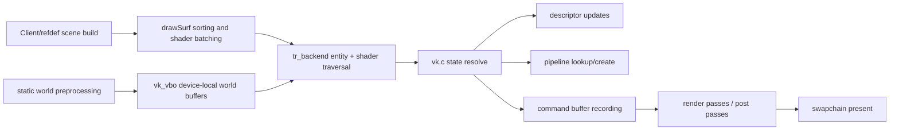
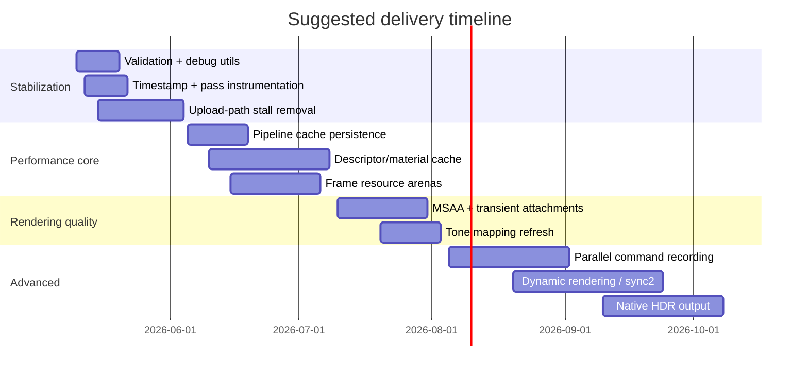
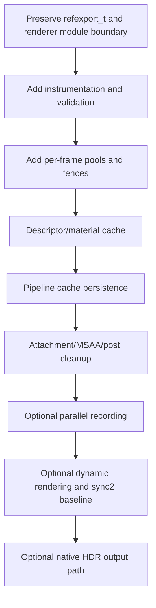

# Vulkan Renderer Review for FnQL in the idtech3 Context

## Executive summary

The Vulkan renderer in the repository is best understood as a feature-rich, modernized idtech3 renderer that still preserves the classic engine’s front-end/back-end split, shader-stage model, draw-surface sorting, and compatibility-first culture. The project explicitly prioritizes retail compatibility, demo compatibility, measured performance changes, and platform-matrix preservation, and it ships the Vulkan path as a modular renderer alongside OpenGL paths. The repo documentation also shows that the Vulkan renderer already exposes a more ambitious display pipeline than stock idtech3: internal render scaling, HDR-style off-screen rendering, bloom, anti-aliasing controls, cel shading, outlines, and player highlighting. fileciteturn40file0L1-L1 fileciteturn34file0L1-L1 fileciteturn3file0L1-L1 fileciteturn4file0L1-L1

My overall assessment is that the renderer is **architecturally credible and visually ambitious**, but it still carries several **high-probability CPU/GPU efficiency and robustness liabilities** that are typical of “first-generation Vulkan ports” built around an older renderer abstraction. The most important ones visible in the retrieved code are: a helper path that allocates, submits, waits idle, and frees command buffers for one-shot work; a narrow and fixed descriptor model tied to frequent per-bind descriptor updates; a small hardcoded command-buffer budget; old debug-report/debug-marker usage instead of modern debug-utils; validation only being enabled in a narrow debug configuration; and a temporal and memory model that still looks closer to “explicit GL emulation” than to a modern frame-resource architecture. These are solvable, and the fixes can be integrated without violating idtech3 compatibility if they are staged carefully behind cvars and tested against demo playback and renderer output. fileciteturn20file0L1-L1 fileciteturn16file0L1-L1 fileciteturn23file0L1-L1 citeturn7search0turn6search6turn7search1turn15search3

The best near-term returns are not glamorous rewrites. They are: **removing queue-idle behavior from helper paths, formalizing per-frame resource arenas, modernizing debug/validation, persisting and warming pipeline cache state, reducing descriptor churn, and instrumenting the renderer with timestamps and tool markers**. After that, the biggest medium-term gains are a stronger material/descriptor system, better command-buffer/pool lifetime management, more explicit attachment lifetime handling for post-processing and MSAA, and—if the project is willing to raise its baseline—migration toward Vulkan 1.2/1.3-era features such as descriptor indexing, synchronization2, and dynamic rendering. citeturn7search0turn6search6turn22search0turn9search0turn9search2turn18search3turn19search1

## Architecture mapping

Within the broader entity["video_game","Quake III Arena","1999 game"] / entity["organization","id Software","game studio"] lineage, FnQL keeps the familiar idtech3 renderer shape: init/configuration in `tr_init.c`, draw-surface sorting and batch emission in `tr_backend.c`, images in `tr_image.c`, BSP/world geometry in `tr_bsp.c`, shader/material logic in the `tr_*` shader files, and platform-specific loader/surface bootstrapping outside the core renderer. The original idtech3 codebase and the current entity["organization","ioquake3","quake3 source port"] project retain the same broad subsystem structure, even when renderer backends differ. citeturn5search2turn5search0turn4search1turn4search2

FnQL’s Vulkan path overlays that structure rather than replacing it. `code/renderervk/tr_backend.c` still owns draw-surface traversal, entity transform changes, shader batching, and state selection; `code/renderervk/tr_init.c` still owns cvar registration and renderer initialization; `code/renderervk/vk.c` centralizes the Vulkan instance/device/swapchain/render-pass/pipeline/descriptor/frame machinery; `code/renderervk/vk_vbo.c` adds a static-world batching path tailored to idtech3 world surfaces; and `win_qvk.cpp` / `linux_qvk.cpp` provide platform loader and surface glue. The project build documentation confirms the Vulkan renderer is a selectable or defaultable module in multi-renderer builds. fileciteturn23file0L1-L1 fileciteturn24file0L1-L1 fileciteturn20file0L1-L1 fileciteturn21file0L1-L1 fileciteturn32file0L1-L1 fileciteturn33file0L1-L1 fileciteturn34file0L1-L1

The following summary table maps the main repo pieces to idtech3 responsibilities.

| idtech3 responsibility | Current FnQL location | Assessment |
|---|---|---|
| Renderer init, cvars, startup, feature toggles | `code/renderervk/tr_init.c` | Good architectural fit; keeps idtech3 control surface intact while adding Vulkan-specific cvars such as `r_hdr`, `r_bloom`, `r_renderScale`, `r_fbo`, and `r_device`. |
| Draw-surface sorting, entity changes, shader batching | `code/renderervk/tr_backend.c` | Strong idtech3 continuity; however, the renderer still inherits fine-grained state churn from the old batch model. |
| Vulkan object model, swapchain, descriptors, pipelines, frame submission | `code/renderervk/vk.c` and `code/renderervk/vk.h` | Centralized and practical, but also where most modernization work is needed. |
| Static world batching | `code/renderervk/vk_vbo.c` | Intelligent adaptation of idtech3 world geometry to device-local storage, but memory/transient duplication needs scrutiny. |
| OS/library/surface binding | `code/win32/win_qvk.cpp`, `code/unix/linux_qvk.cpp` | Functional, but Linux support visible in the retrieved code is Xlib-only. |
| Build and deployment model | `BUILD.md`, GitHub workflow | Good modular packaging and broad platform build matrix; no substantive renderer regression tests yet. |

The table above is derived from the retrieved repo files and build workflow. fileciteturn23file0L1-L1 fileciteturn24file0L1-L1 fileciteturn16file0L1-L1 fileciteturn21file0L1-L1 fileciteturn32file0L1-L1 fileciteturn33file0L1-L1 fileciteturn34file0L1-L1 fileciteturn41file0L1-L1



This pipeline diagram reflects the retrieved backend, Vulkan core, and VBO files, plus the display-pipeline documentation. fileciteturn23file0L1-L1 fileciteturn20file0L1-L1 fileciteturn21file0L1-L1 fileciteturn4file0L1-L1

## Findings on efficiency, visual quality, and robustness

### Efficiency

The most important efficiency concern is the one-shot command-buffer helper path in `vk.c`. The retrieved code shows `begin_command_buffer()` allocating a primary command buffer with `VK_COMMAND_BUFFER_USAGE_ONE_TIME_SUBMIT_BIT`, and `end_command_buffer()` then ending it, submitting it, calling `vk_queue_wait_idle()`, and freeing the command buffer. That pattern is correct in a narrow sense, but it is exactly the kind of allocate/submit/wait/free path that Vulkan guidance warns against in hot or frequent paths because pool reset/reuse is materially cheaper than allocate/free, and full queue-idle synchronization destroys overlap. fileciteturn20file0L1-L1 citeturn7search0turn6search2turn6search1

The header hardcodes a small frame/execution budget: `NUM_COMMAND_BUFFERS` is `2`, while `MAX_SWAPCHAIN_IMAGES` is `8`. A conservative double-buffer model is not automatically wrong, but it is an awkward fit for modern present queues, variable present modes, and tools-driven frames-in-flight tuning. In practice, this usually means less flexibility in hiding CPU spikes and upload latency than a proper per-frame resource model would provide. fileciteturn16file0L1-L1

Descriptor handling is another likely CPU hotspot. The backend’s `GL_Bind()` path for Vulkan marks the image as used and immediately calls `vk_update_descriptor()` for the current texture unit. That is a strong signal that descriptor writes are happening at material-bind cadence, not at a coarser material lifetime or per-frame cache lifetime. Khronos guidance explicitly recommends avoiding simplistic “recreate or rewrite descriptors all the time” strategies because descriptor management and buffer management are tightly coupled performance concerns. In an idtech3 renderer where stage changes are frequent, this design likely magnifies CPU overhead on texture-heavy scenes. fileciteturn23file0L1-L1 citeturn6search6turn15search4

The static VBO path is clever, but not free. `vk_vbo.c` intentionally stores world geometry in device-local memory, sorts world surfaces by shader, and tries to render long contiguous index runs efficiently while collecting short runs into a host-visible soft index buffer. That is a sensible adaptation of idtech3 world rendering to Vulkan. However, the retrieved code also duplicates index data during build and retains a separate “soft” path for short runs, which increases transient memory pressure and some structural complexity during load/build time. The design is probably still a win versus fully dynamic world submission, but it should be measured, especially on memory-constrained systems and large content sets. fileciteturn21file0L1-L1

Pipeline and state churn are difficult to fully quantify from the retrieved excerpt, but the risk pattern is visible. `vk.h` reserves a large fixed pipeline table (`MAX_VK_PIPELINES`) and stores multiple render-pass and post-process pipeline variants, while the backend still changes state at the classic idtech3 shader/entity cadence. Khronos’ pipeline-cache guidance is clear: pipelines created too late or without robust cache persistence can cause stutters, and resource-cache warmup is valuable in game engines because draw-time pipeline creation is expensive. I did see a `VkPipelineCache` object in the Vulkan state, but I did not retrieve enough of `vk.c` to confirm whether cache data is being persisted to disk and warmed across runs, so I treat that part as an open question. fileciteturn16file0L1-L1 citeturn22search0turn22search4

Multithreading is presently conservative. The retrieved files show a single command pool in the Vulkan state, a serial `RB_RenderDrawSurfList()` traversal, and no visible evidence of per-thread command pools, secondary command buffers, or parallel recording. The Vulkan guide is explicit that command pools are externally synchronized and that parallel recording should use separate pools per host thread. The Khronos command-buffer sample also shows measurable gains from multi-threaded recording in draw-heavy scenes, while warning against too many tiny secondary command buffers. FnQL does not need to jump to a full jobified renderer immediately, but it is currently leaving host-side scaling on the table. fileciteturn16file0L1-L1 fileciteturn23file0L1-L1 citeturn6search7turn7search0

### Visual quality

FnQL’s Vulkan renderer is already visually ahead of classic idtech3 in important ways. The repo documentation and cvars show support for off-screen rendering, internal render scaling, HDR-style rendering, bloom, anti-aliasing, cel shading, outlines, and player highlighting. The Vulkan state also includes multiple post/deferred-like passes and bloom resources. That is already a meaningful upgrade over the original engine’s visual envelope. fileciteturn3file0L1-L1 fileciteturn4file0L1-L1 fileciteturn24file0L1-L1 fileciteturn16file0L1-L1

That said, the retrieved evidence points to “render to HDR-capable intermediate and tone map back down” rather than confirmed end-to-end **native display HDR output**. I did not retrieve evidence of swapchain HDR metadata handling such as `VK_EXT_hdr_metadata`, so I would currently classify display-HDR support as **unconfirmed** rather than present. If native HDR monitors/TVs are a target, that should be treated as a separate capability from the current off-screen HDR/bloom workflow. Vulkan explicitly supports swapchain HDR metadata through `VK_EXT_hdr_metadata`. fileciteturn4file0L1-L1 fileciteturn24file0L1-L1 citeturn21search0turn21search1

For anti-aliasing, the docs expose supersampling and AA controls, but the strongest Vulkan-side recommendation is still to prefer integrated MSAA resolve through subpass/write-back resolve rather than separate resolve passes, and to use transient/lazily allocated multisample attachments where possible. If FnQL currently resolves outside the main render pass in some configurations, that is worth changing. Alpha-tested edges and outlines can then be handled with alpha-to-coverage where appropriate, plus a post AA path for shader aliasing on UI and outlines. fileciteturn4file0L1-L1 citeturn19search1turn19search0

### Robustness and security

The validation and debug story needs modernization. The top of `vk.c` enables validation only in `_DEBUG` and only on Win32, and it uses `VkDebugReportCallbackEXT`; object naming uses `vkDebugMarkerSetObjectNameEXT`. Modern Vulkan guidance strongly prefers `VK_EXT_debug_utils`, and the validation overview also recommends best-practices and synchronization validation features during development. The current approach means Linux and macOS debug builds are likely missing some of the most useful guardrails, and even on Windows the engine is using an older diagnostics path. fileciteturn20file0L1-L1 citeturn7search1turn15search3turn15search6

The renderer also contains portability-sensitive decisions that should be revisited. Linux QVK visible in the repo uses `VK_USE_PLATFORM_XLIB_KHR` and `vkCreateXlibSurfaceKHR`; I did not retrieve a Wayland path. On the swapchain side, `vk_create_swapchain()` errors out if `VK_IMAGE_USAGE_TRANSFER_SRC_BIT` is unavailable when FBOs are inactive because screenshots depend on it. That is understandable for a convenience feature, but it narrows portability and violates the project’s own stated principle that platform additions should not silently narrow the supported matrix. A safer design is to route screenshots through a guaranteed off-screen resolved image when swapchain transfer-source support is unavailable. fileciteturn33file0L1-L1 fileciteturn20file0L1-L1 fileciteturn40file0L1-L1

Recent commit history is encouraging here: one recent commit explicitly mentions fixing IQM frame validation crashes and correcting Vulkan outline uniforms, which is a good sign that asset robustness and effect correctness are being addressed. But those fixes also demonstrate that the renderer is still exposed to asset- and state-correctness bugs. Adding `VK_EXT_robustness2`, null-descriptor handling where relevant, and stronger validation coverage would reduce the crash/UB surface further, especially under malformed or edge-case content. fileciteturn37file0L1-L1 fileciteturn38file0L1-L1 citeturn9search6turn15search0

The following current-vs-proposed table summarizes the highest-value design deltas.

| Area | Current reading | Proposed direction |
|---|---|---|
| Upload / setup command submission | One-shot allocate/submit/queue-idle/free helper path | Reusable per-frame transient upload pools with fences or timeline-style sequencing |
| Descriptor model | Small fixed descriptor layout with per-bind updates | Material/texture descriptor cache, per-frame ring buffers, optional descriptor indexing |
| Validation / debug | Debug-report + debug-marker, narrow debug-only coverage | Debug-utils, best-practices, sync validation, labels/regions, cross-platform debug enablement |
| Pipeline management | Large fixed pipeline inventory, cache persistence unconfirmed | Persistent pipeline cache + warmup manifest + pipeline creation telemetry |
| World geometry | Strong static VBO concept, but duplicated transient data | Keep concept; reduce duplication and formalize upload lifetime |
| Multithreading | Serial recording, single visible pool model | Optional parallel secondary-command recording for opaque world draws |
| Visual output | Feature-rich SDR-present path with HDR-style intermediates | Better tone mapping, integrated MSAA resolve, optional true HDR display path |

That table is based on the retrieved code/docs and Khronos guidance on descriptors, command buffers, validation, pipeline cache, dynamic rendering, and MSAA. fileciteturn16file0L1-L1 fileciteturn20file0L1-L1 fileciteturn21file0L1-L1 fileciteturn23file0L1-L1 citeturn6search6turn7search0turn22search0turn7search1turn19search1turn18search3

## Benchmarking and reproducibility

A meaningful performance program for this renderer needs to separate **CPU frame time**, **GPU frame time**, and **per-pass GPU costs**. Vulkan timestamp queries are the right low-level mechanism for measuring pass timings, while calibrated timestamps help line up CPU and GPU time domains. Khronos’ timestamp guidance also warns against interpreting arbitrary stage-pair timings too literally; for approximate per-pass profiling, outer-stage or carefully chosen sync2 timestamps are the safer choice. citeturn23search0turn23search2

The benchmark suite should include at least five workloads: a world-heavy opaque scene; an alpha/particle-heavy scene; a model-heavy combat scene; a post-processing-heavy scene with bloom/HDR/cel/outline enabled; and a resize/restart/material-warmup scenario that stresses swapchain and pipeline creation. Because the project explicitly cares about demo compatibility and deterministic behavior, at least two workloads should be driven by repeatable demo playback rather than free camera movement. That aligns with the project’s documented compatibility constraints. fileciteturn40file0L1-L1 fileciteturn3file0L1-L1

Use these metrics:

| Metric | Why it matters |
|---|---|
| CPU frame time median / P95 / P99 | Detects descriptor, submission, and pipeline churn |
| GPU frame time median / P95 / P99 | Detects barrier, pass, resolve, and bandwidth issues |
| GPU time per pass | Shows cost of opaque, UI, bloom-extract, blur, combine, tone-map/gamma paths |
| Pipeline creations per run / per restart | Detects late or missing pipeline warmup |
| Descriptor writes per frame | Detects material-bind inefficiency |
| Upload bytes and upload submissions per frame | Detects helper-path abuse and stalling |
| Queue-idle or device-idle event count | Detects pipeline bubbles and hard stalls |
| Peak VRAM and allocation count | Detects allocator/pathological suballocation behavior |
| Validation error / warning count in debug runs | Detects UB and synchronization mistakes |

For tooling, use cross-vendor frame capture plus vendor profilers. The Vulkan tools page lists RenderDoc and Tracy as standard cross-vendor choices; Nsight Graphics is the strongest NVIDIA-side graphics debugger/profiler; Radeon Developer Panel + Radeon GPU Profiler and Radeon Memory Visualizer provide AMD-side queue, timing, and memory analysis. entity["organization","Khronos Group","vulkan standards body"] maintains the Vulkan tools directory and official guidance. citeturn14search2turn12search6turn11search1turn13search2turn13search9

A reproducible benchmark harness should be scripted around modular-renderer selection and predictable cvars. The build docs already describe modular renderer selection, `USE_RENDERER_DLOPEN`, and choosing the Vulkan renderer. In practice, the benchmark launcher should force the Vulkan path, disable adaptive settings, pin the window size, pin the render scale, and log all renderer cvars at startup. Reproduce each workload under at least three settings groups: **quality-min**, **current-default**, and **stress-quality**. fileciteturn34file0L1-L1

Recommended baseline expectations before any rewrite:

- first-run or `vid_restart` spikes likely indicate incomplete pipeline warmup;
- descriptor-heavy scenes likely show elevated CPU variance;
- resize/screenshot paths may expose stalls or unsupported swapchain-usage assumptions;
- post-processing passes should be timing-separated so bloom and tone-map costs are visible rather than hidden in a monolithic “frame GPU ms.” fileciteturn20file0L1-L1 fileciteturn24file0L1-L1 citeturn22search0turn23search0

## Prioritized roadmap

The roadmap below is ordered by likely engineering value per unit of risk.

| Priority | Change | Effort | Risk | Expected gain |
|---|---|---:|---:|---|
| P0 | Remove queue-idle helper path; introduce reusable per-frame upload contexts | Medium | Low | Large CPU/GPU overlap improvement |
| P0 | Modernize validation/debug to debug-utils + best-practices + sync validation | Small | Low | Large robustness/debugging gain |
| P0 | Add timestamps, debug labels, and per-pass instrumentation | Small | Low | Large observability gain |
| P1 | Persist and warm pipeline caches; prebuild known pipelines | Medium | Low | Fewer stutters on first frame/restart |
| P1 | Rework descriptor updates around material caches and ring buffers | Medium | Medium | Lower CPU cost in draw-heavy scenes |
| P1 | Formalize per-frame command pools and resource arenas | Medium | Medium | Lower allocation overhead, cleaner lifetime model |
| P2 | Adopt a stronger allocator strategy for buffers/images | Medium | Medium | Lower fragmentation and better memory insight |
| P2 | Improve MSAA, transient attachment usage, and post-process attachment lifetime | Medium | Medium | Better bandwidth efficiency and image quality |
| P2 | Optional parallel recording for opaque/world draws | Large | Medium | Moderate-to-large CPU scaling on big scenes |
| P3 | Native HDR output path with metadata + display-space handling | Large | High | Better true-HDR presentation on supported displays |
| P3 | Optional modernization to dynamic rendering + sync2 baseline | Large | Medium | Cleaner code and lower render-pass object complexity |

These priorities follow directly from the repo structure plus Khronos guidance on command buffers, descriptors, synchronization, pipeline caching, dynamic rendering, and MSAA. fileciteturn16file0L1-L1 fileciteturn20file0L1-L1 citeturn7search0turn6search6turn22search0turn9search2turn18search3turn19search1



The timeline is a planning estimate, not a measured schedule. It is designed to front-load reversible, low-risk wins before architectural changes. Its sequencing is motivated by the repo’s compatibility constraints and the relative complexity of the Vulkan changes involved. fileciteturn40file0L1-L1 citeturn7search0turn22search0turn18search3

## Implementation playbooks

### Frame resources, submission, and synchronization

The first implementation step should create a small `FrameContext` array indexed by frames in flight. Each entry should own: one graphics command pool, one transient upload command pool, one descriptor sub-allocator or resettable descriptor pool, one ring-buffer slice for per-frame uniform data, and one completion fence. That moves the renderer away from “allocate and wait now” toward “record now, retire when the frame fence signals.” Vulkan’s command-pool and command-buffer guidance strongly supports this model. citeturn6search2turn7search0

```c
typedef struct FrameContext {
    VkCommandPool graphicsPool;
    VkCommandPool uploadPool;
    VkCommandBuffer graphicsCmd;
    VkCommandBuffer uploadCmd;
    VkFence frameFence;
    VkSemaphore imageAcquired;
    VkSemaphore renderFinished;
    DescriptorArena descArena;
    RingBuffer uboRing;
} FrameContext;
```

```c
void BeginFrame(FrameContext* f) {
    vkWaitForFences(device, 1, &f->frameFence, VK_TRUE, UINT64_MAX);
    vkResetFences(device, 1, &f->frameFence);
    vkResetCommandPool(device, f->graphicsPool, 0);
    vkResetCommandPool(device, f->uploadPool, 0);
    DescriptorArena_Reset(&f->descArena);
    RingBuffer_BeginFrame(&f->uboRing);
}
```

The important rollback criterion here is simple: if this change introduces even one persistent validation error, device-loss repro, or demo-output mismatch, revert to the previous submission path behind a cvar while preserving the instrumentation work.

### Descriptor and material system

The second step should decouple texture/material lifetime from draw-call lifetime. The current backend-visible pattern suggests per-bind descriptor writes. Replace that with a material cache keyed by `(images, sampler state, shader stage layout, effect flags)` and store per-object transforms or small shader params in a per-frame ring buffer, ideally through dynamic offsets or push constants where the data size is appropriate. Descriptor indexing is optional at first; a non-bindless cache still gives significant benefit. Khronos’ descriptor guidance is directly aligned with this change. fileciteturn23file0L1-L1 citeturn6search6turn9search0turn9search3

```c
MaterialKey key = {
    .baseImage = stage0Image,
    .lightmap  = stage1Image,
    .effect    = effectFlags,
    .sampler   = samplerBits
};

Material* mat = MaterialCache_FindOrCreate(key);
uint32_t uboOffset = RingBuffer_AllocAligned(&frame->uboRing, sizeof(DrawParams), minUboAlign);
memcpy(mapped + uboOffset, &params, sizeof(params));

vkCmdBindPipeline(cmd, VK_PIPELINE_BIND_POINT_GRAPHICS, mat->pipeline);
vkCmdBindDescriptorSets(cmd, VK_PIPELINE_BIND_POINT_GRAPHICS,
                        mat->layout, 0, 1, &mat->set, 1, &uboOffset);
```

If descriptor indexing is later enabled, the same cache can evolve into a “material references resource-table indices” design without changing higher-level idtech3 shader semantics.

### Pipeline cache and warmup

The Vulkan state already includes a `VkPipelineCache`, which is good, but the modernization target should be explicit **persistence** and **warmup**. Record all created graphics pipelines to a small manifest, persist `vkGetPipelineCacheData()` on clean shutdown, and load it on startup. During startup or map load, prebuild the pipelines required by renderer defaults and known post chains. Khronos’ sample shows why: runtime pipeline creation without cache reuse causes visible stutter. fileciteturn16file0L1-L1 citeturn22search0turn22search4

### Visual-quality improvements

The current visual stack already justifies a more coherent post pipeline. I recommend:

- keep an FP16 scene color target for HDR-style lighting and bloom input;
- adopt a modern tone mapper such as ACES fit or a filmic curve instead of ad hoc gamma-only remap;
- standardize bloom as **extract → downsample/blur chain → combine** with exposure-aware thresholds;
- prefer 4x MSAA with integrated resolve for geometry;
- add optional post AA for alpha-tested and outline cases;
- reserve native HDR output as a separate capability that uses HDR metadata only when the swapchain path proves it out. fileciteturn4file0L1-L1 fileciteturn16file0L1-L1 citeturn20search0turn19search1turn21search0

Example tone-mapping fragment code:

```glsl
vec3 ACESFilm(vec3 x) {
    const float a = 2.51;
    const float b = 0.03;
    const float c = 2.43;
    const float d = 0.59;
    const float e = 0.14;
    return clamp((x * (a * x + b)) / (x * (c * x + d) + e), 0.0, 1.0);
}

void main() {
    vec3 hdr = texture(uSceneColor, vUV).rgb;
    vec3 bloom = texture(uBloom, vUV).rgb;
    float exposure = uExposure;
    vec3 color = ACESFilm((hdr + bloom) * exposure);
    color = pow(color, vec3(1.0 / 2.2));
    outColor = vec4(color, 1.0);
}
```

If you want a lightweight alpha-edge improvement without committing to full TAA, an MSAA + alpha-to-coverage route for foliage/alpha-tested shaders plus a conservative post AA path is the lowest-risk option for idtech3-style content. Full TAA is possible, but it is harder to reconcile with razor-sharp HUD/UI expectations and deterministic screenshot workflows.

### Testing, CI, and rollback

The current GitHub Actions workflow builds a wide artifact matrix, including Vulkan-enabled binaries on Windows, Linux, and macOS, but it does not show renderer correctness or regression tests. The next CI step should therefore be **incremental**, not heroic:

1. add a debug Vulkan build with validation enabled;
2. add a headless or off-screen smoke scene on Linux using a software Vulkan implementation where practical;
3. run one scripted demo/workload and export FPS + per-pass timing JSON;
4. compare against a golden baseline with thresholds;
5. archive frame captures or at least timing artifacts on regressions. entity["organization","GitHub","code hosting platform"] workflows already provide the packaging matrix to hang this on. fileciteturn41file0L1-L1

Recommended rollback criteria:

- any new validation error in CI or local debug runs;
- any reproducible device loss or deadlock;
- any demo-output mismatch judged unacceptable by project policy;
- >5% regression in median or P95 frame time on the default benchmark set without a documented reason;
- visually obvious regressions in UI, HUD, player outlines, or screenshot output.

## Compatibility, required Vulkan capability, and migration plan

The project’s own technical notes are the right migration guardrails: preserve retail compatibility, preserve demo compatibility, require measured justification for regressions, and avoid silently narrowing the platform matrix. That means all major renderer work should be introduced under feature flags and staged in a way that leaves the existing render path recoverable until confidence is high. fileciteturn40file0L1-L1

For **current observed capability**, the safest reading from the retrieved files is:

- **Minimum Vulkan baseline:** effectively Vulkan 1.0-era API usage.
- **Required instance extensions:** `VK_KHR_surface` plus a platform surface extension; the retrieved platform files show Win32 and Xlib surface creation paths.
- **Required device extension:** `VK_KHR_swapchain`.
- **Debug-only legacy extensions in current code:** `VK_EXT_debug_report`, and likely `VK_EXT_debug_marker` when available for object naming.
- **Possible optional memory-allocation-era dependency:** the retrieved Vulkan state/function pointers include `vkGetBufferMemoryRequirements2KHR` / `vkGetImageMemoryRequirements2KHR`, suggesting an optional KHR memory-requirements path that should be confirmed in the full `vk.c`. fileciteturn20file0L1-L1 fileciteturn32file0L1-L1 fileciteturn33file0L1-L1

For the **recommended modernization target**, I suggest this split:

| Scope | Recommendation |
|---|---|
| Conservative modernization | Keep compatibility with Vulkan 1.0/1.1-class devices where feasible; add debug-utils, stronger validation, better submission/resource lifetime, and pipeline-cache persistence without raising baseline immediately. |
| Practical new baseline | Target Vulkan 1.2 as the “clean” floor for active development. Descriptor indexing is promoted in 1.2, and depth/stencil resolve support is much easier to standardize there. |
| Cleanest modern baseline | Vulkan 1.3 if the project is willing to simplify and use core synchronization2, extended dynamic state, and dynamic-rendering-era conventions directly. |
| Optional extensions / promoted features | `VK_EXT_debug_utils`, `VK_KHR_synchronization2`, `VK_KHR_dynamic_rendering`, `VK_EXT_descriptor_indexing` or Vulkan 1.2 core, `VK_KHR_depth_stencil_resolve` or Vulkan 1.2 core, `VK_EXT_hdr_metadata` for native HDR output, `VK_EXT_robustness2`, and `VK_EXT_extended_dynamic_state` if not already covered by a 1.3 floor. |

Those recommendations follow directly from the Vulkan extension/version documentation. citeturn7search1turn9search2turn18search3turn9search0turn9search3turn21search0turn9search6turn21search9

A migration plan that respects idtech3 architecture should look like this:

1. **Instrument first.** Add timestamps, labels, validation, and debug-utils with no functional changes.
2. **Stabilize frame lifetime.** Introduce `FrameContext`, reusable pools, and upload retirement.
3. **Stabilize resources.** Move per-draw descriptor writes toward cached materials and ring-buffered per-frame data.
4. **Stabilize pipelines.** Add persistence, warmup, and creation telemetry before changing pipeline architecture.
5. **Modernize rendering internals.** Improve MSAA/attachment lifetime and post chain; only then consider dynamic rendering and broader pipeline simplification.
6. **Parallelize selectively.** Introduce secondary command recording only for opaque/world-heavy phases where measured CPU benefit is clear.
7. **Ship native HDR only when complete.** Do not conflate off-screen HDR with display HDR.



This migration order keeps the engine’s classic renderer contract intact while progressively replacing the most expensive Vulkan-era liabilities first. It is also the ordering most compatible with the repo’s documented compatibility-first policy. fileciteturn40file0L1-L1 fileciteturn34file0L1-L1

## Open questions and limitations

Some important `vk.c` details were only partially retrievable through the connector path, so a few items remain open rather than fully verified:

- whether pipeline-cache data is persisted and warmed across runs;
- the exact descriptor-pool reset and allocation lifecycle across frames;
- whether `VK_EXT_debug_marker` and dedicated-allocation-era features are strictly required or only opportunistically used;
- whether any Linux/SDL/Wayland Vulkan surface path exists elsewhere outside the retrieved Xlib binding;
- whether the current “HDR” path includes any true display-HDR swapchain/color-space integration. fileciteturn20file0L1-L1 fileciteturn16file0L1-L1 fileciteturn33file0L1-L1

Even with those gaps, the highest-confidence conclusion is stable: **FnQL’s Vulkan renderer is a strong evolutionary step for idtech3, but its next gains will come from tightening its Vulkan lifetime model, descriptor and pipeline strategy, and validation/tooling discipline—not from adding more rendering features first.** fileciteturn40file0L1-L1 fileciteturn23file0L1-L1 citeturn6search6turn7search0turn22search0turn15search3